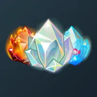
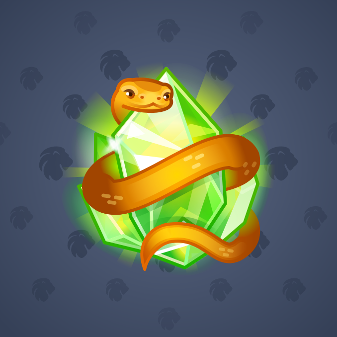

# Astral Shard

  <!-- Левая часть: карточка коллекции Astral Shard -->
  

    

      
    

    
Astral Shard

    
Коллекция

  

  <!-- Правая часть: информация о подарке -->
  

    
<strong>Дата выхода:</strong> 01.12.2024 
    <strong>Цена:</strong> 500 <a href="/stars">Stars⭐️</a> 
    <strong>Тираж:</strong> 10 000 шт. 
    <strong>Дата выхода улучшений:</strong> 31.01.2025 
    <strong>Стоимость улучшения:</strong> от 25 до 25 000 <a href="/stars">Stars⭐️</a> 
    <strong>Улучшено:</strong> 5 638 шт. (56,4% от тиража) 
    <strong>Сожжено:</strong> 3 804 шт. (38,0% от тиража)

  

**Astral Shard** — подарок, выпущенный 1 декабря 2024 года. Представляет собой стилизованный кристалл. Стоимость при выпуске составляла 500 звёзд, общий тираж — 10 000 экземпляров. До внедрения механики улучшений 31 января 2025 года 3 804 экземпляра было сожжено. По состоянию на февраль 2026 года улучшено 5 638 экземпляров, что составляет 56,4% от изначального тиража.

Коллекция включает 50 уникальных моделей с заявленной редкостью от 0,8% до 2,4%. Для всех моделей количество улучшенных экземпляров указано приблизительно.

  <!-- Левая часть: карточка экземпляра Eve’s Apple -->
  

    

      
    

    
Astral Shard #952

    
Модель Eve’s Apple

  

  <!-- Правая часть: текст о редкости -->
  

    
Наиболее редкая модель коллекции — <strong>Eve’s Apple</strong> — насчитывает 28 улучшенных экземпляров, что соответствует реальной редкости 0,50% (при заявленных 0,8%).

  

## Ключевые особенности

*   **Значительное расхождение редкости:** модель Eve’s Apple имеет реальную редкость почти в 1,6 раза ниже заявленной. Другие модели с заявленной редкостью 0,8% (Elven Might, Dark Soul) также демонстрируют реальные значения ниже ожидаемых.
*   **Приблизительные данные:** все значения количества улучшенных экземпляров в коллекции являются приблизительными, что отражено символом `~` в исходных данных.

## Модели и редкость

Коллекция состоит из 50 моделей. В таблице ниже представлено фактическое количество улучшенных экземпляров по каждой модели, а также реальная редкость (рассчитанная относительно общего числа улучшенных — 5 638) и заявленная при выпуске.

| № | Название модели | Реальная редкость (заявленная) | Кол-во |
|---|:---|:---|:---|
| 1 | Dark Soul | 0,87% (0,8%) | 49 |
| 2 | Elven Might | 0,74% (0,8%) | 42 |
| 3 | Eve’s Apple | 0,50% (0,8%) | 28 |
| 4 | Aquarium | 1,37% (1,3%) | 77 |
| 5 | Crystal Punk | 1,81% (1,3%) | 102 |
| 6 | Excalibrite | 1,22% (1,3%) | 69 |
| 7 | Lovestone | 1,35% (1,3%) | 76 |
| 8 | Muffin | 1,06% (1,3%) | 60 |
| 9 | Nectarite | 1,45% (1,3%) | 82 |
| 10 | Arctite | 1,54% (1,7%) | 87 |
| 11 | Barbed | 1,83% (1,7%) | 103 |
| 12 | Blender | 1,37% (1,7%) | 77 |
| 13 | Fractured | 1,84% (1,7%) | 104 |
| 14 | Ivy Vine | 1,70% (1,7%) | 96 |
| 15 | Bogartite | 1,79% (2%) | 101 |
| 16 | Galactite | 2,22% (2%) | 125 |
| 17 | Gold 999 | 2,36% (2%) | 133 |
| 18 | Gramite | 2,43% (2%) | 137 |
| 19 | Jurassic | 1,84% (2%) | 104 |
| 20 | Nouveau Gold | 1,79% (2%) | 101 |
| 21 | Premium | 1,88% (2%) | 106 |
| 22 | Pure Silver | 1,99% (2%) | 112 |
| 23 | Silver Art | 1,90% (2%) | 107 |
| 24 | Uranium | 2,02% (2%) | 114 |
| 25 | Warholite | 1,95% (2%) | 110 |
| 26 | Black Diamond | 2,29% (2,3%) | 129 |
| 27 | Glowstone | 2,43% (2,3%) | 137 |
| 28 | Labradorite | 2,41% (2,3%) | 136 |
| 29 | Moonstone | 2,55% (2,3%) | 144 |
| 30 | RGB-ite | 2,02% (2,3%) | 114 |
| 31 | True Opal | 2,39% (2,3%) | 135 |
| 32 | White Opal | 1,88% (2,3%) | 106 |
| 33 | Amethyst | 2,50% (2,4%) | 141 |
| 34 | Ammolite | 1,93% (2,4%) | 109 |
| 35 | Aquamarine | 2,39% (2,4%) | 135 |
| 36 | Bouquet | 2,41% (2,4%) | 136 |
| 37 | Candy Flossite | 2,25% (2,4%) | 127 |
| 38 | Citrine | 2,32% (2,4%) | 131 |
| 39 | Emerald | 2,70% (2,4%) | 152 |
| 40 | Ethereal | 2,39% (2,4%) | 135 |
| 41 | Garnet | 2,50% (2,4%) | 141 |
| 42 | Moonlit | 2,15% (2,4%) | 121 |
| 43 | Ocean Jasper | 2,52% (2,4%) | 142 |
| 44 | Red Ruby | 2,36% (2,4%) | 133 |
| 45 | Ruby Fuchsite | 2,39% (2,4%) | 135 |
| 46 | Sapphire | 2,64% (2,4%) | 149 |
| 47 | Spinel | 2,62% (2,4%) | 148 |
| 48 | Sunstone | 2,48% (2,4%) | 140 |
| 49 | Tanzanite | 2,41% (2,4%) | 136 |
| 50 | Tourmaline | 2,27% (2,4%) | 128 |

**Наиболее редкими** являются модели с заявленной редкостью 0,8% — **Dark Soul** (49 экз.), **Elven Might** (42 экз.) и **Eve’s Apple** (28 экз.). При этом реальная редкость Eve’s Apple (0,50%) существенно dsit заявленной, и это наименьшее количество улучшенных экземпляров во всей коллекции.