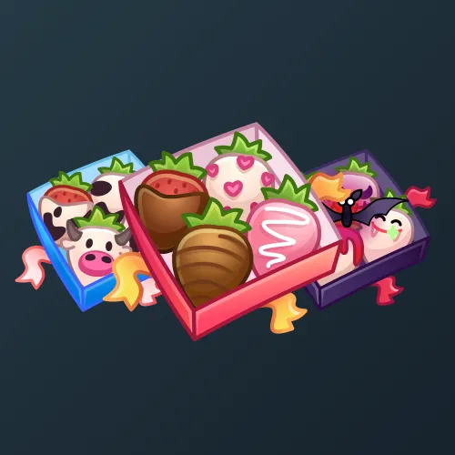

# Berry Box

  <!-- Левая часть: карточка коллекции -->
  

    

      
    

    
Berry Box

    
Коллекция

  

  <!-- Правая часть: информация о подарке -->
  

    
<strong>Дата выхода:</strong> 13 ноября 2024 
    <strong>Цена:</strong> 50 <a href="/stars">Stars⭐️</a> 
    <strong>Тираж:</strong> 100 000 шт. 
    <strong>Дата выхода улучшений:</strong> 1 января 2025 
    <strong>Стоимость улучшения:</strong> 25 <a href="/stars">Stars⭐️</a> 
    <strong>Улучшено:</strong> 50 607 шт. (50.6% от тиража) 
    <strong>Сожжено:</strong> 33 420 шт. (33.4% от тиража)

  

**Berry Box** — Telegram-подарок, выпущенный 13 ноября 2024 года. Представляет собой стилизованную коробку с ягодами (клубникой) и сладостями. Коллекция включает 70 уникальных моделей с заявленной редкостью от 0.5% до 2%. Изначальный тираж составил 100 000 экземпляров. До введения улучшений 1 января 2025 года было сожжено 33 420 подарков (33.4%). По состоянию на указанную дату улучшено 50 607 экземпляров (50.6% от тиража). Стоимость улучшения фиксирована и составляет 25 Stars для всех моделей.

Наиболее редкая модель коллекции — **Megabite** — насчитывает 224 улучшенных экземпляра, что соответствует реальной редкости 0.44% (при заявленных 0.5%).

---

## Ключевые особенности

- Модели с заявленной редкостью 0.5% имеют фактическое количество улучшенных от 224 до 261, при этом реальная редкость всех пяти моделей этой группы ниже заявленной (0.44–0.52%).
- Наибольшее расхождение между заявленной и реальной редкостью наблюдается у модели **Kawaii** (1% заявлено, 0.92% реально) и **Cupid** (1.5% заявлено, 1.39% реально).

## Модели и редкость

Коллекция состоит из 70 моделей. В таблице ниже представлено фактическое количество улучшенных экземпляров по каждой модели, а также реальная редкость (рассчитанная относительно общего числа улучшенных — 50 607) и заявленная при выпуске.

| №   | Название модели     | Реальная редкость (заявленная) | Кол-во улучшенных |
| --- | ------------------- | ------------------------------- | ----------------- |
| 1   | Berrific            | 0.47% (0.5%)                    | 236               |
| 2   | Bumberries          | 0.52% (0.5%)                    | 261               |
| 3   | Lady Bites          | 0.49% (0.5%)                    | 247               |
| 4   | Megabite            | 0.44% (0.5%)                    | 224               |
| 5   | Sweet Kiss          | 0.51% (0.5%)                    | 259               |
| 6   | Anniversary         | 1.01% (1.0%)                    | 511               |
| 7   | Art Project         | 1.03% (1.0%)                    | 522               |
| 8   | Berryllium          | 0.95% (1.0%)                    | 479               |
| 9   | Canis Major         | 1.02% (1.0%)                    | 516               |
| 10  | Glitchberry         | 1.00% (1.0%)                    | 505               |
| 11  | Harlequin           | 1.06% (1.0%)                    | 536               |
| 12  | High Voltage        | 1.00% (1.0%)                    | 504               |
| 13  | Infrared            | 1.00% (1.0%)                    | 504               |
| 14  | Kawaii              | 0.92% (1.0%)                    | 464               |
| 15  | Lovely Bites        | 0.95% (1.0%)                    | 480               |
| 16  | Lovestorm           | 0.96% (1.0%)                    | 487               |
| 17  | Mood Ring           | 0.93% (1.0%)                    | 470               |
| 18  | Natural             | 1.00% (1.0%)                    | 504               |
| 19  | Nature Box          | 0.96% (1.0%)                    | 484               |
| 20  | Noir                | 1.03% (1.0%)                    | 523               |
| 21  | Sketchy             | 1.01% (1.0%)                    | 512               |
| 22  | Spring              | 1.07% (1.0%)                    | 543               |
| 23  | Strobe              | 0.95% (1.0%)                    | 480               |
| 24  | Wedded              | 1.02% (1.0%)                    | 518               |
| 25  | Zomberry            | 1.05% (1.0%)                    | 530               |
| 26  | Alpha               | 1.54% (1.5%)                    | 781               |
| 27  | Anatomy             | 1.53% (1.5%)                    | 772               |
| 28  | Atmosphere          | 1.53% (1.5%)                    | 775               |
| 29  | Bowtied             | 1.52% (1.5%)                    | 771               |
| 30  | Clarity             | 1.46% (1.5%)                    | 741               |
| 31  | Comic Book          | 1.61% (1.5%)                    | 814               |
| 32  | Confetti            | 1.42% (1.5%)                    | 718               |
| 33  | Cupid               | 1.39% (1.5%)                    | 704               |
| 34  | Extra Berry         | 1.49% (1.5%)                    | 753               |
| 35  | Frosty Icing        | 1.48% (1.5%)                    | 751               |
| 36  | Glimglam            | 1.48% (1.5%)                    | 747               |
| 37  | Gryffindor          | 1.54% (1.5%)                    | 777               |
| 38  | Ice Diamond         | 1.61% (1.5%)                    | 817               |
| 39  | Lemon Lime          | 1.46% (1.5%)                    | 738               |
| 40  | Lovey Dovey         | 1.55% (1.5%)                    | 783               |
| 41  | Martian             | 1.47% (1.5%)                    | 745               |
| 42  | Milky Cows          | 1.47% (1.5%)                    | 742               |
| 43  | Rawberry            | 1.50% (1.5%)                    | 758               |
| 44  | Rose Gold           | 1.55% (1.5%)                    | 784               |
| 45  | Sine Wave           | 1.50% (1.5%)                    | 760               |
| 46  | Starberry           | 1.58% (1.5%)                    | 799               |
| 47  | Sweet Game          | 1.48% (1.5%)                    | 751               |
| 48  | Teeth Crush         | 1.47% (1.5%)                    | 745               |
| 49  | Tuxedo              | 1.46% (1.5%)                    | 740               |
| 50  | Unicorns            | 1.50% (1.5%)                    | 759               |
| 51  | Baubles             | 2.02% (2.0%)                    | 1 024             |
| 52  | Chillberry          | 2.03% (2.0%)                    | 1 027             |
| 53  | Eiffel 95           | 1.93% (2.0%)                    | 978               |
| 54  | Foraged             | 2.00% (2.0%)                    | 1 011             |
| 55  | Fresh               | 1.99% (2.0%)                    | 1 007             |
| 56  | Golden Dip          | 1.94% (2.0%)                    | 980               |
| 57  | Iridescent          | 2.07% (2.0%)                    | 1 049             |
| 58  | Luxury              | 2.01% (2.0%)                    | 1 019             |
| 59  | Magenta             | 2.07% (2.0%)                    | 1 050             |
| 60  | Manga               | 2.04% (2.0%)                    | 1 032             |
| 61  | Paparazzi           | 2.06% (2.0%)                    | 1 041             |
| 62  | Pointilism          | 1.94% (2.0%)                    | 983               |
| 63  | Purple Ribbon       | 2.04% (2.0%)                    | 1 033             |
| 64  | RGBerry             | 2.04% (2.0%)                    | 1 033             |
| 65  | Rarity              | 2.00% (2.0%)                    | 1 010             |
| 66  | Refraction          | 2.04% (2.0%)                    | 1 034             |
| 67  | Ribbons             | 1.97% (2.0%)                    | 999               |
| 68  | Sweet Star          | 2.15% (2.0%)                    | 1 087             |
| 69  | Valentine           | 1.98% (2.0%)                    | 1 001             |
| 70  | White Cocoa         | 2.08% (2.0%)                    | 1 054             |

Наиболее редкими являются модели с заявленной редкостью 0.5% — **Megabite** (224), **Berrific** (236), **Lady Bites** (247), **Sweet Kiss** (259) и **Bumberries** (261). При этом реальная редкость модели **Megabite** (0.44%) существенно ниже заявленной, и это наименьшее количество улучшенных экземпляров во всей коллекции. Модели с редкостью 2% демонстрируют фактическое количество от 978 до 1087, что в целом соответствует ожидаемому распределению, за исключением модели **Sweet Star** (1087), которая немного превышает средние значения.