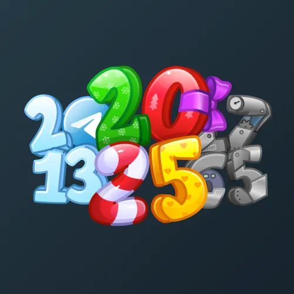

# Big Year

  

    

      
    

    
Big Year

    
Коллекция

  

  

    
<strong>Дата выхода:</strong> 1 января 2025 
    <strong>Цена:</strong> 50 <a href="/stars">Stars⭐️</a> 
    <strong>Тираж:</strong> 200 000 шт. 
    <strong>Дата выхода улучшений:</strong> 13 мая 2025 
    <strong>Стоимость улучшения:</strong> от 25 до 25 000 <a href="/stars">Stars⭐️</a> 
    <strong>Улучшено:</strong> 74 426 шт. (37.2% от тиража) 
    <strong>Сожжено:</strong> 98 585 шт. (49.3% от тиража)

  

**Big Year** — Telegram-подарок, выпущенный 1 января 2025 года. Каждая модель коллекции привязана к знаковому событию или личности, оставившей след в истории: от основания Telegram (2013) до публикации «Хоббита» (1937). Серия включает 55 уникальных моделей с заявленной редкостью от 0.5% до 2.9%. Изначальный тираж составил 200 000 экземпляров. До введения улучшений 13 мая 2025 года было сожжено 98 585 подарков (49.3%). По состоянию на указанную дату улучшено 74 426 экземпляров (37.2% от тиража). Стоимость улучшения варьируется от 25 до 25 000 Stars в зависимости от модели.

    
Наиболее редкая модель коллекции — <strong>Jelly Year</strong> — насчитывает 339 улучшенных экземпляров, что соответствует реальной редкости 0.46% (при заявленных 0.5%).

## Ключевые особенности

- Высокий процент сожжённых экземпляров (почти половина тиража) до введения улучшений.
- Модели с заявленной редкостью 0.5% имеют фактическое количество улучшенных от 339 до 387, при этом реальная редкость некоторых из них (Jelly Year — 0.46%, Game Boy — 0.46%) ниже заявленной, а Gold Mine (0.52%) — выше.

## Модели и редкость

Коллекция состоит из 55 моделей. В таблице ниже представлено фактическое количество улучшенных экземпляров по каждой модели, а также реальная редкость (рассчитанная относительно общего числа улучшенных — 74 426) и заявленная при выпуске.

| № | Название модели | Реальная редкость (заявленная) | Кол-во улучшенных |
|---|:---|:---|:---|
| 1 | Creator | 0.51% (0.5%) | 382 шт. |
| 2 | Game Boy | 0.46% (0.5%) | 342 шт. |
| 3 | Gold Mine | 0.52% (0.5%) | 387 шт. |
| 4 | Jelly Year | 0.46% (0.5%) | 339 шт. |
| 5 | The Nether | 0.50% (0.5%) | 373 шт. |
| 6 | Balloons | 0.62% (0.6%) | 460 шт. |
| 7 | Cheshire Cat | 0.66% (0.6%) | 494 шт. |
| 8 | King of Pop | 0.56% (0.6%) | 418 шт. |
| 9 | Sir Chaplin | 0.60% (0.6%) | 450 шт. |
| 10 | The Hobbit | 0.63% (0.6%) | 467 шт. |
| 11 | Frida Kahlo | 1.22% (1.2%) | 908 шт. |
| 12 | Original Cola | 1.32% (1.2%) | 980 шт. |
| 13 | Sherlock | 1.23% (1.2%) | 918 шт. |
| 14 | Sputnik-1 | 1.13% (1.2%) | 840 шт. |
| 15 | Telegram | 1.13% (1.2%) | 840 шт. |
| 16 | Toon Family | 1.18% (1.2%) | 879 шт. |
| 17 | Zombie Film | 1.17% (1.2%) | 872 шт. |
| 18 | A New Hope | 1.80% (1.8%) | 1 337 шт. |
| 19 | AC/DC | 1.77% (1.8%) | 1 316 шт. |
| 20 | Big Brother | 1.74% (1.8%) | 1 292 шт. |
| 21 | Covid-19 | 1.80% (1.8%) | 1 343 шт. |
| 22 | Da Vinci | 1.80% (1.8%) | 1 341 шт. |
| 23 | Einstein | 1.86% (1.8%) | 1 385 шт. |
| 24 | First Flight | 1.77% (1.8%) | 1 317 шт. |
| 25 | First Website | 1.81% (1.8%) | 1 347 шт. |
| 26 | Mauveine | 1.80% (1.8%) | 1 343 шт. |
| 27 | Qing Dynasty | 1.82% (1.8%) | 1 357 шт. |
| 28 | Salvador Dali | 1.91% (1.8%) | 1 422 шт. |
| 29 | Van Gogh | 1.82% (1.8%) | 1 356 шт. |
| 30 | War and Peace | 1.85% (1.8%) | 1 379 шт. |
| 31 | YouTubes | 2.12% (2.1%) | 1 581 шт. |
| 32 | Bikini Bottom | 2.32% (2.3%) | 1 725 шт. |
| 33 | Christmas Carol | 2.31% (2.3%) | 1 721 шт. |
| 34 | Columbus | 2.37% (2.3%) | 1 762 шт. |
| 35 | Fallout | 2.36% (2.3%) | 1 753 шт. |
| 36 | Frankenstein | 2.38% (2.3%) | 1 771 шт. |
| 37 | Industrial | 2.25% (2.3%) | 1 673 шт. |
| 38 | Night Bat | 2.35% (2.3%) | 1 750 шт. |
| 39 | Nostradamus | 2.36% (2.3%) | 1 754 шт. |
| 40 | Nuclein | 2.30% (2.3%) | 1 710 шт. |
| 41 | Pavel Durov | 2.33% (2.3%) | 1 734 шт. |
| 42 | Periodic Table | 2.34% (2.3%) | 1 741 шт. |
| 43 | Picasso | 2.33% (2.3%) | 1 732 шт. |
| 44 | Spider Sense | 2.34% (2.3%) | 1 744 шт. |
| 45 | Steve Jobs | 2.24% (2.3%) | 1 670 шт. |
| 46 | Wizard Boy | 2.26% (2.3%) | 1 679 шт. |
| 47 | 2048 | 2.88% (2.9%) | 2 142 шт. |
| 48 | Bitcoin | 3.01% (2.9%) | 2 240 шт. |
| 49 | Cyberpunk | 2.83% (2.9%) | 2 106 шт. |
| 50 | Emo Music | 2.87% (2.9%) | 2 134 шт. |
| 51 | Freddy | 2.88% (2.9%) | 2 140 шт. |
| 52 | Matrix | 2.97% (2.9%) | 2 208 шт. |
| 53 | Pokeball | 2.96% (2.9%) | 2 201 шт. |
| 54 | Retrowave | 2.84% (2.9%) | 2 115 шт. |
| 55 | Walking Dead | 2.81% (2.9%) | 2 095 шт. |

Наиболее редкими являются модели с заявленной редкостью 0.5% — **Jelly Year** (339), **Game Boy** (342), **The Nether** (373), **Creator** (382) и **Gold Mine** (387). При этом реальная редкость модели **Jelly Year** (0.46%) ниже заявленной, и это наименьшее количество улучшенных экземпляров во всей коллекции. Модели с редкостью 2.9% демонстрируют фактическое количество от 2 095 до 2 240, при этом **Bitcoin** (3.01%) и **Matrix** (2.97%) немного превышают ожидаемые значения.