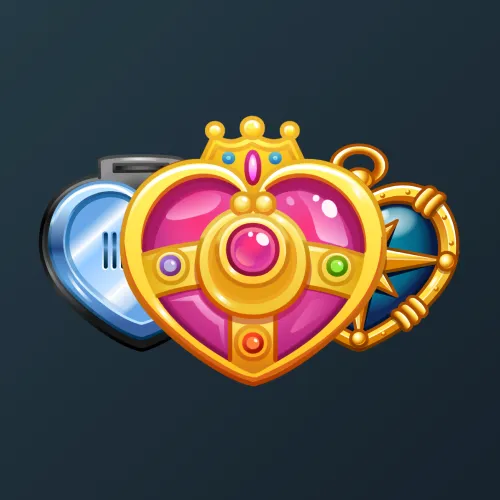
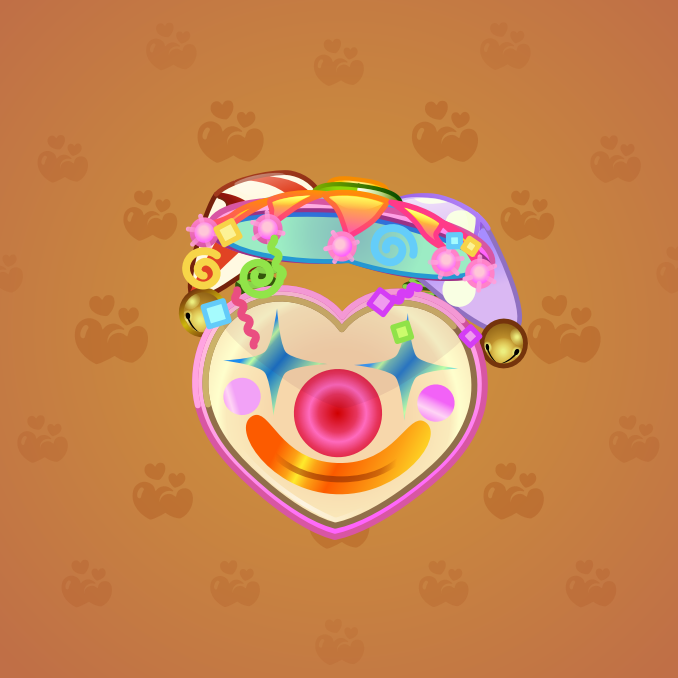
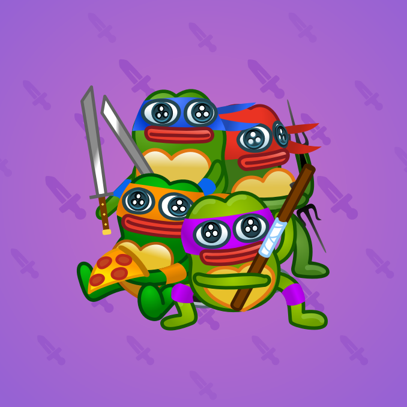

# Heart Locket

  <!-- Левая часть: карточка коллекции Heart Locket -->
  

    

      
    

    
Heart Locket

    
Коллекция

  

  <!-- Правая часть: информация о подарке -->
  

    
<strong>Дата выхода:</strong> 14.02.2025 
    <strong>Цена:</strong> 10 000 <a href="/stars">Stars⭐️</a> 
    <strong>Тираж:</strong> 2 000 шт. 
    <strong>Дата выхода улучшений:</strong> 30.05.2025 
    <strong>Стоимость улучшения:</strong> варьировалась от 2 000 до 25 000 <a href="/stars">Stars⭐️</a> 
    <strong>Улучшено:</strong> 1 949 шт. (97,5% от тиража) 
    <strong>Сожжено:</strong> 27 шт. (1,4% от тиража)

  

**Heart Locket** — подарок, выпущенный 14 февраля 2025 года. Представляет собой медальон в форме сердца, стилизованный под аниме «Сейлор Мун». Стоимость при выпуске составляла 10 000 звёзд, общий тираж — 2 000 экземпляров, что делает коллекцию одной из самых редких в Telegram. До внедрения механики улучшений 30 мая 2025 года 27 экземпляров было сожжено. По состоянию на февраль 2026 года улучшено 1 949 экземпляров, что составляет 97,5% от изначального тиража.

Коллекция включает 60 уникальных моделей с заявленной редкостью от 1% до 2,5%. Тематика дизайнов выходит за рамки «Sailor Moon» и включает отсылки к «Черепашкам-ниндзя» (Turtles), «Ведьмаку» (White Wolf) и другим символам. Некоторое время коллекцию пророчили в «убийцы Pepe» (см. <a href="/plush-pepe">Plush Pepe</a>), однако по минимальной цене она не обошла Plush Pepe, несмотря на меньший тираж.

  <!-- Левая часть: карточка экземпляра Cirque -->
  

    

      
    

    
Heart Locket #582

    
Модель Cirque

  

  <!-- Правая часть: текст о редкости -->
  

    
Наиболее редкая модель коллекции — <strong>Cirque</strong> — насчитывает 10 улучшенных экземпляров, что соответствует реальной редкости 0,51% (при заявленных 1%).

  

<!-- Дополнительный блок для модели Turtles по запросу пользователя -->

  <!-- Левая часть: карточка экземпляра Turtles -->
  

    

      
    

    
Heart Locket #607

    
Модель Turtles

  

  <!-- Правая часть: текст о востребованности -->
  

    
Одна из наиболее востребованных моделей коллекции — <strong>Turtles</strong> — насчитывает 19 улучшенных экземпляров, что соответствует реальной редкости 0,98% (при заявленных 1%). Модель отсылает к «Черепашкам-ниндзя» и пользуется высоким спросом среди коллекционеров.

  

## Ключевые особенности

*   **Крайне редкие модели:** модели с заявленной редкостью 1% (Cirque, Uranus, Great Wave) имеют фактическое количество улучшенных экземпляров менее 20. Cirque с 10 экземплярами является абсолютным минимумом коллекции.
*   **Высокая востребованность:** наиболее востребованными моделями среди коллекционеров являются Mirror (22 экз.), Golden (21 экз.), Turtles (19 экз.) и White Wolf (20 экз.).
*   **Вариативность стоимости улучшения:** стоимость улучшения варьировалась в диапазоне от 2 000 до 25 000 звёзд, что повлияло на доступность процесса апгрейда.
*   **Разнообразие дизайнов:** в коллекции представлены модели, отсылающие к аниме (Mirror), западной поп-культуре (Turtles, White Wolf) и абстрактным символам (Cirque, Great Wave).

## Модели и редкость

Коллекция состоит из 60 моделей. В таблице ниже представлено фактическое количество улучшенных экземпляров по каждой модели, а также реальная редкость (рассчитанная относительно общего числа улучшенных — 1 949) и заявленная при выпуске.

| № | Название модели | Реальная редкость (заявленная) | Кол-во |
|---|:---|:---|:---|
| 1 | Cirque | 0,51% (1%) | 10 |
| 2 | Golden | 1,08% (1%) | 21 |
| 3 | Great Wave | 0,87% (1%) | 17 |
| 4 | Mirror | 1,13% (1%) | 22 |
| 5 | Neptune | 1,03% (1%) | 20 |
| 6 | Turtles | 0,98% (1%) | 19 |
| 7 | Tuxedo Mask | 0,98% (1%) | 19 |
| 8 | Uranus | 0,82% (1%) | 16 |
| 9 | Valentine | 1,03% (1%) | 20 |
| 10 | White Wolf | 1,03% (1%) | 20 |
| 11 | Acorn Hunter | 1,90% (1,5%) | 37 |
| 12 | Casino Bugs | 1,03% (1,5%) | 20 |
| 13 | Fairy Dust | 1,13% (1,5%) | 22 |
| 14 | Gem Shards | 1,49% (1,5%) | 29 |
| 15 | Jupiter | 2,05% (1,5%) | 40 |
| 16 | Koi Pond | 1,54% (1,5%) | 30 |
| 17 | Lady Bug | 1,90% (1,5%) | 37 |
| 18 | Lunar Grail | 1,69% (1,5%) | 33 |
| 19 | Mars | 1,90% (1,5%) | 37 |
| 20 | Matryoshka | 1,54% (1,5%) | 30 |
| 21 | Mecha Love | 1,33% (1,5%) | 26 |
| 22 | Mercury | 1,75% (1,5%) | 34 |
| 23 | Ocean Star | 1,18% (1,5%) | 23 |
| 24 | Pluto | 1,39% (1,5%) | 27 |
| 25 | Queen Bee | 1,69% (1,5%) | 33 |
| 26 | Rebellion | 0,98% (1,5%) | 19 |
| 27 | Royal Heart | 1,54% (1,5%) | 30 |
| 28 | Sanctuary | 1,33% (1,5%) | 26 |
| 29 | Saturn | 1,54% (1,5%) | 30 |
| 30 | Shaman | 1,39% (1,5%) | 27 |
| 31 | Shield of Sun | 1,23% (1,5%) | 24 |
| 32 | Spider Web | 1,80% (1,5%) | 35 |
| 33 | Stone Flower | 0,77% (1,5%) | 15 |
| 34 | Synthwave | 1,59% (1,5%) | 31 |
| 35 | Telegram | 1,59% (1,5%) | 31 |
| 36 | Venus | 2,05% (1,5%) | 40 |
| 37 | Angelic Pink | 2,00% (2%) | 39 |
| 38 | Black Hole | 1,44% (2%) | 28 |
| 39 | Compass | 1,95% (2%) | 38 |
| 40 | Emocore | 1,95% (2%) | 38 |
| 41 | Glam Furry | 1,95% (2%) | 38 |
| 42 | Heartwood | 1,85% (2%) | 36 |
| 43 | Hell Rise | 2,00% (2%) | 39 |
| 44 | Karaoke Bar | 1,80% (2%) | 35 |
| 45 | Love Ring | 1,44% (2%) | 28 |
| 46 | Luna | 2,16% (2%) | 42 |
| 47 | Reactor | 1,69% (2%) | 33 |
| 48 | Sakura | 1,95% (2%) | 38 |
| 49 | Satoru | 2,26% (2%) | 44 |
| 50 | Soulkeeper | 2,10% (2%) | 41 |
| 51 | Toy Joy | 2,62% (2%) | 51 |
| 52 | Trapped Heart | 2,31% (2%) | 45 |
| 53 | Vampire | 2,41% (2%) | 47 |
| 54 | Waffle Maker | 1,69% (2%) | 33 |
| 55 | Azure Gem | 2,77% (2,5%) | 54 |
| 56 | Comic Book | 2,67% (2,5%) | 52 |
| 57 | Disco | 3,03% (2,5%) | 59 |
| 58 | Nightclub | 2,62% (2,5%) | 51 |
| 59 | Pepperoni | 2,41% (2,5%) | 47 |
| 60 | Royal Flush | 2,21% (2,5%) | 43 |

**Наиболее редкими** являются модели с заявленной редкостью 1% — **Cirque** (10 экз.), **Uranus** (16 экз.) и **Great Wave** (17 экз.). Наименьшее количество улучшенных экземпляров среди всех моделей имеет **Cirque**. Среди наиболее востребованных моделей, помимо указанных, выделяются **Mirror** (22 экз.), **Golden** (21 экз.), **Turtles** (19 экз.) и **White Wolf** (20 экз.).