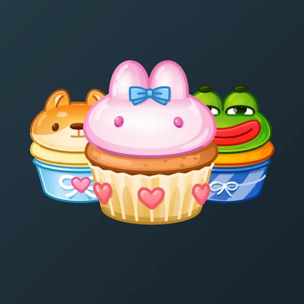

# Bunny Muffin

  

    

      
    

    
Bunny Muffin

    
Коллекция

  

  

    
<strong>Дата выхода:</strong> 1 декабря 2024 
    <strong>Цена:</strong> 50 <a href="/stars">Stars⭐️</a> 
    <strong>Тираж:</strong> 100 000 шт. 
    <strong>Дата выхода улучшений:</strong> 31 января 2025 
    <strong>Стоимость улучшения:</strong> от 25 до 25 000 <a href="/stars">Stars⭐️</a> 
    <strong>Улучшено:</strong> 51 317 шт. (51.3% от тиража) 
    <strong>Сожжено:</strong> 33 345 шт. (33.3% от тиража)

  

**Bunny Muffin** — Telegram-подарок, выпущенный 1 декабря 2024 года. Представляет собой стилизованного кролика-кекса. Коллекция включает 100 уникальных моделей с заявленной редкостью от 0.3% до 2%. Изначальный тираж составил 100 000 экземпляров. До введения улучшений 31 января 2025 года было сожжено 33 345 подарков (33.3%). По состоянию на указанную дату улучшено 51 317 экземпляров (51.3% от тиража). Наиболее редкая модель коллекции — **Diamond** — насчитывает 150 улучшенных экземпляров, что соответствует реальной редкости 0.29% (при заявленных 0.3%).

## Модели и редкость

Коллекция состоит из 100 моделей. В таблице ниже представлено фактическое количество улучшенных экземпляров по каждой модели, а также реальная редкость (рассчитанная относительно общего числа улучшенных — 51 317) и заявленная при выпуске.

| № | Название модели | Реальная редкость (заявленная) | Кол-во улучшенных |
|---|-------------------|----------------------------------|-------------------|
| 1 | Diamond | 0.29% (0.3%) | 150 шт. |
| 2 | Froggy | 0.31% (0.3%) | 161 шт. |
| 3 | Gold | 0.29% (0.3%) | 151 шт. |
| 4 | Lovely Ruby | 0.34% (0.3%) | 174 шт. |
| 5 | Choco Bear | 0.42% (0.4%) | 216 шт. |
| 6 | Electric | 0.47% (0.4%) | 242 шт. |
| 7 | Gothic | 0.38% (0.4%) | 196 шт. |
| 8 | Hackathon | 0.36% (0.4%) | 185 шт. |
| 9 | Honey Bee | 0.41% (0.4%) | 209 шт. |
| 10 | Lu Crystal | 0.41% (0.4%) | 208 шт. |
| 11 | Meltdown | 0.44% (0.4%) | 224 шт. |
| 12 | Mermaid | 0.41% (0.4%) | 208 шт. |
| 13 | Mr. Souffle | 0.41% (0.4%) | 209 шт. |
| 14 | Neon Sign | 0.40% (0.4%) | 204 шт. |
| 15 | Party Clown | 0.41% (0.4%) | 210 шт. |
| 16 | Party Time | 0.39% (0.4%) | 201 шт. |
| 17 | Shiba Inu | 0.41% (0.4%) | 210 шт. |
| 18 | Snowman | 0.40% (0.4%) | 206 шт. |
| 19 | Telegram | 0.37% (0.4%) | 188 шт. |
| 20 | Unicorn | 0.40% (0.4%) | 203 шт. |
| 21 | With Love | 0.43% (0.4%) | 219 шт. |
| 22 | Airy Souffle | 0.49% (0.5%) | 250 шт. |
| 23 | Bronze | 0.51% (0.5%) | 262 шт. |
| 24 | Cookie Bun | 0.52% (0.5%) | 269 шт. |
| 25 | Day and Night | 0.50% (0.5%) | 258 шт. |
| 26 | Frosted | 0.48% (0.5%) | 248 шт. |
| 27 | Ice Cream | 0.49% (0.5%) | 253 шт. |
| 28 | Meow Meow | 0.50% (0.5%) | 257 шт. |
| 29 | Pink Bow | 0.50% (0.5%) | 258 шт. |
| 30 | Sugar Glade | 0.56% (0.5%) | 287 шт. |
| 31 | Sweet Miracle | 0.49% (0.5%) | 254 шт. |
| 32 | Berry Tale | 0.82% (0.8%) | 420 шт. |
| 33 | Brave Tiger | 0.82% (0.8%) | 421 шт. |
| 34 | Citrus | 0.77% (0.8%) | 395 шт. |
| 35 | Cutie | 0.76% (0.8%) | 392 шт. |
| 36 | Grandma’s Pie | 0.83% (0.8%) | 428 шт. |
| 37 | Green Tea | 0.87% (0.8%) | 445 шт. |
| 38 | Little Sister | 0.85% (0.8%) | 437 шт. |
| 39 | Lollipop | 0.82% (0.8%) | 420 шт. |
| 40 | Silver | 0.78% (0.8%) | 402 шт. |
| 41 | Sour Apple | 0.81% (0.8%) | 415 шт. |
| 42 | Tiffani | 0.82% (0.8%) | 420 шт. |
| 43 | Velvet Rose | 0.76% (0.8%) | 391 шт. |
| 44 | Watermelon | 0.79% (0.8%) | 403 шт. |
| 45 | Young Chili | 0.80% (0.8%) | 409 шт. |
| 46 | Slime | 0.86% (0.9%) | 440 шт. |
| 47 | Valentine | 0.93% (0.9%) | 477 шт. |
| 48 | Berry Punch | 1.04% (1.0%) | 533 шт. |
| 49 | Butterfly Tie | 1.03% (1.0%) | 531 шт. |
| 50 | Сhamomile | 0.96% (1.0%) | 491 шт. |
| 51 | Hulk | 1.19% (1.2%) | 610 шт. |
| 52 | Old Batman | 1.22% (1.2%) | 626 шт. |
| 53 | Spiderman | 1.26% (1.2%) | 649 шт. |
| 54 | Sunshine | 1.12% (1.2%) | 576 шт. |
| 55 | Wolverine | 1.22% (1.2%) | 626 шт. |
| 56 | Apple Fresh | 1.39% (1.4%) | 713 шт. |
| 57 | Berry Jam | 1.46% (1.4%) | 748 шт. |
| 58 | Blueberry | 1.32% (1.4%) | 680 шт. |
| 59 | Bubble Gum | 1.35% (1.4%) | 692 шт. |
| 60 | Chill-Out | 1.41% (1.4%) | 723 шт. |
| 61 | Chocolate | 1.37% (1.4%) | 704 шт. |
| 62 | Citrus Boom | 1.42% (1.4%) | 731 шт. |
| 63 | Clear Sky | 1.33% (1.4%) | 685 шт. |
| 64 | Cloud | 1.44% (1.4%) | 740 шт. |
| 65 | Cornflower | 1.33% (1.4%) | 682 шт. |
| 66 | Cotton Candy | 1.52% (1.4%) | 782 шт. |
| 67 | Dark Cherry | 1.39% (1.4%) | 711 шт. |
| 68 | Dragon Fruit | 1.42% (1.4%) | 730 шт. |
| 69 | Dreamer | 1.43% (1.4%) | 736 шт. |
| 70 | Droplet | 1.39% (1.4%) | 714 шт. |
| 71 | Eclair | 1.39% (1.4%) | 713 шт. |
| 72 | Gorgeous | 1.40% (1.4%) | 716 шт. |
| 73 | Grapefruit | 1.37% (1.4%) | 701 шт. |
| 74 | Iceberry | 1.39% (1.4%) | 713 шт. |
| 75 | Jellyfish | 1.49% (1.4%) | 765 шт. |
| 76 | Juicy Melon | 1.39% (1.4%) | 712 шт. |
| 77 | Key Lime | 1.41% (1.4%) | 722 шт. |
| 78 | Lava Cake | 1.39% (1.4%) | 711 шт. |
| 79 | Lavender Kiss | 1.44% (1.4%) | 737 шт. |
| 80 | Macaron | 1.36% (1.4%) | 698 шт. |
| 81 | Mandarin | 1.41% (1.4%) | 724 шт. |
| 82 | Matcha | 1.45% (1.4%) | 744 шт. |
| 83 | Orange Bliss | 1.42% (1.4%) | 730 шт. |
| 84 | Orchid | 1.43% (1.4%) | 735 шт. |
| 85 | Photonegative | 1.35% (1.4%) | 693 шт. |
| 86 | Red Alert | 1.35% (1.4%) | 693 шт. |
| 87 | Refreshing | 1.43% (1.4%) | 734 шт. |
| 88 | Sea Cruise | 1.40% (1.4%) | 718 шт. |
| 89 | Silent Film | 1.43% (1.4%) | 732 шт. |
| 90 | Softness | 1.51% (1.4%) | 773 шт. |
| 91 | Sour Drop | 1.34% (1.4%) | 687 шт. |
| 92 | Space Drive | 1.46% (1.4%) | 747 шт. |
| 93 | Sweet Grape | 1.41% (1.4%) | 726 шт. |
| 94 | Vanilla | 1.42% (1.4%) | 729 шт. |
| 95 | Winter Dessert | 1.44% (1.4%) | 737 шт. |
| 96 | Girlfriend | 1.48% (1.5%) | 761 шт. |
| 97 | Opera Ghost | 1.50% (1.5%) | 771 шт. |
| 98 | Cappuccino | 1.84% (2.0%) | 944 шт. |
| 99 | Classic | 2.04% (2.0%) | 1 046 шт. |
| 100 | Latte | 1.92% (2.0%) | 988 шт. |

Наиболее редкими являются модели с заявленной редкостью 0.3% — **Diamond** (150), **Gold** (151), **Froggy** (161) и **Lovely Ruby** (174). При этом реальная редкость модели **Diamond** (0.29%) ниже заявленной, и это наименьшее количество улучшенных экземпляров во всей коллекции. Модели с редкостью 2% демонстрируют фактическое количество от 944 до 1 046, что в целом соответствует ожидаемому распределению, за исключением модели **Classic** (2.04%), которая немного превышает средние значения.