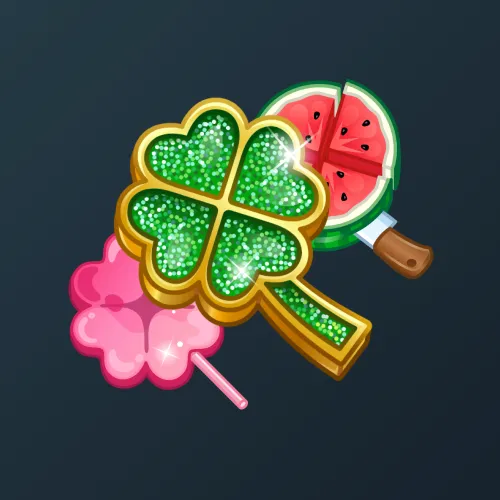

# Clover Pin

  <!-- Левая часть: карточка коллекции -->
  

    

      
    

    
Clover Pin

    
Коллекция

  

  <!-- Правая часть: информация о подарке -->
  

    
<strong>Дата выхода:</strong> 16 марта 2025 
    <strong>Цена:</strong> 100 <a href="/stars">Stars⭐️</a> 
    <strong>Тираж:</strong> 300 000 шт. 
    <strong>Дата выхода улучшений:</strong> 5 сентября 2025 
    <strong>Стоимость улучшения:</strong> от 25 до 50 000 <a href="/stars">Stars⭐️</a> 
    <strong>Улучшено:</strong> 151 663 шт. (50.6% от тиража) 
    <strong>Сожжено:</strong> 29 030 шт. (9.7% от тиража)

  

**Clover Pin** — Telegram-подарок в виде броши с зелёным листом клевера, выпущенный 16 марта 2025 года в честь ирландского праздника День святого Патрика. Изначальная стоимость составляла 100 звёзд, общий тираж — 300 000 экземпляров. До введения улучшений 5 сентября 2025 года было сожжено 29 030 подарков (9.7%). По состоянию на указанную дату улучшено 151 663 экземпляра (50.6% от тиража). Коллекция включает 50 уникальных моделей с заявленной редкостью от 0.5% до 3%.

Наиболее редкая модель коллекции — **Moon Power** — насчитывает 1 086 улучшенных экземпляров, что соответствует реальной редкости 0.72% (при заявленных 0.5%).

---

## Ключевые особенности

- При цене входа 100 Stars процент сожжённых составил 9.7%.
- Модели с заявленной редкостью 0.5% имеют фактическое количество улучшенных от 1 086 до 1 149, что выше ожидаемого (реальная редкость 0.72–0.76%).
- Модели с редкостью 3% демонстрируют равномерное распределение в диапазоне 6 774–6 945 экземпляров.

## Модели и редкость

Коллекция состоит из 50 моделей. В таблице ниже представлено фактическое количество улучшенных экземпляров по каждой модели, а также реальная редкость (рассчитанная относительно общего числа улучшенных — 151 663) и заявленная при выпуске.

| №   | Название модели     | Реальная редкость (заявленная) | Кол-во улучшенных |
| --- | ------------------- | ------------------------------- | ----------------- |
| 1   | Emo Pin             | 0.73% (0.5%)                    | 1 109             |
| 2   | Kelly Green         | 0.75% (0.5%)                    | 1 132             |
| 3   | Moon Power          | 0.72% (0.5%)                    | 1 086             |
| 4   | Sakura              | 0.76% (0.5%)                    | 1 149             |
| 5   | Tama Gadget         | 0.72% (0.5%)                    | 1 088             |
| 6   | Butterfly           | 2.24% (1.5%)                    | 3 390             |
| 7   | Cheese              | 2.23% (1.5%)                    | 3 376             |
| 8   | Corrupted           | 2.18% (1.5%)                    | 3 305             |
| 9   | Merrow              | 2.19% (1.5%)                    | 3 328             |
| 10  | Pepperoni           | 2.24% (1.5%)                    | 3 396             |
| 11  | Balloon             | 3.00% (2.0%)                    | 4 553             |
| 12  | Berry Waffle        | 3.06% (2.0%)                    | 4 637             |
| 13  | Crystal Hearts      | 3.07% (2.0%)                    | 4 659             |
| 14  | Fabulous            | 3.10% (2.0%)                    | 4 702             |
| 15  | Fortune Cookie      | 3.00% (2.0%)                    | 4 550             |
| 16  | Fortune Meter       | 2.92% (2.0%)                    | 4 435             |
| 17  | Four Wishes         | 3.01% (2.0%)                    | 4 561             |
| 18  | Frutiger Aero       | 3.03% (2.0%)                    | 4 598             |
| 19  | Golden Ale          | 3.00% (2.0%)                    | 4 543             |
| 20  | Golden Ticket       | 3.01% (2.0%)                    | 4 573             |
| 21  | Good Boy            | 2.97% (2.0%)                    | 4 498             |
| 22  | Hot Brand           | 3.04% (2.0%)                    | 4 611             |
| 23  | Ice Cream           | 3.02% (2.0%)                    | 4 582             |
| 24  | Joystick            | 2.98% (2.0%)                    | 4 526             |
| 25  | Kaleidoscope        | 3.05% (2.0%)                    | 4 630             |
| 26  | Lava Lamp           | 2.95% (2.0%)                    | 4 477             |
| 27  | Lollipop            | 3.02% (2.0%)                    | 4 581             |
| 28  | Maple Leaf          | 3.07% (2.0%)                    | 4 651             |
| 29  | Needlework          | 2.96% (2.0%)                    | 4 486             |
| 30  | Orange Juice        | 3.02% (2.0%)                    | 4 576             |
| 31  | Pinwheel            | 2.91% (2.0%)                    | 4 416             |
| 32  | Purrfect Paw        | 2.93% (2.0%)                    | 4 441             |
| 33  | Rose Quartz         | 3.02% (2.0%)                    | 4 584             |
| 34  | Ruby Clover         | 3.00% (2.0%)                    | 4 547             |
| 35  | Sangria             | 3.07% (2.0%)                    | 4 650             |
| 36  | Soap Bubbles        | 2.95% (2.0%)                    | 4 477             |
| 37  | Stained Glass       | 2.97% (2.0%)                    | 4 508             |
| 38  | Star Princess       | 3.07% (2.0%)                    | 4 652             |
| 39  | Vinyl Record        | 2.95% (2.0%)                    | 4 477             |
| 40  | Watermelon          | 3.07% (2.0%)                    | 4 653             |
| 41  | Buy Low             | 4.53% (3.0%)                    | 6 874             |
| 42  | Celtic Knot         | 4.55% (3.0%)                    | 6 898             |
| 43  | Glass Rainbow       | 4.55% (3.0%)                    | 6 900             |
| 44  | Matrix              | 4.55% (3.0%)                    | 6 906             |
| 45  | Nebula              | 4.50% (3.0%)                    | 6 821             |
| 46  | Peacock             | 4.50% (3.0%)                    | 6 819             |
| 47  | Red Tartan          | 4.53% (3.0%)                    | 6 870             |
| 48  | Sell High           | 4.47% (3.0%)                    | 6 774             |
| 49  | Top Student         | 4.58% (3.0%)                    | 6 945             |
| 50  | Verdant Plaid       | 4.52% (3.0%)                    | 6 852             |

Наиболее редкими являются модели с заявленной редкостью 0.5% — **Moon Power** (1 086), **Tama Gadget** (1 088), **Emo Pin** (1 109), **Kelly Green** (1 132) и **Sakura** (1 149). При этом реальная редкость модели **Moon Power** (0.72%) существенно выше заявленной, но количество улучшенных экземпляров — наименьшее во всей коллекции. Модели с редкостью 3% демонстрируют фактическое количество от 6 774 до 6 945, что в целом соответствует ожидаемому распределению.