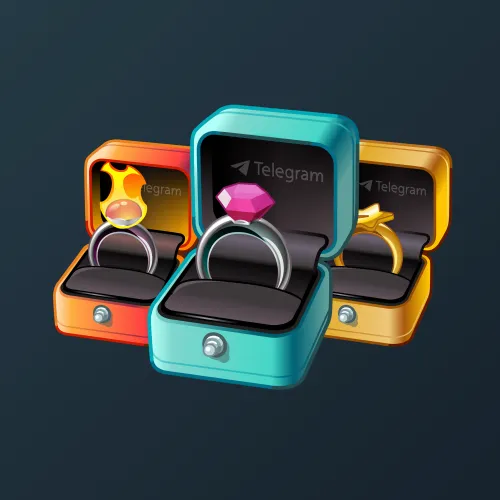

# Diamond Ring

  <!-- Левая часть: карточка коллекции -->
  

    

      
    

    
Diamond Ring

    
Коллекция

  

  <!-- Правая часть: информация о подарке -->
  

    
<strong>Дата выхода:</strong> 14 февраля 2025 
    <strong>Цена:</strong> 1 000 <a href="/stars">Stars⭐️</a> 
    <strong>Тираж:</strong> 35 000 шт. 
    <strong>Дата выхода улучшений:</strong> 14 февраля 2025 
    <strong>Стоимость улучшения:</strong> от 200 до 25 000 <a href="/stars">Stars⭐️</a> 
    <strong>Улучшено:</strong> 32 221 шт. (92.1% от тиража) 
    <strong>Сожжено:</strong> 2 076 шт. (5.9% от тиража)

  

**Diamond Ring** — коллекционный Telegram-подарок, выпущенный на День всех влюблённых 14 февраля 2025 года. Подарок выполнен в виде кольца с бриллиантом в подарочной коробке. Изначальный тираж составил 35 000 экземпляров. Улучшения стали доступны в день выхода, при этом до их введения было сожжено 2 076 подарков (5.9%). По состоянию на указанную дату улучшено 32 221 экземпляр (92.1% от тиража). Коллекция включает 100 уникальных моделей с заявленной редкостью от 0.5% до 1.5%.

Наиболее редкая модель коллекции — **Bubble Burst** — насчитывает 139 улучшенных экземпляров, что соответствует реальной редкости 0.43% (при заявленных 0.5%).

Другие NFT-кольца: <a href="/signet-ring">Signet Ring</a>, <a href="/gem-signet">Gem Signet</a>, <a href="/bonded-ring">Bonded Ring</a>.

---

## Ключевые особенности

- Высокий процент улучшенных экземпляров (92.1%) при достаточно высокой стоимости входа (1 000 Stars).
- Модели с заявленной редкостью 0.5% имеют фактическое количество улучшенных от 139 до 183, что близко к ожидаемым значениям.

## Модели и редкость

Коллекция состоит из 100 моделей. В таблице ниже представлено фактическое количество улучшенных экземпляров по каждой модели, а также реальная редкость (рассчитанная относительно общего числа улучшенных — 32 221) и заявленная при выпуске.

| №   | Название модели        | Реальная редкость (заявленная) | Кол-во улучшенных |
| --- | ---------------------- | ------------------------------- | ----------------- |
| 1   | Black Hole             | 0.49% (0.5%)                    | 159               |
| 2   | Black Thorn            | 0.47% (0.5%)                    | 150               |
| 3   | Blood Band             | 0.54% (0.5%)                    | 175               |
| 4   | Blood Orange           | 0.52% (0.5%)                    | 169               |
| 5   | Bloodstone             | 0.49% (0.5%)                    | 157               |
| 6   | Bubble Burst           | 0.43% (0.5%)                    | 139               |
| 7   | Cobalt Rose            | 0.47% (0.5%)                    | 153               |
| 8   | Cold Desire            | 0.51% (0.5%)                    | 165               |
| 9   | Cold Fusion            | 0.48% (0.5%)                    | 156               |
| 10  | Color Blocks           | 0.47% (0.5%)                    | 150               |
| 11  | Color Spray            | 0.55% (0.5%)                    | 177               |
| 12  | Couture                | 0.56% (0.5%)                    | 180               |
| 13  | Diamond                | 0.53% (0.5%)                    | 172               |
| 14  | Doodle                 | 0.52% (0.5%)                    | 168               |
| 15  | Fireball               | 0.49% (0.5%)                    | 159               |
| 16  | Firestorm              | 0.48% (0.5%)                    | 156               |
| 17  | Freehand               | 0.52% (0.5%)                    | 168               |
| 18  | Frostband              | 0.50% (0.5%)                    | 160               |
| 19  | Goldfinger             | 0.48% (0.5%)                    | 156               |
| 20  | Graffiti               | 0.51% (0.5%)                    | 163               |
| 21  | Inferno                | 0.54% (0.5%)                    | 175               |
| 22  | Iron Feather           | 0.49% (0.5%)                    | 159               |
| 23  | Line Art               | 0.46% (0.5%)                    | 147               |
| 24  | Manhattan              | 0.49% (0.5%)                    | 158               |
| 25  | Marigold               | 0.54% (0.5%)                    | 173               |
| 26  | Midnight               | 0.52% (0.5%)                    | 166               |
| 27  | Nocturne               | 0.51% (0.5%)                    | 164               |
| 28  | Obsidian               | 0.50% (0.5%)                    | 160               |
| 29  | Ocean Agate            | 0.52% (0.5%)                    | 166               |
| 30  | Ocean Gem              | 0.52% (0.5%)                    | 167               |
| 31  | Orion                  | 0.52% (0.5%)                    | 167               |
| 32  | Pink Diamond           | 0.53% (0.5%)                    | 172               |
| 33  | Pink Lover             | 0.57% (0.5%)                    | 183               |
| 34  | Pure Love              | 0.45% (0.5%)                    | 146               |
| 35  | Rainbow                | 0.47% (0.5%)                    | 153               |
| 36  | Red Velvet             | 0.48% (0.5%)                    | 156               |
| 37  | Royal Purple           | 0.53% (0.5%)                    | 170               |
| 38  | Sapphire               | 0.47% (0.5%)                    | 150               |
| 39  | Silver Smoke           | 0.45% (0.5%)                    | 145               |
| 40  | Silver Star            | 0.51% (0.5%)                    | 163               |
| 41  | Sketch                 | 0.49% (0.5%)                    | 159               |
| 42  | Snake Eye              | 0.50% (0.5%)                    | 161               |
| 43  | Tesla                  | 0.48% (0.5%)                    | 156               |
| 44  | Valentine              | 0.45% (0.5%)                    | 144               |
| 45  | Velvet Rose            | 0.50% (0.5%)                    | 161               |
| 46  | Vice City              | 0.50% (0.5%)                    | 162               |
| 47  | Whirlpool              | 0.55% (0.5%)                    | 176               |
| 48  | Eclipse                | 0.96% (1.0%)                    | 310               |
| 49  | El Dorado              | 1.03% (1.0%)                    | 333               |
| 50  | Silver Lake            | 1.05% (1.0%)                    | 338               |
| 51  | Steampunk              | 1.02% (1.0%)                    | 328               |
| 52  | Sunset                 | 0.94% (1.0%)                    | 304               |
| 53  | Twilight               | 0.97% (1.0%)                    | 311               |
| 54  | Acid Green             | 1.48% (1.5%)                    | 477               |
| 55  | Amethyst               | 1.51% (1.5%)                    | 486               |
| 56  | Arabian Night          | 1.52% (1.5%)                    | 491               |
| 57  | Aurora                 | 1.53% (1.5%)                    | 494               |
| 58  | Azurite                | 1.46% (1.5%)                    | 472               |
| 59  | Barbie Gem             | 1.43% (1.5%)                    | 461               |
| 60  | Black Amber            | 1.48% (1.5%)                    | 478               |
| 61  | Black Velvet           | 1.47% (1.5%)                    | 474               |
| 62  | Blue Pearl             | 1.60% (1.5%)                    | 514               |
| 63  | Bondi Blue             | 1.57% (1.5%)                    | 506               |
| 64  | Bronze Heart           | 1.40% (1.5%)                    | 451               |
| 65  | Canary                 | 1.47% (1.5%)                    | 475               |
| 66  | Champagne              | 1.58% (1.5%)                    | 508               |
| 67  | Citrus Shift           | 1.46% (1.5%)                    | 471               |
| 68  | Clam Shell             | 1.47% (1.5%)                    | 475               |
| 69  | Color Chaos            | 1.47% (1.5%)                    | 473               |
| 70  | Copper Rose            | 1.61% (1.5%)                    | 518               |
| 71  | Dark Orchid            | 1.43% (1.5%)                    | 460               |
| 72  | Dorodango              | 1.55% (1.5%)                    | 500               |
| 73  | Dragon Eyes            | 1.49% (1.5%)                    | 480               |
| 74  | Elven Tears            | 1.53% (1.5%)                    | 492               |
| 75  | Emerald                | 1.40% (1.5%)                    | 450               |
| 76  | Flamingo               | 1.57% (1.5%)                    | 506               |
| 77  | Forest Lake            | 1.46% (1.5%)                    | 470               |
| 78  | Glamour                | 1.52% (1.5%)                    | 490               |
| 79  | Honeydew               | 1.44% (1.5%)                    | 464               |
| 80  | Hot Pink               | 1.45% (1.5%)                    | 468               |
| 81  | Miami Beach            | 1.55% (1.5%)                    | 501               |
| 82  | Mikado Yellow          | 1.64% (1.5%)                    | 527               |
| 83  | Mint Candy             | 1.48% (1.5%)                    | 478               |
| 84  | Neon Chrome            | 1.51% (1.5%)                    | 488               |
| 85  | Nightshade             | 1.44% (1.5%)                    | 464               |
| 86  | Peridot                | 1.51% (1.5%)                    | 488               |
| 87  | Princess Cut           | 1.46% (1.5%)                    | 472               |
| 88  | Prismatic              | 1.38% (1.5%)                    | 446               |
| 89  | Quick Silver           | 1.43% (1.5%)                    | 460               |
| 90  | Red Light              | 1.59% (1.5%)                    | 512               |
| 91  | Red Wedding            | 1.40% (1.5%)                    | 451               |
| 92  | Rose Quartz            | 1.53% (1.5%)                    | 493               |
| 93  | Scrapyard              | 1.52% (1.5%)                    | 489               |
| 94  | Sovereign              | 1.51% (1.5%)                    | 487               |
| 95  | Space Steel            | 1.52% (1.5%)                    | 491               |
| 96  | Sunrise                | 1.55% (1.5%)                    | 500               |
| 97  | Topaz                  | 1.58% (1.5%)                    | 509               |
| 98  | Ultramarine            | 1.46% (1.5%)                    | 471               |
| 99  | Vintage Glam           | 1.51% (1.5%)                    | 488               |
| 100 | Water Lily             | 1.53% (1.5%)                    | 492               |

Наиболее редкими являются модели с заявленной редкостью 0.5% — **Bubble Burst** (139), **Valentine** (144), **Silver Smoke** (145), **Pure Love** (146) и **Line Art** (147). При этом реальная редкость модели **Bubble Burst** (0.43%) ниже заявленной, и это наименьшее количество улучшенных экземпляров во всей коллекции. Модели с редкостью 1.5% демонстрируют фактическое количество от 446 до 527, что в целом соответствует ожидаемому распределению.