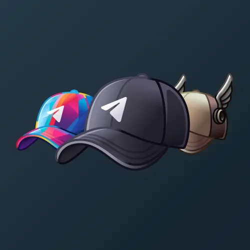

# Durov's Cap

  

    

      
    

    
Durov's Cap

    
Коллекция

  

  

    
<strong>Дата выхода:</strong> 24 ноября 2024 
    <strong>Цена:</strong> 1 000 <a href="/stars">Stars⭐️</a> 
    <strong>Тираж:</strong> 5 000 шт. 
    <strong>Дата выхода улучшений:</strong> 1 января 2025 
    <strong>Стоимость улучшения:</strong> 25 <a href="/stars">Stars⭐️</a> 
    <strong>Улучшено:</strong> 4 707 шт. (94.1% от тиража) 
    <strong>Сожжено:</strong> 226 шт. (4.5% от тиража)

  

**Durov's Cap** — Telegram-подарок, выпущенный 24 ноября 2024 года. Представляет собой стилизованную кепку, ассоциирующуюся с основателем Telegram. Коллекция включает 55 уникальных моделей с заявленной редкостью от 0.5% до 2%. Изначальный тираж составил 5 000 экземпляров. До введения улучшений 1 января 2025 года было сожжено 226 подарков (4.5%). По состоянию на указанную дату улучшено 4 707 экземпляров (94.1% от тиража). Наиболее редкая модель коллекции — **Asterix** — насчитывает 19 улучшенных экземпляров, что соответствует реальной редкости 0.40% (при заявленных 0.5%).

## Ключевые особенности

- К 31 мая 2025 года минимальная цена (флор) на вторичном рынке достигла 250 TON (около $700), что означает рост примерно в 50 раз относительно первоначальной цены в 1000 Stars.
- Высокий процент улучшенных экземпляров (94.1%) свидетельствует о востребованности коллекции среди пользователей.
- Ограниченный тираж (5 000 экземпляров) и прямая ассоциация с основателем Telegram способствуют сохранению высокой стоимости на вторичном рынке.

## Модели и редкость

Коллекция состоит из 55 моделей. В таблице ниже представлено фактическое количество улучшенных экземпляров по каждой модели, а также реальная редкость (рассчитанная относительно общего числа улучшенных — 4 707) и заявленная при выпуске.

| № | Название модели | Реальная редкость (заявленная) | Кол-во улучшенных |
|---|:---|:---|:---|
| 1 | Asterix | 0.40% (0.5%) | 19 шт. |
| 2 | Artwork | 1.04% (1.0%) | 49 шт. |
| 3 | RGB Glitch | 0.98% (1.0%) | 46 шт. |
| 4 | Captain | 1.15% (1.5%) | 54 шт. |
| 5 | Cartoon | 1.30% (1.5%) | 61 шт. |
| 6 | Cotton Candy | 1.61% (1.5%) | 76 шт. |
| 7 | Falcon | 1.44% (1.5%) | 68 шт. |
| 8 | Fun Time | 1.55% (1.5%) | 73 шт. |
| 9 | Honey Bee | 1.38% (1.5%) | 65 шт. |
| 10 | Jetspin | 1.47% (1.5%) | 69 шт. |
| 11 | Neon | 1.17% (1.5%) | 55 шт. |
| 12 | Redrum | 1.32% (1.5%) | 62 шт. |
| 13 | Snowfall | 1.55% (1.5%) | 73 шт. |
| 14 | Toxic Guy | 1.55% (1.5%) | 73 шт. |
| 15 | Tron | 1.40% (1.5%) | 66 шт. |
| 16 | Voltage | 2.04% (1.5%) | 96 шт. |
| 17 | Apple Slice | 2.06% (2.0%) | 97 шт. |
| 18 | Ashen | 2.04% (2.0%) | 96 шт. |
| 19 | Aurora | 1.70% (2.0%) | 80 шт. |
| 20 | Autumn | 1.98% (2.0%) | 93 шт. |
| 21 | Bluebird | 2.15% (2.0%) | 101 шт. |
| 22 | Bog Moss | 2.10% (2.0%) | 99 шт. |
| 23 | Bordeaux | 2.04% (2.0%) | 96 шт. |
| 24 | Candy Shade | 2.00% (2.0%) | 94 шт. |
| 25 | Chicago Bulls | 1.55% (2.0%) | 73 шт. |
| 26 | Classic | 1.72% (2.0%) | 81 шт. |
| 27 | Corkwood | 1.91% (2.0%) | 90 шт. |
| 28 | Creamsicle | 2.29% (2.0%) | 108 шт. |
| 29 | Dipper | 2.21% (2.0%) | 104 шт. |
| 30 | Duck Tales | 1.85% (2.0%) | 87 шт. |
| 31 | Duskwave | 2.29% (2.0%) | 108 шт. |
| 32 | Freshwave | 2.04% (2.0%) | 96 шт. |
| 33 | Frosted Brew | 1.93% (2.0%) | 91 шт. |
| 34 | Frosthorn | 2.15% (2.0%) | 101 шт. |
| 35 | Goldrose | 2.10% (2.0%) | 99 шт. |
| 36 | Ivory | 2.25% (2.0%) | 106 шт. |
| 37 | Jade | 1.81% (2.0%) | 85 шт. |
| 38 | Krueger | 2.40% (2.0%) | 113 шт. |
| 39 | Macintosh | 2.21% (2.0%) | 104 шт. |
| 40 | Mossy | 1.85% (2.0%) | 87 шт. |
| 41 | Negative | 1.87% (2.0%) | 88 шт. |
| 42 | Night Ivy | 1.95% (2.0%) | 92 шт. |
| 43 | Nightshade | 2.06% (2.0%) | 97 шт. |
| 44 | Patriot | 2.17% (2.0%) | 102 шт. |
| 45 | Pink Pop | 1.72% (2.0%) | 81 шт. |
| 46 | Pinkie Cap | 2.12% (2.0%) | 100 шт. |
| 47 | Pokemon | 1.93% (2.0%) | 91 шт. |
| 48 | Sea Sunset | 2.19% (2.0%) | 103 шт. |
| 49 | Seabreeze | 1.93% (2.0%) | 91 шт. |
| 50 | Sepium | 1.66% (2.0%) | 78 шт. |
| 51 | Shadeux | 2.12% (2.0%) | 100 шт. |
| 52 | Shadow | 2.34% (2.0%) | 110 шт. |
| 53 | Sky High | 2.08% (2.0%) | 98 шт. |
| 54 | Sunrise | 1.78% (2.0%) | 84 шт. |
| 55 | Villager | 2.12% (2.0%) | 100 шт. |

Наиболее редкими являются модели с заявленной редкостью 0.5% — **Asterix** (19), а также модели с редкостью 1% — **RGB Glitch** (46) и **Artwork** (49). При этом реальная редкость модели **Asterix** (0.40%) ниже заявленной, и это наименьшее количество улучшенных экземпляров во всей коллекции.