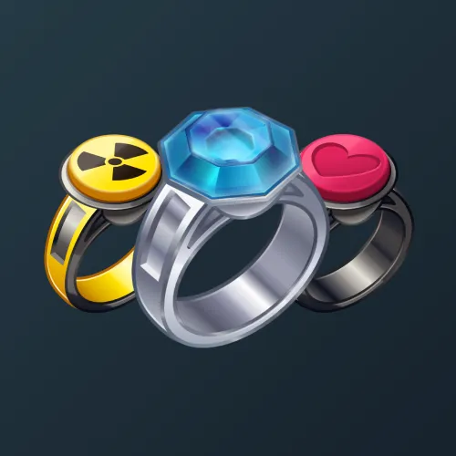

# Gem Signet

  <!-- Левая часть: карточка коллекции -->
  

    

      
    

    
Gem Signet

    
Коллекция

  

  <!-- Правая часть: информация о подарке -->
  

    
<strong>Дата выхода:</strong> 5 ноября 2024 
    <strong>Цена:</strong> 500 <a href="/stars">Stars⭐️</a> 
    <strong>Тираж:</strong> 10 000 шт. 
    <strong>Дата выхода улучшений:</strong> 19 мая 2025 
    <strong>Стоимость улучшения:</strong> от 100 до 25 000 <a href="/stars">Stars⭐️</a> 
    <strong>Улучшено:</strong> 6 144 шт. (61.4% от тиража) 
    <strong>Сожжено:</strong> 3 038 шт. (30.4% от тиража)

  

**Gem Signet** — Telegram-подарок, выпущенный 5 ноября 2024 года. Представляет собой кольцо с драгоценным камнем и является одним из первых подарков в Telegram. Коллекция включает 50 уникальных моделей с заявленной редкостью от 0.1% до 5%. Изначальный тираж составил 10 000 экземпляров. До введения улучшений 19 мая 2025 года было сожжено (обменяно на звёзды) 3 038 подарков (30.4%). По состоянию на указанную дату улучшено 6 144 экземпляра (61.4% от тиража). Стоимость улучшения варьируется от 100 до 25 000 Stars в зависимости от модели.

Наиболее редкая модель коллекции — **Spinny Boi** — насчитывает 5 улучшенных экземпляров, что соответствует реальной редкости 0.08% (при заявленных 0.1%).

---

## Ключевые особенности

- В коллекции присутствует модель **Spinny Boi** с изображением крутящегося кота из мема «О-И-И-А», которая является одной из самых редких и дорогих.
- Помимо Gem Signet, в Telegram существуют и другие коллекции колец: Signet Ring, Diamond Ring, Bonded Ring.

## Модели и редкость

Коллекция состоит из 50 моделей. В таблице ниже представлено фактическое количество улучшенных экземпляров по каждой модели, а также реальная редкость (рассчитанная относительно общего числа улучшенных — 6 144) и заявленная при выпуске.

| №   | Название модели     | Реальная редкость (заявленная) | Кол-во улучшенных |
| --- | ------------------- | ------------------------------- | ----------------- |
| 1   | Molten Core         | 0.13% (0.1%)                    | 8                 |
| 2   | Spinny Boi          | 0.08% (0.1%)                    | 5                 |
| 3   | Atomic Bomb         | 0.26% (0.2%)                    | 16                |
| 4   | Bubble Queen        | 0.21% (0.2%)                    | 13                |
| 5   | Cold Flame          | 0.13% (0.2%)                    | 8                 |
| 6   | Eternal Life        | 0.24% (0.2%)                    | 15                |
| 7   | Fire Stone          | 0.16% (0.2%)                    | 10                |
| 8   | Love Seal           | 0.20% (0.2%)                    | 12                |
| 9   | Night King          | 0.24% (0.2%)                    | 15                |
| 10  | 8 Bit Diamond       | 0.24% (0.3%)                    | 15                |
| 11  | Dragon Soul         | 0.36% (0.3%)                    | 22                |
| 12  | Paper Topaz         | 0.33% (0.3%)                    | 20                |
| 13  | Pixel Emerald       | 0.24% (0.3%)                    | 15                |
| 14  | Sunstone            | 0.26% (0.3%)                    | 16                |
| 15  | Water Lily          | 0.28% (0.3%)                    | 17                |
| 16  | Arabica             | 0.44% (0.5%)                    | 27                |
| 17  | El Dorado           | 0.70% (0.5%)                    | 43                |
| 18  | Event Horizon       | 0.46% (0.5%)                    | 28                |
| 19  | Hot Cherry          | 0.59% (0.5%)                    | 36                |
| 20  | Pearl Eye           | 0.47% (0.5%)                    | 29                |
| 21  | Timekeeper          | 0.50% (0.5%)                    | 31                |
| 22  | Arc Reactor         | 1.06% (1.2%)                    | 65                |
| 23  | Black Lotus         | 1.30% (1.5%)                    | 80                |
| 24  | Blood Opal          | 1.73% (1.5%)                    | 106               |
| 25  | Death Star          | 1.50% (1.5%)                    | 92                |
| 26  | Fading Crown        | 1.33% (1.5%)                    | 82                |
| 27  | Feral Rage          | 1.53% (1.5%)                    | 94                |
| 28  | Sentry Turret       | 1.66% (1.5%)                    | 102               |
| 29  | Bloodstone          | 1.95% (2.0%)                    | 120               |
| 30  | Jet Black           | 3.24% (3.0%)                    | 199               |
| 31  | Neon Signet         | 2.95% (3.0%)                    | 181               |
| 32  | Render              | 2.88% (3.0%)                    | 177               |
| 33  | Brass Zircon        | 3.39% (3.5%)                    | 208               |
| 34  | Old Bronze          | 3.50% (3.5%)                    | 215               |
| 35  | Amethyst            | 4.36% (4.0%)                    | 268               |
| 36  | Dark Violet         | 3.79% (4.0%)                    | 233               |
| 37  | Elven Shade         | 3.78% (4.0%)                    | 232               |
| 38  | Malachite           | 4.02% (4.0%)                    | 247               |
| 39  | Malibu Pink         | 4.23% (4.0%)                    | 260               |
| 40  | Moonstone           | 4.48% (4.0%)                    | 275               |
| 41  | Nuclear Core        | 3.96% (4.0%)                    | 243               |
| 42  | Ogre’s Kiss         | 4.17% (4.0%)                    | 256               |
| 43  | Pink Quartz         | 4.00% (4.0%)                    | 246               |
| 44  | Sapphire            | 3.66% (4.0%)                    | 225               |
| 45  | Silver Gold         | 3.61% (4.0%)                    | 222               |
| 46  | Snake Ruby          | 3.76% (4.0%)                    | 231               |
| 47  | Tanzanite           | 4.12% (4.0%)                    | 253               |
| 48  | Fleur de Mer        | 4.31% (4.2%)                    | 265               |
| 49  | Green Beryl         | 4.15% (4.2%)                    | 255               |
| 50  | Helios              | 5.18% (5.0%)                    | 318               |

Наиболее редкими являются модели с заявленной редкостью 0.1% — **Spinny Boi** (5) и **Molten Core** (8). При этом реальная редкость модели **Spinny Boi** (0.08%) ниже заявленной, и это наименьшее количество улучшенных экземпляров во всей коллекции. Также крайне редки модели группы 0.2%: **Cold Flame** (8), **Fire Stone** (10), **Love Seal** (12) и другие. В группе с редкостью 5% модель **Helios** (318) ожидаемо имеет наибольшее количество, однако её реальная редкость (5.18%) несколько превышает заявленную.