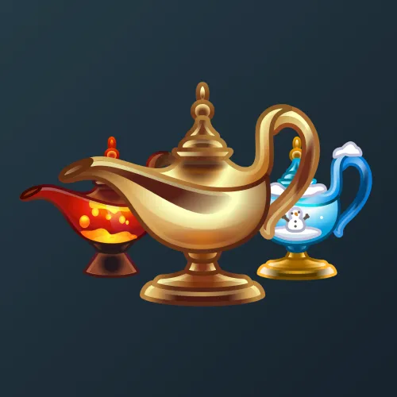

# Genie Lamp

  <!-- Левая часть: карточка коллекции -->
  

    

      
    

    
Genie Lamp

    
Коллекция

  

  <!-- Правая часть: информация о подарке -->
  

    
<strong>Дата выхода:</strong> 1 декабря 2024 
    <strong>Цена:</strong> 350 <a href="/stars">Stars⭐️</a> 
    <strong>Тираж:</strong> 15 000 шт. 
    <strong>Дата выхода улучшений:</strong> 29 января 2025 
    <strong>Стоимость улучшения:</strong> от 25 до 25 000 <a href="/stars">Stars⭐️</a> 
    <strong>Улучшено:</strong> 6 505 шт. (43.4% от тиража) 
    <strong>Сожжено:</strong> 7 334 шт. (48.9% от тиража)

  

**Genie Lamp** — Telegram-подарок в виде лампы джина, выпущенный 1 декабря 2024 года. Изначальный тираж составлял 15 000 экземпляров. До введения улучшений 29 января 2025 года было сожжено 7 334 подарка (48.9%), в результате чего осталось 7 666 экземпляров. По состоянию на указанную дату улучшено 6 505 подарков (43.4% от тиража). Коллекция включает 49 уникальных моделей с заявленной редкостью от 0.2% до 3.5%.

Наиболее редкая модель коллекции — **Aladdin** — насчитывает 11 улучшенных экземпляров, что соответствует реальной редкости 0.17% (при заявленных 0.2%).

---

## Ключевые особенности

- Почти половина тиража была сожжена до введения улучшений (48.9%).
- Модель **Aladdin** с заявленной редкостью 0.2% имеет фактическое количество улучшенных экземпляров 11, что является наименьшим показателем во всей коллекции.
- Модели с заявленной редкостью 0.5% демонстрируют значительный разброс: от 30 до 70 улучшенных экземпляров.
- В группе 3.5% разброс количества составляет от 206 до 265, что близко к ожидаемым значениям.

## Модели и редкость

Коллекция состоит из 49 моделей. В таблице ниже представлено фактическое количество улучшенных экземпляров по каждой модели, а также реальная редкость (рассчитанная относительно общего числа улучшенных — 6 505) и заявленная при выпуске.

| №   | Название модели        | Реальная редкость (заявленная) | Кол-во улучшенных |
| --- | ---------------------- | ------------------------------- | ----------------- |
| 1   | Aladdin                | 0.17% (0.2%)                    | 11                |
| 2   | Cat Spirit             | 0.48% (0.5%)                    | 31                |
| 3   | Lava Lamp              | 1.08% (0.5%)                    | 70                |
| 4   | Lightning              | 0.58% (0.5%)                    | 38                |
| 5   | Snow Globe             | 0.46% (0.5%)                    | 30                |
| 6   | Space Travel           | 0.51% (0.5%)                    | 33                |
| 7   | Tea Time               | 0.60% (0.5%)                    | 39                |
| 8   | Arctic Winds           | 1.09% (1.0%)                    | 71                |
| 9   | Goldfish               | 1.03% (1.0%)                    | 67                |
| 10  | Herbal Wind            | 0.83% (1.0%)                    | 54                |
| 11  | Liquid Cat             | 1.17% (1.0%)                    | 76                |
| 12  | Lost Souls             | 0.98% (1.0%)                    | 64                |
| 13  | Star Dust              | 0.97% (1.0%)                    | 63                |
| 14  | Sweet Desire           | 0.81% (1.0%)                    | 53                |
| 15  | Thunder                | 1.15% (1.0%)                    | 75                |
| 16  | Witch’s Secret         | 1.41% (1.3%)                    | 92                |
| 17  | Flammable              | 1.72% (1.5%)                    | 112               |
| 18  | Inflated               | 1.35% (1.5%)                    | 88                |
| 19  | Monstrous              | 1.54% (1.5%)                    | 100               |
| 20  | Piggy Bank             | 1.43% (1.5%)                    | 93                |
| 21  | To The Moon            | 1.52% (1.5%)                    | 99                |
| 22  | Astral Planes          | 1.81% (2.0%)                    | 118               |
| 23  | Blue Neon              | 2.21% (2.0%)                    | 144               |
| 24  | Crypto Dream           | 2.14% (2.0%)                    | 139               |
| 25  | Love Thirst            | 1.92% (2.0%)                    | 125               |
| 26  | Meowgical              | 1.74% (2.0%)                    | 113               |
| 27  | Night’s Wish           | 1.94% (2.0%)                    | 126               |
| 28  | Star Power             | 1.91% (2.0%)                    | 124               |
| 29  | Arabian Night          | 2.83% (3.0%)                    | 184               |
| 30  | Blueprint              | 2.83% (3.0%)                    | 184               |
| 31  | Bronze Dust            | 3.09% (3.0%)                    | 201               |
| 32  | Copper Pot             | 2.97% (3.0%)                    | 193               |
| 33  | Dark Silver            | 3.01% (3.0%)                    | 196               |
| 34  | Enigma                 | 2.98% (3.0%)                    | 194               |
| 35  | Eternal Smoke          | 3.35% (3.0%)                    | 218               |
| 36  | Jade Lantern           | 2.67% (3.0%)                    | 174               |
| 37  | Lime Art               | 3.12% (3.0%)                    | 203               |
| 38  | Moonlight              | 3.01% (3.0%)                    | 196               |
| 39  | Mystic Aura            | 2.71% (3.0%)                    | 176               |
| 40  | Red Devil              | 3.06% (3.0%)                    | 199               |
| 41  | Red Sketch             | 2.92% (3.0%)                    | 190               |
| 42  | Sunset Rays            | 2.91% (3.0%)                    | 189               |
| 43  | Sunshine               | 2.78% (3.0%)                    | 181               |
| 44  | White Sprite           | 2.89% (3.0%)                    | 188               |
| 45  | Chrome                 | 3.46% (3.5%)                    | 225               |
| 46  | Gold Tarnish           | 4.07% (3.5%)                    | 265               |
| 47  | Golden Flame           | 4.01% (3.5%)                    | 261               |
| 48  | Persian Dawn           | 3.17% (3.5%)                    | 206               |
| 49  | Sahara                 | 3.69% (3.5%)                    | 240               |

Наиболее редкими являются модели с заявленной редкостью 0.2–0.5% — **Aladdin** (11), **Snow Globe** (30), **Cat Spirit** (31), **Space Travel** (33) и **Lightning** (38). При этом реальная редкость модели **Aladdin** (0.17%) ниже заявленной, и это наименьшее количество улучшенных экземпляров во всей коллекции. Модели с редкостью 3.5% демонстрируют фактическое количество от 206 до 265, что в целом соответствует ожидаемому распределению.