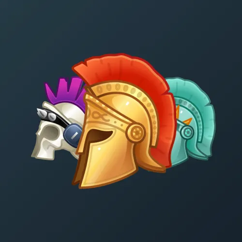

# Heroic Helmet

  <!-- Левая часть: карточка коллекции -->
  

    

      
    

    
Heroic Helmet

    
Коллекция

  

  <!-- Правая часть: информация о подарке -->
  

    
<strong>Дата выхода:</strong> 23 февраля 2025 
    <strong>Цена:</strong> 5 000 <a href="/stars">Stars⭐️</a> 
    <strong>Тираж:</strong> 8 000 шт. 
    <strong>Дата выхода улучшений:</strong> 25 мая 2025 
    <strong>Стоимость улучшения:</strong> от 1 000 до 25 000 <a href="/stars">Stars⭐️</a> 
    <strong>Улучшено:</strong> 3 412 шт. (42.7% от тиража) 
    <strong>Сожжено:</strong> 4 206 шт. (52.6% от тиража)

  

**Heroic Helmet** — Telegram-подарок в виде шлема гладиатора, выпущенный 23 февраля 2025 года. Изначальный тираж составлял 8 000 экземпляров. До введения улучшений 25 мая 2025 года было сожжено 4 206 подарков (52.6%), в результате чего осталось 3 794 экземпляра. По состоянию на указанную дату улучшено 3 412 подарков (42.7% от тиража). Коллекция включает 53 уникальные модели с заявленной редкостью от 1% до 3%.

Наиболее редкая модель коллекции — **Hard Rock** — насчитывает 28 улучшенных экземпляров, что соответствует реальной редкости 0.82% (при заявленных 1%).

---

## Ключевые особенности

- Более половины тиража (52.6%) было сожжено до введения улучшений.
- Модели с заявленной редкостью 1% имеют фактическое количество улучшенных от 28 до 39, при этом минимальное значение у **Hard Rock** (28).
- В группе 3% разброс количества составляет от 96 до 116, что близко к ожидаемым значениям.

## Модели и редкость

Коллекция состоит из 53 моделей. В таблице ниже представлено фактическое количество улучшенных экземпляров по каждой модели, а также реальная редкость (рассчитанная относительно общего числа улучшенных — 3 412) и заявленная при выпуске.

| №   | Название модели        | Реальная редкость (заявленная) | Кол-во улучшенных |
| --- | ---------------------- | ------------------------------- | ----------------- |
| 1   | Cyberpunk              | 1.11% (1.0%)                    | 38                |
| 2   | Dynamo                 | 1.14% (1.0%)                    | 39                |
| 3   | Equalizer              | 1.00% (1.0%)                    | 34                |
| 4   | Frozen Aegis           | 0.88% (1.0%)                    | 30                |
| 5   | Hard Rock              | 0.82% (1.0%)                    | 28                |
| 6   | Pickelhaube            | 0.88% (1.0%)                    | 30                |
| 7   | Punk Skull             | 0.88% (1.0%)                    | 30                |
| 8   | Bounty Hunter          | 1.61% (1.5%)                    | 55                |
| 9   | Chainsaw               | 1.44% (1.5%)                    | 49                |
| 10  | Inferno                | 1.47% (1.5%)                    | 50                |
| 11  | King Leonidas          | 1.93% (1.5%)                    | 66                |
| 12  | Maya Warrior           | 1.52% (1.5%)                    | 52                |
| 13  | Nekonidas              | 1.61% (1.5%)                    | 55                |
| 14  | Neon Legion            | 2.02% (1.5%)                    | 69                |
| 15  | Unicorn                | 1.49% (1.5%)                    | 51                |
| 16  | Atlantis               | 1.82% (2.0%)                    | 62                |
| 17  | Biker Warrior          | 1.64% (2.0%)                    | 56                |
| 18  | Black Thorn            | 2.11% (2.0%)                    | 72                |
| 19  | Blue Parrot            | 2.02% (2.0%)                    | 69                |
| 20  | Galea Alba             | 2.26% (2.0%)                    | 77                |
| 21  | Giraffe                | 1.73% (2.0%)                    | 59                |
| 22  | Happy Frog             | 2.40% (2.0%)                    | 82                |
| 23  | King Midas             | 1.67% (2.0%)                    | 57                |
| 24  | Ladybug                | 1.55% (2.0%)                    | 53                |
| 25  | Pale Guard             | 2.46% (2.0%)                    | 84                |
| 26  | Pancake                | 2.29% (2.0%)                    | 78                |
| 27  | Praetorian             | 2.49% (2.0%)                    | 85                |
| 28  | Quackus                | 2.14% (2.0%)                    | 73                |
| 29  | Skeleton               | 1.88% (2.0%)                    | 64                |
| 30  | Son of Ares            | 1.49% (2.0%)                    | 51                |
| 31  | Steampunk              | 1.82% (2.0%)                    | 62                |
| 32  | Watermelon             | 2.17% (2.0%)                    | 74                |
| 33  | Aphrodite              | 2.43% (2.5%)                    | 83                |
| 34  | Bengal Tiger           | 2.81% (2.5%)                    | 96                |
| 35  | Centurion              | 2.67% (2.5%)                    | 91                |
| 36  | Chieftain              | 2.29% (2.5%)                    | 78                |
| 37  | Gladiator              | 2.20% (2.5%)                    | 75                |
| 38  | Hard Hat               | 2.90% (2.5%)                    | 99                |
| 39  | Hippotigris            | 2.20% (2.5%)                    | 75                |
| 40  | Liberty                | 2.29% (2.5%)                    | 78                |
| 41  | Mercurial              | 2.40% (2.5%)                    | 82                |
| 42  | Milk Legend            | 2.43% (2.5%)                    | 83                |
| 43  | Mythic Green           | 2.49% (2.5%)                    | 85                |
| 44  | Old Leather            | 2.20% (2.5%)                    | 75                |
| 45  | Phoenix                | 1.99% (2.5%)                    | 68                |
| 46  | Spartan                | 2.34% (2.5%)                    | 80                |
| 47  | Aegean Sea             | 3.25% (3.0%)                    | 111               |
| 48  | Ancient Gold           | 3.19% (3.0%)                    | 109               |
| 49  | Athena                 | 3.40% (3.0%)                    | 116               |
| 50  | Desert Camo            | 2.81% (3.0%)                    | 96                |

Наиболее редкими являются модели с заявленной редкостью 1% — **Hard Rock** (28), **Frozen Aegis** (30), **Pickelhaube** (30), **Punk Skull** (30) и **Equalizer** (34). При этом реальная редкость модели **Hard Rock** (0.82%) ниже заявленной, и это наименьшее количество улучшенных экземпляров во всей коллекции. Модели с редкостью 3% демонстрируют фактическое количество от 96 до 116, что в целом соответствует ожидаемому распределению.