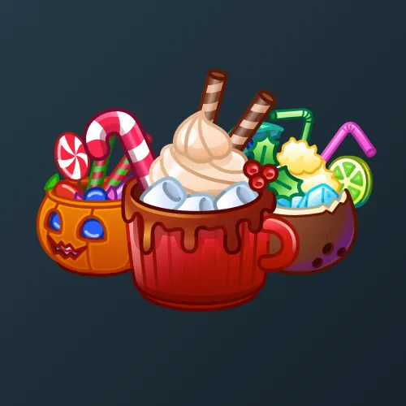

# Holiday Drink

  <!-- Левая часть: карточка коллекции -->
  

    

      
    

    
Holiday Drink

    
Коллекция

  

  <!-- Правая часть: информация о подарке -->
  

    
<strong>Дата выхода:</strong> 23 декабря 2024 
    <strong>Цена:</strong> 25 <a href="/stars">Stars⭐️</a> 
    <strong>Тираж:</strong> 200 000 шт. 
    <strong>Дата выхода улучшений:</strong> 13 мая 2025 
    <strong>Стоимость улучшения:</strong> от 25 до 25 000 <a href="/stars">Stars⭐️</a> 
    <strong>Улучшено:</strong> 84 060 шт. (42.0% от тиража) 
    <strong>Сожжено:</strong> 79 011 шт. (39.5% от тиража)

  

**Holiday Drink** — Telegram-подарок, выпущенный 23 декабря 2024 года. Представляет собой праздничный напиток со сладостями и относится к новогодней серии подарков Telegram, состоящей из 6 экземпляров. Коллекция включает 50 уникальных моделей с заявленной редкостью от 0.1% до 5%. Изначальный тираж составил 200 000 экземпляров. До введения улучшений 13 мая 2025 года было сожжено (обменяно на звёзды) 79 011 подарков (39.5%). По состоянию на указанную дату улучшено 84 060 экземпляров (42.0% от тиража). Стоимость улучшения варьируется от 25 до 25 000 Stars в зависимости от модели.

Наиболее редкая модель коллекции — **Gold Dust** — насчитывает 85 улучшенных экземпляров, что соответствует реальной редкости 0.10% (при заявленных 0.1%).

---

## Модели и редкость

Коллекция состоит из 50 моделей. В таблице ниже представлено фактическое количество улучшенных экземпляров по каждой модели, а также реальная редкость (рассчитанная относительно общего числа улучшенных — 84 060) и заявленная при выпуске.

| №   | Название модели     | Реальная редкость (заявленная) | Кол-во улучшенных |
| --- | ------------------- | ------------------------------- | ----------------- |
| 1   | Gold Dust           | 0.10% (0.1%)                    | 85                |
| 2   | Cyber Mix           | 0.22% (0.2%)                    | 183               |
| 3   | Brain Gum           | 0.37% (0.4%)                    | 311               |
| 4   | Depresso            | 0.42% (0.4%)                    | 357               |
| 5   | Honolulu            | 0.38% (0.4%)                    | 318               |
| 6   | Ogre Latte          | 0.38% (0.4%)                    | 321               |
| 7   | Pumpkin Juice       | 0.40% (0.4%)                    | 333               |
| 8   | Mermaid             | 0.51% (0.5%)                    | 431               |
| 9   | Darkside            | 0.64% (0.6%)                    | 534               |
| 10  | Fish Basket         | 0.62% (0.6%)                    | 525               |
| 11  | Lizard Blood        | 0.65% (0.6%)                    | 546               |
| 12  | Milky Way           | 0.61% (0.6%)                    | 511               |
| 13  | Emo Drip            | 0.95% (0.9%)                    | 800               |
| 14  | Leprechaun          | 0.92% (0.9%)                    | 771               |
| 15  | Checkmate           | 0.99% (1.0%)                    | 831               |
| 16  | Toxic Waste         | 1.24% (1.2%)                    | 1 041             |
| 17  | Area 51             | 1.29% (1.3%)                    | 1 082             |
| 18  | Blue Taser          | 1.31% (1.3%)                    | 1 101             |
| 19  | Bowser Brew         | 1.27% (1.3%)                    | 1 066             |
| 20  | Mr. Freeze          | 1.26% (1.3%)                    | 1 063             |
| 21  | Crystal Shot        | 1.37% (1.4%)                    | 1 151             |
| 22  | Cubism              | 1.43% (1.4%)                    | 1 198             |
| 23  | Fire Chariot        | 1.38% (1.4%)                    | 1 156             |
| 24  | Flaming B-52        | 1.40% (1.4%)                    | 1 177             |
| 25  | Love Potion         | 1.43% (1.4%)                    | 1 198             |
| 26  | Lucid Roast         | 1.35% (1.4%)                    | 1 136             |
| 27  | Candyman            | 1.45% (1.5%)                    | 1 217             |
| 28  | Stickers            | 1.54% (1.5%)                    | 1 294             |
| 29  | Berry Pixel         | 1.58% (1.6%)                    | 1 326             |
| 30  | Peach Latte         | 1.74% (1.7%)                    | 1 459             |
| 31  | Low Poly            | 1.74% (1.8%)                    | 1 461             |
| 32  | Kiwi Box            | 1.87% (1.9%)                    | 1 572             |
| 33  | Orange Ghost        | 2.42% (2.4%)                    | 2 036             |
| 34  | Hot Fuchsia         | 2.57% (2.6%)                    | 2 159             |
| 35  | Cotton Candy        | 2.68% (2.7%)                    | 2 249             |
| 36  | Honeyfire           | 3.19% (3.0%)                    | 2 680             |
| 37  | Ginger Joker        | 3.00% (3.1%)                    | 2 521             |
| 38  | Matcha              | 3.23% (3.2%)                    | 2 716             |
| 39  | Hibiscus Tea        | 3.19% (3.3%)                    | 2 683             |
| 40  | Lavender Tea        | 3.44% (3.4%)                    | 2 892             |
| 41  | Moonberry           | 3.53% (3.5%)                    | 2 967             |
| 42  | Marigold            | 3.64% (3.6%)                    | 3 064             |
| 43  | Citrus              | 3.74% (3.7%)                    | 3 140             |
| 44  | Bubblegum           | 3.96% (3.9%)                    | 3 332             |
| 45  | Choco Mint          | 4.51% (4.5%)                    | 3 790             |
| 46  | Black Russian       | 4.67% (4.7%)                    | 3 922             |
| 47  | Rose Velvet         | 4.88% (4.8%)                    | 4 106             |
| 48  | Banana Split        | 4.77% (4.9%)                    | 4 012             |
| 49  | Mango Blast         | 4.93% (4.9%)                    | 4 145             |
| 50  | Apple Mousse        | 4.90% (5.0%)                    | 4 123             |

Наиболее редкими являются модели с заявленной редкостью 0.1% — **Gold Dust** (85) и с редкостью 0.2% — **Cyber Mix** (183). При этом реальная редкость модели **Gold Dust** (0.10%) практически совпадает с заявленной, и это наименьшее количество улучшенных экземпляров во всей коллекции. Модели с редкостью 5% — **Apple Mousse** (4 123) и **Mango Blast** (4 145) — ожидаемо имеют наибольшее количество, при этом реальная редкость **Mango Blast** (4.93%) близка к заявленной, а **Apple Mousse** (4.90%) — чуть ниже.