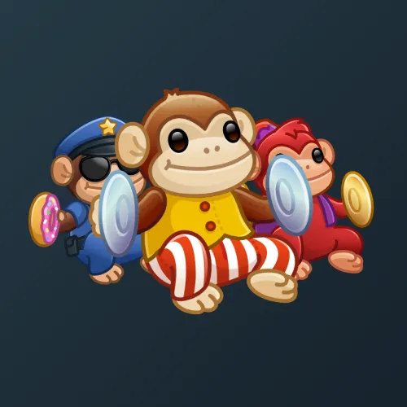

# Jolly Chimp

  <!-- Левая часть: карточка коллекции -->
  

    

      
    

    
Jolly Chimp

    
Коллекция

  

  <!-- Правая часть: информация о подарке -->
  

    
<strong>Дата выхода:</strong> 1 апреля 2025 
    <strong>Цена:</strong> 200 <a href="/stars">Stars⭐️</a> 
    <strong>Тираж:</strong> 150 000 шт. 
    <strong>Дата выхода улучшений:</strong> 11 августа 2025 
    <strong>Стоимость улучшения:</strong> от 25 до 25 000 <a href="/stars">Stars⭐️</a> 
    <strong>Улучшено:</strong> 115 971 шт. (77.3% от тиража) 
    <strong>Сожжено:</strong> 17 845 шт. (11.9% от тиража)

  

**Jolly Chimp** — Telegram-подарок, выпущенный 1 апреля 2025 года в честь Дня Дураков. Представляет собой весёлого шимпанзе с тарелками. Коллекция включает 50 уникальных моделей с заявленной редкостью от 0.5% до 3%. Изначальный тираж составил 150 000 экземпляров. До введения улучшений 11 августа 2025 года было сожжено (обменяно на звёзды) 17 845 подарков (11.9%). По состоянию на указанную дату улучшено 115 971 экземпляр (77.3% от тиража). Стоимость улучшения варьируется от 25 до 25 000 Stars в зависимости от модели.

Наиболее редкая модель коллекции — **Golden Monkey** — насчитывает 554 улучшенных экземпляра, что соответствует реальной редкости 0.48% (при заявленных 0.5%).

---

## Модели и редкость

Коллекция состоит из 50 моделей. В таблице ниже представлено фактическое количество улучшенных экземпляров по каждой модели, а также реальная редкость (рассчитанная относительно общего числа улучшенных — 115 971) и заявленная при выпуске.

| №   | Название модели     | Реальная редкость (заявленная) | Кол-во улучшенных |
| --- | ------------------- | ------------------------------- | ----------------- |
| 1   | Chimpool            | 0.52% (0.5%)                    | 602               |
| 2   | Golden Monkey       | 0.48% (0.5%)                    | 554               |
| 3   | Liberation          | 0.54% (0.5%)                    | 632               |
| 4   | Smash King          | 0.51% (0.5%)                    | 596               |
| 5   | Tired Primate       | 0.49% (0.5%)                    | 571               |
| 6   | Cherub              | 0.96% (1.0%)                    | 1 109             |
| 7   | Count Macaqula      | 1.03% (1.0%)                    | 1 189             |
| 8   | La Baboon           | 0.99% (1.0%)                    | 1 149             |
| 9   | Olympia             | 1.03% (1.0%)                    | 1 192             |
| 10  | Ape Puppet          | 1.53% (1.5%)                    | 1 769             |
| 11  | Bank Robber         | 1.50% (1.5%)                    | 1 741             |
| 12  | Busy Mom            | 1.49% (1.5%)                    | 1 732             |
| 13  | Chimp Imp           | 1.58% (1.5%)                    | 1 832             |
| 14  | Gravity Bangs       | 1.45% (1.5%)                    | 1 676             |
| 15  | Jason               | 1.52% (1.5%)                    | 1 758             |
| 16  | Robo Kong           | 1.47% (1.5%)                    | 1 703             |
| 17  | Silverback          | 1.44% (1.5%)                    | 1 669             |
| 18  | Abubu               | 1.90% (2.0%)                    | 2 205             |
| 19  | Bananas             | 2.05% (2.0%)                    | 2 375             |
| 20  | Belle Bang          | 1.95% (2.0%)                    | 2 265             |
| 21  | Cavegirl            | 1.93% (2.0%)                    | 2 244             |
| 22  | Caveman             | 2.01% (2.0%)                    | 2 333             |
| 23  | French Cafe         | 1.98% (2.0%)                    | 2 292             |
| 24  | Genie               | 2.02% (2.0%)                    | 2 341             |
| 25  | Hex Witch           | 2.03% (2.0%)                    | 2 352             |
| 26  | Knight              | 1.99% (2.0%)                    | 2 313             |
| 27  | Little Sister       | 2.03% (2.0%)                    | 2 352             |
| 28  | Monkey Mouse        | 1.93% (2.0%)                    | 2 235             |
| 29  | Retro Cartoon       | 2.04% (2.0%)                    | 2 366             |
| 30  | Shaman              | 2.03% (2.0%)                    | 2 358             |
| 31  | Alarm Ape           | 2.57% (2.5%)                    | 2 983             |
| 32  | Crystal             | 2.54% (2.5%)                    | 2 948             |
| 33  | Fool King           | 2.47% (2.5%)                    | 2 866             |
| 34  | Grayscale           | 2.47% (2.5%)                    | 2 864             |
| 35  | Hot Springs         | 2.44% (2.5%)                    | 2 826             |
| 36  | Howler              | 2.50% (2.5%)                    | 2 900             |
| 37  | Luminous            | 2.51% (2.5%)                    | 2 908             |
| 38  | Policeman           | 2.50% (2.5%)                    | 2 903             |
| 39  | Toddler             | 2.58% (2.5%)                    | 2 994             |
| 40  | Artist              | 3.03% (3.0%)                    | 3 515             |
| 41  | Baby Kong           | 3.10% (3.0%)                    | 3 593             |
| 42  | Bellboy             | 2.93% (3.0%)                    | 3 402             |
| 43  | Clash Elixir        | 3.01% (3.0%)                    | 3 493             |
| 44  | Coco Lime           | 2.98% (3.0%)                    | 3 458             |
| 45  | Early Adopter       | 2.97% (3.0%)                    | 3 449             |
| 46  | Farm Girl           | 2.95% (3.0%)                    | 3 422             |
| 47  | Jungle Pop          | 3.01% (3.0%)                    | 3 496             |
| 48  | Patchwork           | 3.08% (3.0%)                    | 3 568             |
| 49  | Snow Yeti           | 2.94% (3.0%)                    | 3 407             |
| 50  | Tourist             | 3.01% (3.0%)                    | 3 494             |

Наиболее редкими являются модели с заявленной редкостью 0.5% — **Golden Monkey** (554), **Tired Primate** (571), **Smash King** (596) и **Chimpool** (602). При этом реальная редкость модели **Golden Monkey** (0.48%) ниже заявленной, и это наименьшее количество улучшенных экземпляров во всей коллекции. В группе с редкостью 3% наибольшее количество демонстрируют **Baby Kong** (3 593) и **Patchwork** (3 568), что соответствует реальной редкости около 3.10% и 3.08% — выше заявленной, тогда как **Bellboy** (3 402) с редкостью 2.93% находится у нижней границы.