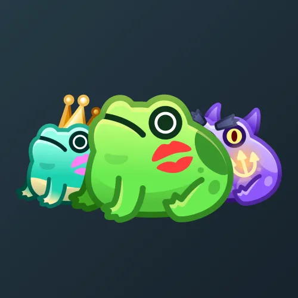

# Kissed Frog

  <!-- Левая часть: карточка коллекции -->
  

    

      
    

    
Kissed Frog

    
Коллекция

  

  <!-- Правая часть: информация о подарке -->
  

    
<strong>Дата выхода:</strong> 1 ноября 2024 
    <strong>Цена:</strong> 15 <a href="/stars">Stars⭐️</a> 
    <strong>Тираж:</strong> 15 000 шт. 
    <strong>Дата выхода улучшений:</strong> 1 января 2025 
    <strong>Стоимость улучшения:</strong> 25 <a href="/stars">Stars⭐️</a> 
    <strong>Улучшено:</strong> 14 063 шт. (93.8% от тиража) 
    <strong>Сожжено:</strong> 722 шт. (4.8% от тиража)

  

**Kissed Frog** — Telegram-подарок, выпущенный 1 ноября 2024 года в честь Хэллоуина. Представляет собой лягушку с поцелуем. Коллекция включает 49 уникальных моделей с заявленной редкостью от 0.5% до 4%. Изначальный тираж составил 15 000 экземпляров. До введения улучшений 1 января 2025 года было сожжено (обменяно на звёзды) 722 подарка (4.8%). По состоянию на указанную дату улучшено 14 063 экземпляра (93.8% от тиража). Стоимость улучшения фиксирована и составляет 25 Stars для всех моделей.

Наиболее редкая модель коллекции — **Count Croakula** — насчитывает 58 улучшенных экземпляров, что соответствует реальной редкости 0.41% (при заявленных 0.5%).

---

## Ключевые особенности

- Коллекция характеризуется крайне высоким процентом улучшенных экземпляров (93.8%) при минимальном количестве сожжённых (всего 4.8% от тиража), что обусловлено незначительным обменом подарков на звёзды до введения улучшений.

## Модели и редкость

Коллекция состоит из 49 моделей. В таблице ниже представлено фактическое количество улучшенных экземпляров по каждой модели, а также реальная редкость (рассчитанная относительно общего числа улучшенных — 14 063) и заявленная при выпуске.

| №   | Название модели     | Реальная редкость (заявленная) | Кол-во улучшенных |
| --- | ------------------- | ------------------------------- | ----------------- |
| 1   | Brewtoad            | 0.46% (0.5%)                    | 65                |
| 2   | Count Croakula      | 0.41% (0.5%)                    | 58                |
| 3   | Frogmaid            | 0.49% (0.5%)                    | 69                |
| 4   | Happy Pepe          | 0.57% (0.5%)                    | 80                |
| 5   | Honeyhop            | 0.51% (0.5%)                    | 72                |
| 6   | Lilie Pond          | 0.44% (0.5%)                    | 62                |
| 7   | Lucifrog            | 0.56% (0.5%)                    | 79                |
| 8   | Melty Butter        | 0.46% (0.5%)                    | 64                |
| 9   | Puddles             | 0.50% (0.5%)                    | 70                |
| 10  | Rocky Hopper        | 0.45% (0.5%)                    | 63                |
| 11  | Sweet Dream         | 0.63% (0.5%)                    | 88                |
| 12  | Tree Frog           | 0.48% (0.5%)                    | 68                |
| 13  | Zodiak Croak        | 0.52% (0.5%)                    | 73                |
| 14  | Icefrog             | 1.09% (1.0%)                    | 153               |
| 15  | Lava Leap           | 1.12% (1.0%)                    | 157               |
| 16  | Pond Fairy          | 0.92% (1.0%)                    | 129               |
| 17  | Tesla Frog          | 0.92% (1.0%)                    | 129               |
| 18  | Trixie              | 0.98% (1.0%)                    | 138               |
| 19  | Boingo              | 1.42% (1.5%)                    | 199               |
| 20  | Cupid               | 1.44% (1.5%)                    | 202               |
| 21  | Desert Frog         | 1.74% (1.5%)                    | 245               |
| 22  | Hopberry            | 1.49% (1.5%)                    | 210               |
| 23  | Ms. Toad            | 1.61% (1.5%)                    | 227               |
| 24  | Prince Ribbit       | 1.55% (1.5%)                    | 218               |
| 25  | Toadstool           | 1.45% (1.5%)                    | 204               |
| 26  | Bronze              | 2.11% (2.0%)                    | 297               |
| 27  | Silver              | 1.88% (2.0%)                    | 264               |
| 28  | Duskhopper          | 2.48% (2.5%)                    | 349               |
| 29  | Ectobloom           | 2.53% (2.5%)                    | 356               |
| 30  | Ectofrog            | 2.53% (2.5%)                    | 356               |
| 31  | Lemon Drop          | 2.36% (2.5%)                    | 332               |
| 32  | Minty Bloom         | 2.65% (2.5%)                    | 372               |
| 33  | Poison              | 2.37% (2.5%)                    | 333               |
| 34  | Ramune              | 2.56% (2.5%)                    | 360               |
| 35  | Sarutoad            | 2.53% (2.5%)                    | 356               |
| 36  | Starry Night        | 2.73% (2.5%)                    | 384               |
| 37  | Void Hopper         | 2.60% (2.5%)                    | 365               |
| 38  | Banana Pox          | 2.99% (3.0%)                    | 420               |
| 39  | Frogtart            | 3.04% (3.0%)                    | 428               |
| 40  | Melon               | 3.04% (3.0%)                    | 428               |
| 41  | Brownie             | 3.86% (4.0%)                    | 543               |
| 42  | Cranberry           | 3.90% (4.0%)                    | 549               |
| 43  | Frogwave            | 3.99% (4.0%)                    | 561               |
| 44  | Lemon Juice         | 4.22% (4.0%)                    | 594               |
| 45  | Lily Pond           | 4.06% (4.0%)                    | 571               |
| 46  | Peach               | 3.69% (4.0%)                    | 519               |
| 47  | Sea Breeze          | 4.00% (4.0%)                    | 563               |
| 48  | Sky Leaper          | 3.80% (4.0%)                    | 534               |
| 49  | Tide Pod            | 3.80% (4.0%)                    | 535               |
| 50  | Toadberry           | 4.07% (4.0%)                    | 572               |

Наиболее редкими являются модели с заявленной редкостью 0.5% — **Count Croakula** (58), **Lilie Pond** (62), **Rocky Hopper** (63), **Melty Butter** (64) и **Brewtoad** (65). При этом реальная редкость модели **Count Croakula** (0.41%) ниже заявленной, и это наименьшее количество улучшенных экземпляров во всей коллекции. В группе с редкостью 4% наименьшее количество у модели **Peach** (519), что соответствует реальной редкости 3.69% — ниже заявленной, тогда как **Lemon Juice** (594) с редкостью 4.22% превышает ожидаемое значение.