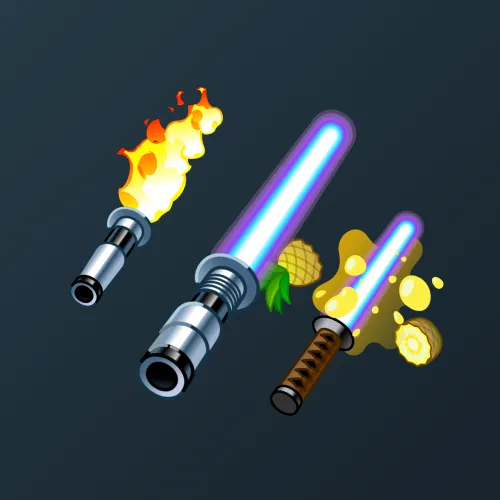

# Light Sword

  <!-- Левая часть: карточка коллекции -->
  

    

      
    

    
Light Sword

    
Коллекция

  

  <!-- Правая часть: информация о подарке -->
  

    
<strong>Дата выхода:</strong> 23 февраля 2025 
    <strong>Цена:</strong> 200 <a href="/stars">Stars⭐️</a> 
    <strong>Тираж:</strong> 150 000 шт. 
    <strong>Дата выхода улучшений:</strong> 19 мая 2025 
    <strong>Стоимость улучшения:</strong> от 25 до 25 000 <a href="/stars">Stars⭐️</a> 
    <strong>Улучшено:</strong> 124 294 шт. (82.9% от тиража) 
    <strong>Сожжено:</strong> 18 778 шт. (12.5% от тиража)

  

**Light Sword** — Telegram-подарок в виде джедайского светового меча из вселенной «Звёздных войн», выпущенный 23 февраля 2025 года. Изначальный тираж составлял 150 000 экземпляров. До введения улучшений 19 мая 2025 года было сожжено 18 778 подарков (12.5%). По состоянию на указанную дату улучшено 124 294 экземпляра (82.9% от тиража). Коллекция включает 52 уникальные модели с заявленной редкостью от 0.1% до 3%.

Наиболее редкая модель коллекции — **Wrath of Vader** — насчитывает 129 улучшенных экземпляров, что соответствует реальной редкости 0.10% (при заявленных 0.1%).

Все подарки, выходившие на 23 февраля, можно посмотреть <a href="/february-23-gifts">здесь</a>.

---

## Ключевые особенности

- Высокий процент улучшенных экземпляров (82.9%) при средней цене входа 200 Stars.
- Модели с заявленной редкостью 0.1% и 0.2% имеют фактическое количество улучшенных от 129 до 257, при этом минимальное значение у **Wrath of Vader** (129).
- В группе 3% разброс количества составляет от 3 636 до 3 881, что близко к ожидаемым значениям.

## Модели и редкость

Коллекция состоит из 52 моделей. В таблице ниже представлено фактическое количество улучшенных экземпляров по каждой модели, а также реальная редкость (рассчитанная относительно общего числа улучшенных — 124 294) и заявленная при выпуске.

| №   | Название модели        | Реальная редкость (заявленная) | Кол-во улучшенных |
| --- | ---------------------- | ------------------------------- | ----------------- |
| 1   | Wrath of Vader         | 0.10% (0.1%)                    | 129               |
| 2   | Fury of Kylo           | 0.20% (0.2%)                    | 254               |
| 3   | Jedi Luke              | 0.19% (0.2%)                    | 241               |
| 4   | Master Yoda            | 0.21% (0.2%)                    | 257               |
| 5   | Might of Maul          | 0.20% (0.2%)                    | 250               |
| 6   | The Skywalker          | 0.20% (0.2%)                    | 243               |
| 7   | Darksaber              | 0.40% (0.4%)                    | 494               |
| 8   | Doom Slayer            | 0.50% (0.5%)                    | 620               |
| 9   | Eva Unit-01            | 0.51% (0.5%)                    | 639               |
| 10  | Fruit Katana           | 0.50% (0.5%)                    | 619               |
| 11  | Steve                  | 0.49% (0.5%)                    | 607               |
| 12  | Absinthe               | 1.03% (1.0%)                    | 1 281             |
| 13  | Dragonfire             | 0.98% (1.0%)                    | 1 220             |
| 14  | Electric Force         | 0.97% (1.0%)                    | 1 207             |
| 15  | Fukushimmer            | 1.02% (1.0%)                    | 1 264             |
| 16  | Lava Lash              | 1.03% (1.0%)                    | 1 284             |
| 17  | Love Samurai           | 0.97% (1.0%)                    | 1 208             |
| 18  | Phantom                | 1.01% (1.0%)                    | 1 254             |
| 19  | Stargazer              | 0.98% (1.0%)                    | 1 222             |
| 20  | The Tempest            | 0.96% (1.0%)                    | 1 198             |
| 21  | Tsunami                | 1.01% (1.0%)                    | 1 252             |
| 22  | Clown Wars             | 1.46% (1.5%)                    | 1 814             |
| 23  | Cultist                | 1.53% (1.5%)                    | 1 903             |
| 24  | Enforcer               | 1.49% (1.5%)                    | 1 852             |
| 25  | Bananakin              | 2.02% (2.0%)                    | 2 510             |
| 26  | Stick                  | 1.95% (2.0%)                    | 2 422             |
| 27  | Andromeda              | 3.12% (3.0%)                    | 3 881             |
| 28  | Bifrost                | 2.93% (3.0%)                    | 3 644             |
| 29  | Brand Name             | 3.02% (3.0%)                    | 3 750             |
| 30  | Comics                 | 3.00% (3.0%)                    | 3 729             |
| 31  | Crystal Queen          | 3.00% (3.0%)                    | 3 731             |
| 32  | Double Time            | 3.07% (3.0%)                    | 3 815             |
| 33  | Duelist                | 2.97% (3.0%)                    | 3 686             |
| 34  | Gaslight               | 3.02% (3.0%)                    | 3 756             |
| 35  | Hoth Aurora            | 2.93% (3.0%)                    | 3 643             |
| 36  | Hyperdrive             | 2.96% (3.0%)                    | 3 684             |
| 37  | Jedi Princess          | 2.96% (3.0%)                    | 3 678             |
| 38  | Jet Fuel               | 3.00% (3.0%)                    | 3 732             |
| 39  | Lava Forge             | 3.04% (3.0%)                    | 3 780             |
| 40  | Lotus Saber            | 3.05% (3.0%)                    | 3 792             |
| 41  | Low Battery            | 3.04% (3.0%)                    | 3 782             |
| 42  | Nunchaku               | 2.97% (3.0%)                    | 3 695             |
| 43  | Police Droid           | 3.06% (3.0%)                    | 3 806             |
| 44  | Polygon                | 3.00% (3.0%)                    | 3 725             |
| 45  | Prismatic              | 3.05% (3.0%)                    | 3 785             |
| 46  | Quasar                 | 2.96% (3.0%)                    | 3 674             |
| 47  | Refraction             | 2.93% (3.0%)                    | 3 636             |
| 48  | Sensei                 | 2.99% (3.0%)                    | 3 721             |
| 49  | Super Saiyan           | 3.04% (3.0%)                    | 3 774             |
| 50  | Toy Blade              | 3.01% (3.0%)                    | 3 747             |
| 51  | Valhalla               | 2.97% (3.0%)                    | 3 693             |
| 52  | Windu                  | 3.03% (3.0%)                    | 3 764             |

Наиболее редкими являются модели с заявленной редкостью 0.1–0.2% — **Wrath of Vader** (129), **Jedi Luke** (241), **The Skywalker** (243), **Might of Maul** (250) и **Fury of Kylo** (254). При этом реальная редкость модели **Wrath of Vader** (0.10%) точно соответствует заявленной, и это наименьшее количество улучшенных экземпляров во всей коллекции. Модели с редкостью 3% демонстрируют фактическое количество от 3 636 до 3 881, что в целом соответствует ожидаемому распределению.