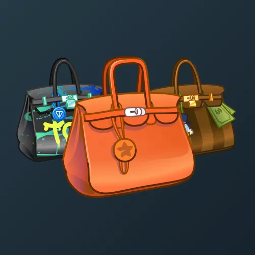

# Loot Bag

  <!-- Левая часть: карточка коллекции -->
  

    

      
    

    
Loot Bag

    
Коллекция

  

  <!-- Правая часть: информация о подарке -->
  

    
<strong>Дата выхода:</strong> 14 февраля 2025 
    <strong>Цена:</strong> 2 500 <a href="/stars">Stars⭐️</a> 
    <strong>Тираж:</strong> 15 000 шт. 
    <strong>Дата выхода улучшений:</strong> 14 февраля 2025 
    <strong>Стоимость улучшения:</strong> от 500 до 25 000 <a href="/stars">Stars⭐️</a> 
    <strong>Улучшено:</strong> 14 429 шт. (96.2% от тиража) 
    <strong>Сожжено:</strong> 511 шт. (3.4% от тиража)

  

**Loot Bag** — Telegram-подарок в виде NFT-сумки со звёздами, выпущенный 14 февраля 2025 года. Изначальный тираж составлял 15 000 экземпляров. Улучшения стали доступны в день выхода, при этом до их введения было сожжено 511 подарков (3.4%). По состоянию на указанную дату улучшено 14 429 экземпляров (96.2% от тиража). Коллекция включает 78 уникальных моделей с заявленной редкостью от 0.5% до 2%.

Наиболее редкая модель коллекции — **Glacier** — насчитывает 50 улучшенных экземпляров, что соответствует реальной редкости 0.35% (при заявленных 0.5%).

---

## Ключевые особенности

- Улучшения стали доступны в день выхода подарка.
- Почти весь тираж (96.2%) был улучшен.
- Модели с заявленной редкостью 0.5% имеют фактическое количество улучшенных от 50 до 92, при этом минимальное значение у **Glacier** (50).
- В группе 2% разброс количества составляет от 264 до 314, что близко к ожидаемым значениям.

## Модели и редкость

Коллекция состоит из 78 моделей. В таблице ниже представлено фактическое количество улучшенных экземпляров по каждой модели, а также реальная редкость (рассчитанная относительно общего числа улучшенных — 14 429) и заявленная при выпуске.

| №   | Название модели        | Реальная редкость (заявленная) | Кол-во улучшенных |
| --- | ---------------------- | ------------------------------- | ----------------- |
| 1   | Ardente                | 0.60% (0.5%)                    | 86                |
| 2   | Black Purrse           | 0.51% (0.5%)                    | 73                |
| 3   | Bouquet                | 0.52% (0.5%)                    | 75                |
| 4   | Circus                 | 0.57% (0.5%)                    | 82                |
| 5   | City Life              | 0.41% (0.5%)                    | 59                |
| 6   | Conductor              | 0.42% (0.5%)                    | 60                |
| 7   | Crypto Byte            | 0.44% (0.5%)                    | 63                |
| 8   | Crypto Punk            | 0.46% (0.5%)                    | 67                |
| 9   | Fluorescent            | 0.47% (0.5%)                    | 68                |
| 10  | Glacier                | 0.35% (0.5%)                    | 50                |
| 11  | Instabag               | 0.58% (0.5%)                    | 84                |
| 12  | Liberty                | 0.43% (0.5%)                    | 62                |
| 13  | Lust Beat              | 0.48% (0.5%)                    | 69                |
| 14  | Miranda                | 0.52% (0.5%)                    | 75                |
| 15  | Money Bag              | 0.64% (0.5%)                    | 92                |
| 16  | Nightmare              | 0.53% (0.5%)                    | 76                |
| 17  | Panthera               | 0.46% (0.5%)                    | 67                |
| 18  | Pendragon              | 0.51% (0.5%)                    | 74                |
| 19  | Pepe Bag               | 0.51% (0.5%)                    | 73                |
| 20  | Poison Dart            | 0.60% (0.5%)                    | 86                |
| 21  | Priestly               | 0.53% (0.5%)                    | 77                |
| 22  | Riot Pack              | 0.44% (0.5%)                    | 63                |
| 23  | Scrooge                | 0.47% (0.5%)                    | 68                |
| 24  | Secret Toys            | 0.51% (0.5%)                    | 73                |
| 25  | Travel Bag             | 0.49% (0.5%)                    | 71                |
| 26  | Woof Pack              | 0.43% (0.5%)                    | 62                |
| 27  | Boulevard              | 0.96% (1.0%)                    | 138               |
| 28  | Contour                | 0.98% (1.0%)                    | 141               |
| 29  | Dark Arches            | 1.05% (1.0%)                    | 152               |
| 30  | Faubourg               | 1.02% (1.0%)                    | 147               |
| 31  | Highway                | 0.87% (1.0%)                    | 126               |
| 32  | Metro Trench           | 0.97% (1.0%)                    | 140               |
| 33  | Night City             | 1.01% (1.0%)                    | 146               |
| 34  | Pink Pulsar            | 0.96% (1.0%)                    | 138               |
| 35  | Road Trip              | 1.02% (1.0%)                    | 147               |
| 36  | Aero Swift             | 1.54% (1.5%)                    | 222               |
| 37  | Anemone                | 1.59% (1.5%)                    | 230               |
| 38  | Aqua Atoll             | 1.41% (1.5%)                    | 204               |
| 39  | Biscuit                | 1.62% (1.5%)                    | 234               |
| 40  | Cherry Croc            | 1.56% (1.5%)                    | 225               |
| 41  | Courchevel             | 1.43% (1.5%)                    | 207               |
| 42  | Grizzly                | 1.50% (1.5%)                    | 217               |
| 43  | Jade Serpent           | 1.49% (1.5%)                    | 215               |
| 44  | Jaune Poussin          | 1.49% (1.5%)                    | 215               |
| 45  | Menthol                | 1.41% (1.5%)                    | 203               |
| 46  | Orange Croc            | 1.35% (1.5%)                    | 195               |
| 47  | Reptile Noir           | 1.52% (1.5%)                    | 219               |
| 48  | Rose Tyrien            | 1.48% (1.5%)                    | 213               |
| 49  | Rouge Royale           | 1.55% (1.5%)                    | 223               |
| 50  | Satin Beige            | 1.42% (1.5%)                    | 205               |
| 51  | Silver Gator           | 1.43% (1.5%)                    | 207               |
| 52  | Soft Suede             | 1.39% (1.5%)                    | 201               |
| 53  | Steel Agate            | 1.68% (1.5%)                    | 242               |
| 54  | Sunrise Bands          | 1.45% (1.5%)                    | 209               |
| 55  | Sunset Stripes         | 1.54% (1.5%)                    | 222               |
| 56  | Tropical               | 1.68% (1.5%)                    | 243               |
| 57  | Verso Blue             | 1.43% (1.5%)                    | 207               |
| 58  | Vert d’Eau             | 1.70% (1.5%)                    | 245               |
| 59  | White Pony             | 1.46% (1.5%)                    | 211               |
| 60  | Academic               | 2.09% (2.0%)                    | 302               |
| 61  | Argylle                | 2.18% (2.0%)                    | 314               |
| 62  | Black Ascot            | 1.85% (2.0%)                    | 267               |
| 63  | Bleu Officier          | 2.08% (2.0%)                    | 300               |
| 64  | Burgun Bag             | 2.04% (2.0%)                    | 295               |
| 65  | Cargo Citron           | 1.83% (2.0%)                    | 264               |
| 66  | Cherry Red             | 2.15% (2.0%)                    | 310               |
| 67  | Chrome Clutch          | 2.00% (2.0%)                    | 289               |
| 68  | Cortado                | 2.05% (2.0%)                    | 296               |
| 69  | Jaune Citrone          | 2.18% (2.0%)                    | 314               |
| 70  | Matte Mint             | 2.17% (2.0%)                    | 313               |
| 71  | Ombre                  | 2.11% (2.0%)                    | 305               |
| 72  | Potamus                | 1.91% (2.0%)                    | 275               |
| 73  | Racing Stripes         | 1.88% (2.0%)                    | 272               |
| 74  | Riviera                | 1.87% (2.0%)                    | 270               |
| 75  | Sakura                 | 1.98% (2.0%)                    | 286               |
| 76  | Studded Green          | 2.07% (2.0%)                    | 298               |
| 77  | Tangerine              | 1.99% (2.0%)                    | 287               |
| 78  | Tressage               | 1.87% (2.0%)                    | 270               |
| 79  | Vertigo                | 1.88% (2.0%)                    | 272               |
| 80  | Zip Pocket             | 1.98% (2.0%)                    | 286               |

Наиболее редкими являются модели с заявленной редкостью 0.5% — **Glacier** (50), **City Life** (59), **Conductor** (60), **Liberty** (62), **Woof Pack** (62) и другие. При этом реальная редкость модели **Glacier** (0.35%) ниже заявленной, и это наименьшее количество улучшенных экземпляров во всей коллекции. Модели с редкостью 2% демонстрируют фактическое количество от 264 до 314, что в целом соответствует ожидаемому распределению.