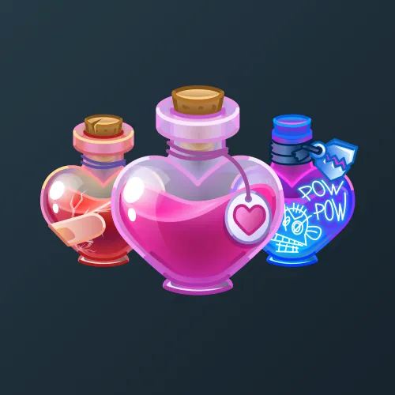

# Love Potion

  <!-- Левая часть: карточка коллекции -->
  

    

      
    

    
Love Potion

    
Коллекция

  

  <!-- Правая часть: информация о подарке -->
  

    
<strong>Дата выхода:</strong> 14 февраля 2025 
    <strong>Цена:</strong> 1 000 <a href="/stars">Stars⭐️</a> 
    <strong>Тираж:</strong> 35 000 шт. 
    <strong>Дата выхода улучшений:</strong> 14 февраля 2025 
    <strong>Стоимость улучшения:</strong> от 200 до 25 000 <a href="/stars">Stars⭐️</a> 
    <strong>Улучшено:</strong> 29 073 шт. (83.1% от тиража) 
    <strong>Сожжено:</strong> 4 588 шт. (13.1% от тиража)

  

**Love Potion** — Telegram-подарок, выпущенный 14 февраля 2025 года в честь Дня всех влюблённых. Подарок выполнен в виде бутылки с приворотным зельем. Изначальный тираж составлял 35 000 экземпляров. Улучшения стали доступны в день выхода, при этом до их введения было сожжено 4 588 подарков (13.1%). По состоянию на указанную дату улучшено 29 073 экземпляра (83.1% от тиража). Коллекция включает 72 уникальные модели с заявленной редкостью от 0.5% до 2.5%.

Наиболее редкая модель коллекции — **Durov Duck** — насчитывает 125 улучшенных экземпляров, что соответствует реальной редкости 0.43% (при заявленных 0.5%).

---

## Ключевые особенности

- Улучшения стали доступны в день выхода подарка.
- Высокий процент улучшенных экземпляров (83.1%) при цене входа 1 000 Stars.
- Модели с заявленной редкостью 0.5% имеют фактическое количество улучшенных от 118 до 163, при этом минимальное значение у **Durov Duck** (125) и **First Kiss** (118).
- В группе 2.5% разброс количества составляет от 688 до 776, что близко к ожидаемым значениям.

## Модели и редкость

Коллекция состоит из 72 моделей. В таблице ниже представлено фактическое количество улучшенных экземпляров по каждой модели, а также реальная редкость (рассчитанная относительно общего числа улучшенных — 29 073) и заявленная при выпуске.

| №   | Название модели        | Реальная редкость (заявленная) | Кол-во улучшенных |
| --- | ---------------------- | ------------------------------- | ----------------- |
| 1   | Angel Wings            | 0.55% (0.5%)                    | 159               |
| 2   | Astral Guide           | 0.55% (0.5%)                    | 161               |
| 3   | Banana                 | 0.50% (0.5%)                    | 144               |
| 4   | Beholder               | 0.53% (0.5%)                    | 153               |
| 5   | Bloodlust              | 0.56% (0.5%)                    | 163               |
| 6   | Dragon Soul            | 0.54% (0.5%)                    | 156               |
| 7   | Durov Duck             | 0.43% (0.5%)                    | 125               |
| 8   | Emo Tears              | 0.49% (0.5%)                    | 142               |
| 9   | Energy Drink           | 0.47% (0.5%)                    | 136               |
| 10  | Espresso               | 0.46% (0.5%)                    | 135               |
| 11  | Eye-lixir              | 0.50% (0.5%)                    | 145               |
| 12  | First Kiss             | 0.41% (0.5%)                    | 118               |
| 13  | Healing Potion         | 0.47% (0.5%)                    | 138               |
| 14  | Ice Queen              | 0.42% (0.5%)                    | 123               |
| 15  | Jinx Tonic             | 0.49% (0.5%)                    | 143               |
| 16  | Lucky Charm            | 0.54% (0.5%)                    | 157               |
| 17  | Molten Gold            | 0.53% (0.5%)                    | 154               |
| 18  | No Signal              | 0.50% (0.5%)                    | 145               |
| 19  | Nurgle’s Rot           | 0.51% (0.5%)                    | 147               |
| 20  | Pickle Rick            | 0.49% (0.5%)                    | 142               |
| 21  | Star Power             | 0.54% (0.5%)                    | 158               |
| 22  | Unicorn Tears          | 0.48% (0.5%)                    | 141               |
| 23  | Whole Milk             | 0.50% (0.5%)                    | 146               |
| 24  | Beauty Brew            | 0.92% (1.0%)                    | 268               |
| 25  | Bubble Gum             | 0.91% (1.0%)                    | 265               |
| 26  | Clubs                  | 1.07% (1.0%)                    | 311               |
| 27  | Diamonds               | 1.04% (1.0%)                    | 301               |
| 28  | Gothic Cola            | 1.08% (1.0%)                    | 314               |
| 29  | Hearts                 | 0.93% (1.0%)                    | 270               |
| 30  | Kiwi Juice             | 1.10% (1.0%)                    | 321               |
| 31  | Spades                 | 1.16% (1.0%)                    | 336               |
| 32  | Tropicano              | 1.00% (1.0%)                    | 290               |
| 33  | Bubble Bath            | 1.56% (1.5%)                    | 454               |
| 34  | Crime Scene            | 1.51% (1.5%)                    | 439               |
| 35  | Fine Mead              | 1.55% (1.5%)                    | 451               |
| 36  | First Aid              | 1.44% (1.5%)                    | 419               |
| 37  | Flat Pink              | 1.43% (1.5%)                    | 417               |
| 38  | Fragrant Oil           | 1.31% (1.5%)                    | 382               |
| 39  | Golden Mire            | 1.55% (1.5%)                    | 450               |
| 40  | Laxative               | 1.48% (1.5%)                    | 431               |
| 41  | Paint Bottle           | 1.50% (1.5%)                    | 437               |
| 42  | Peach Nectar           | 1.38% (1.5%)                    | 400               |
| 43  | Ruby Essence           | 1.43% (1.5%)                    | 415               |
| 44  | Surreal                | 1.53% (1.5%)                    | 445               |
| 45  | White Ink              | 1.47% (1.5%)                    | 426               |
| 46  | Cherry Wine            | 1.94% (2.0%)                    | 564               |
| 47  | Milkshake              | 2.25% (2.0%)                    | 654               |
| 48  | Mouthwash              | 1.95% (2.0%)                    | 567               |
| 49  | Poison Flask           | 2.06% (2.0%)                    | 599               |
| 50  | Romeo                  | 1.99% (2.0%)                    | 579               |
| 51  | Aerogel                | 2.45% (2.5%)                    | 711               |
| 52  | Berry Bomb             | 2.57% (2.5%)                    | 748               |
| 53  | Copper Sulfate         | 2.67% (2.5%)                    | 776               |
| 54  | Fairy Pollen           | 2.49% (2.5%)                    | 724               |
| 55  | Formic Acid            | 2.44% (2.5%)                    | 708               |
| 56  | Gold Rush              | 2.40% (2.5%)                    | 698               |
| 57  | Juliet                 | 2.59% (2.5%)                    | 752               |
| 58  | Liquid Pearl           | 2.41% (2.5%)                    | 701               |
| 59  | Mystic Dew             | 2.47% (2.5%)                    | 718               |
| 60  | Ocean Glow             | 2.37% (2.5%)                    | 688               |
| 61  | Old Rum                | 2.44% (2.5%)                    | 710               |
| 62  | Royal Spritz           | 2.67% (2.5%)                    | 775               |
| 63  | Rusty Water            | 2.55% (2.5%)                    | 740               |
| 64  | Sea Salt               | 2.42% (2.5%)                    | 704               |
| 65  | Seeker’s Wish          | 2.52% (2.5%)                    | 734               |
| 66  | Sour Cider             | 2.46% (2.5%)                    | 714               |
| 67  | Starry Night           | 2.65% (2.5%)                    | 771               |
| 68  | Sugar Ponies           | 2.52% (2.5%)                    | 733               |
| 69  | Sunset Serum           | 2.49% (2.5%)                    | 725               |
| 70  | Toxic Waste            | 2.44% (2.5%)                    | 708               |

Наиболее редкими являются модели с заявленной редкостью 0.5% — **First Kiss** (118), **Ice Queen** (123), **Durov Duck** (125), **Espresso** (135) и **Energy Drink** (136). При этом реальная редкость модели **First Kiss** (0.41%) ниже заявленной, и это наименьшее количество улучшенных экземпляров во всей коллекции. Модели с редкостью 2.5% демонстрируют фактическое количество от 688 до 776, что в целом соответствует ожидаемому распределению.