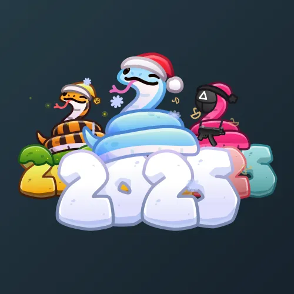

# Lunar Snake

  <!-- Левая часть: карточка коллекции -->
  

    

      
    

    
Lunar Snake

    
Коллекция

  

  <!-- Правая часть: информация о подарке -->
  

    
<strong>Дата выхода:</strong> 1 января 2025 
    <strong>Цена:</strong> 25 <a href="/stars">Stars⭐️</a> 
    <strong>Тираж:</strong> 400 000 шт. 
    <strong>Дата выхода улучшений:</strong> 29 января 2025 
    <strong>Стоимость улучшения:</strong> 25 <a href="/stars">Stars⭐️</a> 
    <strong>Улучшено:</strong> 191 586 шт. (47.9% от тиража) 
    <strong>Сожжено:</strong> 140 654 шт. (35.2% от тиража)

  

**Lunar Snake** — Telegram-подарок, выпущенный 1 января 2025 года в честь нового года. Представляет собой новогоднюю лунную змею. Коллекция включает 100 уникальных моделей с заявленной редкостью от 0.3% до 1.5%. Изначальный тираж составил 400 000 экземпляров. До введения улучшений 29 января 2025 года было сожжено (обменяно на звёзды) 140 654 подарка (35.2%). По состоянию на указанную дату улучшено 191 586 экземпляров (47.9% от тиража). Стоимость улучшения фиксирована и составляет 25 Stars для всех моделей.

Помимо Lunar Snake, в Telegram представлены и другие змеи: <a href="/pet-snake">Pet Snake</a> и <a href="/snake-box">Snake Box</a>.

Наиболее редкая модель коллекции — **Gen Zmei** — насчитывает 587 улучшенных экземпляров, что соответствует реальной редкости 0.31% (при заявленных 0.3%).

---

## Модели и редкость

Коллекция состоит из 100 моделей. В таблице ниже представлено фактическое количество улучшенных экземпляров по каждой модели, а также реальная редкость (рассчитанная относительно общего числа улучшенных — 191 586) и заявленная при выпуске.

| №   | Название модели     | Реальная редкость (заявленная) | Кол-во улучшенных |
| --- | ------------------- | ------------------------------- | ----------------- |
| 1   | Dragon Ball         | 0.32% (0.3%)                    | 620               |
| 2   | Gen Zmei            | 0.31% (0.3%)                    | 587               |
| 3   | Hot Cherry          | 0.31% (0.3%)                    | 590               |
| 4   | Synthwave           | 0.31% (0.3%)                    | 590               |
| 5   | Angelic             | 0.49% (0.5%)                    | 937               |
| 6   | Cryoshard           | 0.50% (0.5%)                    | 967               |
| 7   | Diamondback         | 0.51% (0.5%)                    | 978               |
| 8   | Ender Snake         | 0.46% (0.5%)                    | 891               |
| 9   | Fire Dragon         | 0.46% (0.5%)                    | 888               |
| 10  | Geodesic            | 0.50% (0.5%)                    | 950               |
| 11  | Gold Quartz         | 0.53% (0.5%)                    | 1 014             |
| 12  | Hellspawn           | 0.50% (0.5%)                    | 949               |
| 13  | Hydra               | 0.47% (0.5%)                    | 896               |
| 14  | Lapis               | 0.49% (0.5%)                    | 933               |
| 15  | Lunar Year          | 0.50% (0.5%)                    | 951               |
| 16  | Prismatic           | 0.51% (0.5%)                    | 971               |
| 17  | Psychedelic         | 0.48% (0.5%)                    | 918               |
| 18  | Red Amethyst        | 0.51% (0.5%)                    | 969               |
| 19  | Redstone            | 0.50% (0.5%)                    | 955               |
| 20  | Rorschach           | 0.51% (0.5%)                    | 969               |
| 21  | Snake Game          | 0.47% (0.5%)                    | 909               |
| 22  | Soul Eater          | 0.47% (0.5%)                    | 909               |
| 23  | Timelock            | 0.53% (0.5%)                    | 1 012             |
| 24  | Xenomorph           | 0.49% (0.5%)                    | 934               |
| 25  | Adhesive            | 0.82% (0.8%)                    | 1 577             |
| 26  | Candy Stripe        | 0.83% (0.8%)                    | 1 599             |
| 27  | Cyber Ruby          | 0.83% (0.8%)                    | 1 592             |
| 28  | Fromage             | 0.80% (0.8%)                    | 1 539             |
| 29  | Frosting            | 0.79% (0.8%)                    | 1 512             |
| 30  | Gold Rush           | 0.80% (0.8%)                    | 1 540             |
| 31  | Golden Bleu         | 0.84% (0.8%)                    | 1 603             |
| 32  | Hong Kong           | 0.78% (0.8%)                    | 1 489             |
| 33  | Iron Mine           | 0.81% (0.8%)                    | 1 561             |
| 34  | Mandarin            | 0.78% (0.8%)                    | 1 493             |
| 35  | Night Market        | 0.82% (0.8%)                    | 1 565             |
| 36  | Poisonous           | 0.78% (0.8%)                    | 1 494             |
| 37  | Python Dev          | 0.80% (0.8%)                    | 1 533             |
| 38  | Red Cheddar         | 0.83% (0.8%)                    | 1 583             |
| 39  | Straciatella        | 0.79% (0.8%)                    | 1 516             |
| 40  | Taipei              | 0.75% (0.8%)                    | 1 439             |
| 41  | The Deadliest       | 0.78% (0.8%)                    | 1 501             |
| 42  | Tropicool           | 0.82% (0.8%)                    | 1 576             |
| 43  | Venomous            | 0.78% (0.8%)                    | 1 490             |
| 44  | Arctic Viper        | 1.02% (1.0%)                    | 1 949             |
| 45  | Bear Paw            | 1.02% (1.0%)                    | 1 949             |
| 46  | Glowbra             | 1.01% (1.0%)                    | 1 927             |
| 47  | Hissmas Tree        | 0.99% (1.0%)                    | 1 903             |
| 48  | Hisstagram          | 1.00% (1.0%)                    | 1 921             |
| 49  | Jelly Hazard        | 1.01% (1.0%)                    | 1 943             |
| 50  | Neurotoxin          | 1.03% (1.0%)                    | 1 981             |
| 51  | Pearl Scales        | 1.01% (1.0%)                    | 1 936             |
| 52  | Polarized           | 1.02% (1.0%)                    | 1 958             |
| 53  | Sea Snake           | 1.04% (1.0%)                    | 1 994             |
| 54  | Sun Serpent         | 1.02% (1.0%)                    | 1 960             |
| 55  | Sunset Snake        | 0.99% (1.0%)                    | 1 902             |
| 56  | Wood Snake          | 0.98% (1.0%)                    | 1 869             |
| 57  | Amber Adder         | 1.28% (1.3%)                    | 2 450             |
| 58  | Amethyssst          | 1.26% (1.3%)                    | 2 419             |
| 59  | Aurium              | 1.33% (1.3%)                    | 2 546             |
| 60  | Banded Boa          | 1.32% (1.3%)                    | 2 528             |
| 61  | Blue Horizon        | 1.32% (1.3%)                    | 2 522             |
| 62  | Caustic Moss        | 1.32% (1.3%)                    | 2 537             |
| 63  | Cherry Glitch       | 1.29% (1.3%)                    | 2 474             |
| 64  | Crimson Jade        | 1.26% (1.3%)                    | 2 414             |
| 65  | Frost Fangs         | 1.27% (1.3%)                    | 2 436             |
| 66  | Golden Coal         | 1.29% (1.3%)                    | 2 480             |
| 67  | Golden Sky          | 1.30% (1.3%)                    | 2 485             |
| 68  | Gulal               | 1.31% (1.3%)                    | 2 504             |
| 69  | Hissium             | 1.30% (1.3%)                    | 2 489             |
| 70  | Jade Serpent        | 1.32% (1.3%)                    | 2 522             |
| 71  | Kinder Garter       | 1.26% (1.3%)                    | 2 421             |
| 72  | Orange Rocks        | 1.28% (1.3%)                    | 2 450             |
| 73  | Pink Venom          | 1.28% (1.3%)                    | 2 462             |
| 74  | Purple Cap          | 1.27% (1.3%)                    | 2 432             |
| 75  | Purple Laser        | 1.32% (1.3%)                    | 2 530             |
| 76  | Rainbow Scale       | 1.30% (1.3%)                    | 2 488             |
| 77  | Rosepepper          | 1.29% (1.3%)                    | 2 470             |
| 78  | Sandrift            | 1.32% (1.3%)                    | 2 523             |
| 79  | Spring Burst        | 1.33% (1.3%)                    | 2 549             |
| 80  | Stone Python        | 1.29% (1.3%)                    | 2 468             |
| 81  | Super Hot           | 1.31% (1.3%)                    | 2 508             |
| 82  | Vibrant Venom       | 1.33% (1.3%)                    | 2 557             |
| 83  | White Grape         | 1.30% (1.3%)                    | 2 487             |
| 84  | Albino              | 1.47% (1.5%)                    | 2 814             |
| 85  | Black Mamba         | 1.50% (1.5%)                    | 2 878             |
| 86  | Blizzard            | 1.49% (1.5%)                    | 2 857             |
| 87  | Blood Adder         | 1.47% (1.5%)                    | 2 824             |
| 88  | Blue Boa            | 1.52% (1.5%)                    | 2 916             |
| 89  | Copperhead          | 1.52% (1.5%)                    | 2 911             |
| 90  | Dark Rattle         | 1.51% (1.5%)                    | 2 899             |
| 91  | Fallen Star         | 1.51% (1.5%)                    | 2 885             |
| 92  | Green Flakes        | 1.51% (1.5%)                    | 2 891             |
| 93  | Green Viper         | 1.49% (1.5%)                    | 2 860             |
| 94  | Lancehead           | 1.54% (1.5%)                    | 2 945             |
| 95  | Limescale           | 1.48% (1.5%)                    | 2 832             |
| 96  | Purple Mamba        | 1.51% (1.5%)                    | 2 898             |
| 97  | Red Reptile         | 1.48% (1.5%)                    | 2 842             |
| 98  | Saffron             | 1.46% (1.5%)                    | 2 802             |
| 99  | Water Snake         | 1.50% (1.5%)                    | 2 872             |
| 100 | Yellow Cobra        | 1.48% (1.5%)                    | 2 827             |

Наиболее редкими являются модели с заявленной редкостью 0.3% — **Gen Zmei** (587), **Hot Cherry** (590), **Synthwave** (590) и **Dragon Ball** (620). При этом реальная редкость модели **Gen Zmei** (0.31%) практически совпадает с заявленной, и это наименьшее количество улучшенных экземпляров во всей коллекции. Модели с редкостью 1.5% демонстрируют равномерное распределение в диапазоне 2 802–2 945, при этом **Lancehead** (2 945) имеет наибольшее количество, а **Saffron** (2 802) — наименьшее.