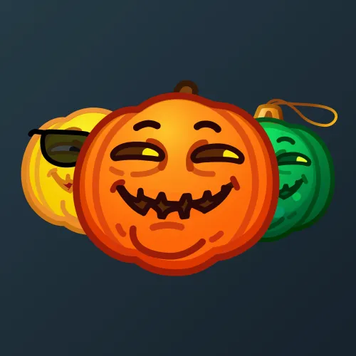

# Mad Pumpkin

  

    

      
    

    
Mad Pumpkin

    
Коллекция

  

  

    
<strong>Дата выхода:</strong> 29 октября 2024 
    <strong>Цена:</strong> 25 <a href="/stars">Stars⭐️</a> 
    <strong>Тираж:</strong> 30 000 шт. 
    <strong>Дата выхода улучшений:</strong> 31 января 2025 
    <strong>Стоимость улучшения:</strong> от 25 до 25 000 <a href="/stars">Stars⭐️</a> 
    <strong>Улучшено:</strong> 19 485 шт. (65.0% от тиража) 
    <strong>Сожжено:</strong> 7 801 шт. (26.0% от тиража)

  

**Mad Pumpkin** — Telegram-подарок, выпущенный 29 октября 2024 года в преддверии Хэллоуина. Представляет собой стилизованную безумную злую тыкву («Фонарь Джека»). Коллекция включает 50 уникальных моделей с заявленной редкостью от 0.5% до 3%. Изначальный тираж составил 30 000 экземпляров. До введения улучшений 31 января 2025 года было сожжено 7 801 подарок (26.0%). По состоянию на указанную дату улучшено 19 485 экземпляров (65.0% от тиража). Наиболее редкая модель коллекции — **Kinky-Winky** — насчитывает 85 улучшенных экземпляров, что соответствует реальной редкости 0.44% (при заявленных 0.5%).

## Ключевые особенности

- Низкая стартовая цена (25 Stars) позволила держателям подарка заработать на перепродаже после роста стоимости.
- Четыре наиболее редкие модели коллекции — **Creepy Po**, **Dark Dipsy**, **Kinky-Winky** и **Oh-Laa-Laa** — отсылают к персонажам телепузиков (Teletubbies).

## Модели и редкость

Коллекция состоит из 50 моделей. В таблице ниже представлено фактическое количество улучшенных экземпляров по каждой модели, а также реальная редкость (рассчитанная относительно общего числа улучшенных — 19 485) и заявленная при выпуске.

| № | Название модели | Реальная редкость (заявленная) | Кол-во улучшенных |
|---|:---|:---|:---|
| 1 | Creepy Po | 0.48% (0.5%) | 93 шт. |
| 2 | Dark Dipsy | 0.46% (0.5%) | 90 шт. |
| 3 | Kinky-Winky | 0.44% (0.5%) | 85 шт. |
| 4 | Oh-Laa-Laa | 0.51% (0.5%) | 99 шт. |
| 5 | Disco Ball | 1.06% (1.0%) | 206 шт. |
| 6 | Frostbite | 0.95% (1.0%) | 185 шт. |
| 7 | Jigsaw | 0.88% (1.0%) | 171 шт. |
| 8 | Johnny Bravo | 0.94% (1.0%) | 183 шт. |
| 9 | Khinkali Boi | 1.00% (1.0%) | 194 шт. |
| 10 | Laugh Potion | 0.91% (1.0%) | 178 шт. |
| 11 | Mummy Troll | 0.97% (1.0%) | 189 шт. |
| 12 | The Joker | 1.05% (1.0%) | 204 шт. |
| 13 | The Mask | 1.23% (1.0%) | 240 шт. |
| 14 | Don Lemon | 1.48% (1.5%) | 288 шт. |
| 15 | Heat Stroke | 1.57% (1.5%) | 306 шт. |
| 16 | Bee Movie | 1.91% (2.0%) | 373 шт. |
| 17 | Cheshire Cat | 1.86% (2.0%) | 363 шт. |
| 18 | Chuckle-ate | 2.05% (2.0%) | 399 шт. |
| 19 | Daredevil | 1.85% (2.0%) | 360 шт. |
| 20 | Dark Humor | 2.06% (2.0%) | 402 шт. |
| 21 | Dark Ritual | 2.04% (2.0%) | 397 шт. |
| 22 | Krusty | 2.04% (2.0%) | 398 шт. |
| 23 | Le Mime | 2.08% (2.0%) | 406 шт. |
| 24 | Little Sketchy | 1.97% (2.0%) | 384 шт. |
| 25 | Mandarin | 2.25% (2.0%) | 439 шт. |
| 26 | Pump King | 1.96% (2.0%) | 381 шт. |
| 27 | Purple Imp | 2.15% (2.0%) | 419 шт. |
| 28 | Red Demon | 1.91% (2.0%) | 372 шт. |
| 29 | Robotic | 2.21% (2.0%) | 431 шт. |
| 30 | Solaris | 2.15% (2.0%) | 419 шт. |
| 31 | Spotlight | 1.98% (2.0%) | 385 шт. |
| 32 | Squashbuckler | 1.90% (2.0%) | 370 шт. |
| 33 | The Mocker | 2.08% (2.0%) | 405 шт. |
| 34 | Uranus | 1.84% (2.0%) | 358 шт. |
| 35 | Copperfield | 3.08% (3.0%) | 600 шт. |
| 36 | Cucurbita | 2.87% (3.0%) | 559 шт. |
| 37 | Evil Grin | 2.84% (3.0%) | 554 шт. |
| 38 | Flat Joke | 2.85% (3.0%) | 556 шт. |
| 39 | Golden Boy | 3.00% (3.0%) | 584 шт. |
| 40 | Green Grins | 3.07% (3.0%) | 599 шт. |
| 41 | Ha-Harvest | 2.89% (3.0%) | 564 шт. |
| 42 | Hollow Gold | 3.19% (3.0%) | 622 шт. |
| 43 | Joke-O’-Lantern | 2.92% (3.0%) | 569 шт. |
| 44 | Let It Snow | 3.22% (3.0%) | 627 шт. |
| 45 | Ornament | 3.02% (3.0%) | 588 шт. |
| 46 | Plutonium | 2.66% (3.0%) | 518 шт. |
| 47 | Shamrock | 3.25% (3.0%) | 634 шт. |
| 48 | Silver Surfer | 2.93% (3.0%) | 571 шт. |
| 49 | Unripe | 3.01% (3.0%) | 587 шт. |
| 50 | Watermelon | 2.97% (3.0%) | 579 шт. |

Наиболее редкими являются модели с заявленной редкостью 0.5% — **Kinky-Winky** (85), **Dark Dipsy** (90), **Creepy Po** (93) и **Oh-Laa-Laa** (99). При этом реальная редкость модели **Kinky-Winky** (0.44%) ниже заявленной, и это наименьшее количество улучшенных экземпляров во всей коллекции.