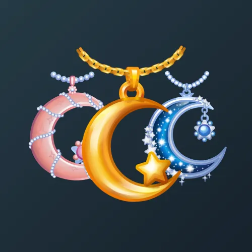

# Moon Pendant

  

    

      
    

    
Moon Pendant

    
Коллекция

  

  

    
<strong>Дата выхода:</strong> 30 марта 2025 
    <strong>Цена:</strong> 100 <a href="/stars">Stars⭐️</a> 
    <strong>Тираж:</strong> 120 000 шт. 
    <strong>Дата выхода улучшений:</strong> 11 августа 2025 
    <strong>Стоимость улучшения:</strong> от 25 до 25 000 <a href="/stars">Stars⭐️</a> 
    <strong>Улучшено:</strong> 101 862 шт. (84.9% от тиража) 
    <strong>Сожжено:</strong> 8 920 шт. (7.4% от тиража)

  

**Moon Pendant** — Telegram-подарок, выпущенный 30 марта 2025 года в честь мусульманского праздника Ураза-байрам (завершение поста Рамадан). Представляет собой стилизованный кулон с полумесяцем и звездой. Коллекция включает 50 уникальных моделей с заявленной редкостью от 0.5% до 3%. Изначальный тираж составил 120 000 экземпляров. До введения улучшений 11 августа 2025 года было сожжено 8 920 подарков (7.4%). По состоянию на указанную дату улучшено 101 862 экземпляра (84.9% от тиража). Наиболее редкая модель коллекции — **Silver Tree** — насчитывает 455 улучшенных экземпляров, что соответствует реальной редкости 0.45% (при заявленных 0.5%).

## Ключевые особенности

- Коллекция приурочена к празднику Ураза-байрам.

## Модели и редкость

Коллекция состоит из 50 моделей. В таблице ниже представлено фактическое количество улучшенных экземпляров по каждой модели, а также реальная редкость (рассчитанная относительно общего числа улучшенных — 101 862) и заявленная при выпуске.

| № | Название модели | Реальная редкость (заявленная) | Кол-во улучшенных |
|---|:---|:---|:---|
| 1 | Jade Vines | 0.50% (0.5%) | 514 шт. |
| 2 | Obsidian | 0.49% (0.5%) | 495 шт. |
| 3 | Princess | 0.56% (0.5%) | 568 шт. |
| 4 | Silver Tree | 0.45% (0.5%) | 455 шт. |
| 5 | Starry Night | 0.53% (0.5%) | 540 шт. |
| 6 | Azurite | 1.04% (1.0%) | 1 056 шт. |
| 7 | Harmony | 0.99% (1.0%) | 1 006 шт. |
| 8 | Rosethorn | 1.02% (1.0%) | 1 044 шт. |
| 9 | Eternal Rose | 1.47% (1.5%) | 1 493 шт. |
| 10 | Frosted Green | 1.50% (1.5%) | 1 531 шт. |
| 11 | Moon Tears | 1.46% (1.5%) | 1 489 шт. |
| 12 | Rosewood | 1.46% (1.5%) | 1 482 шт. |
| 13 | Serenity | 1.47% (1.5%) | 1 497 шт. |
| 14 | Shiny Sparks | 1.49% (1.5%) | 1 522 шт. |
| 15 | Silver Lace | 1.53% (1.5%) | 1 554 шт. |
| 16 | Sovereign | 1.46% (1.5%) | 1 492 шт. |
| 17 | Starlit Silver | 1.54% (1.5%) | 1 572 шт. |
| 18 | Twilight Wish | 1.49% (1.5%) | 1 516 шт. |
| 19 | Calm Sunset | 1.95% (2.0%) | 1 981 шт. |
| 20 | Carved Gold | 2.03% (2.0%) | 2 067 шт. |
| 21 | Dawn Mirror | 2.06% (2.0%) | 2 097 шт. |
| 22 | Eclipse | 2.01% (2.0%) | 2 046 шт. |
| 23 | Golden Palace | 1.98% (2.0%) | 2 013 шт. |
| 24 | Lunar Orbit | 2.04% (2.0%) | 2 082 шт. |
| 25 | Mirage | 1.91% (2.0%) | 1 946 шт. |
| 26 | Pearl Rose | 1.95% (2.0%) | 1 984 шт. |
| 27 | Precious Pearl | 2.04% (2.0%) | 2 074 шт. |
| 28 | Royal Purple | 2.03% (2.0%) | 2 071 шт. |
| 29 | Sand Dune | 1.98% (2.0%) | 2 015 шт. |
| 30 | Sea Jewel | 1.98% (2.0%) | 2 019 шт. |
| 31 | Stained Glass | 1.96% (2.0%) | 1 996 шт. |
| 32 | Circle Glare | 2.58% (2.5%) | 2 625 шт. |
| 33 | Diamond Tear | 2.50% (2.5%) | 2 544 шт. |
| 34 | Glass Rainbow | 2.48% (2.5%) | 2 524 шт. |
| 35 | Gratitude | 2.45% (2.5%) | 2 499 шт. |
| 36 | Little Star | 2.46% (2.5%) | 2 507 шт. |
| 37 | Sapphires | 2.62% (2.5%) | 2 667 шт. |
| 38 | Silver Blue | 2.55% (2.5%) | 2 597 шт. |
| 39 | Amethyst | 2.96% (3.0%) | 3 018 шт. |
| 40 | Copper Alloy | 3.05% (3.0%) | 3 108 шт. |
| 41 | Desert Night | 2.97% (3.0%) | 3 024 шт. |
| 42 | Emerald | 2.97% (3.0%) | 3 025 шт. |
| 43 | Frozen Light | 3.07% (3.0%) | 3 131 шт. |
| 44 | Golden Moon | 2.95% (3.0%) | 3 005 шт. |
| 45 | Liquid Gold | 3.00% (3.0%) | 3 060 шт. |
| 46 | Ruby Core | 2.95% (3.0%) | 3 007 шт. |
| 47 | Silver Moon | 3.08% (3.0%) | 3 136 шт. |
| 48 | Stellar Grace | 3.02% (3.0%) | 3 080 шт. |
| 49 | Sunset Rose | 2.99% (3.0%) | 3 046 шт. |
| 50 | Titanium | 3.00% (3.0%) | 3 053 шт. |

Наиболее редкими являются модели с заявленной редкостью 0.5% — **Silver Tree** (455), **Obsidian** (495), **Jade Vines** (514), **Starry Night** (540) и **Princess** (568). При этом реальная редкость модели **Silver Tree** (0.45%) ниже заявленной, и это наименьшее количество улучшенных экземпляров во всей коллекции.