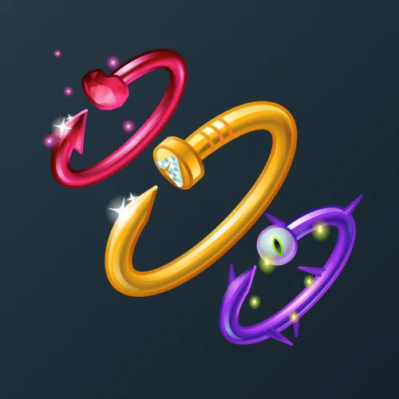

# Nail Bracelet

  <!-- Левая часть: карточка коллекции -->
  

    

      
    

    
Nail Bracelet

    
Коллекция

  

  <!-- Правая часть: информация о подарке -->
  

    
<strong>Дата выхода:</strong> 14 февраля 2025 
    <strong>Цена:</strong> 10 000 <a href="/stars">Stars⭐️</a> 
    <strong>Тираж:</strong> 5 000 шт. 
    <strong>Дата выхода улучшений:</strong> 22 мая 2025 
    <strong>Стоимость улучшения:</strong> от 2 000 до 25 000 <a href="/stars">Stars⭐️</a> 
    <strong>Улучшено:</strong> 4 683 шт. (93.7% от тиража) 
    <strong>Сожжено:</strong> 182 шт. (3.6% от тиража)

  

**Nail Bracelet** — Telegram-подарок в виде браслета на запястье, стилизованного под гвоздь, выпущенный 14 февраля 2025 года специально ко Дню всех влюблённых. Изначальный тираж составлял 5 000 экземпляров. До введения улучшений 22 мая 2025 года было сожжено 182 подарка (3.6%). По состоянию на указанную дату улучшено 4 683 экземпляра (93.7% от тиража). Коллекция включает 50 уникальных моделей с заявленной редкостью от 0.5% до 3.5%.

Наиболее редкая модель коллекции — **Mystic Copper** — насчитывает 20 улучшенных экземпляров, что соответствует реальной редкости 0.43% (при заявленных 0.5%).

---

## Ключевые особенности

- Высокий процент улучшенных экземпляров (93.7%) при высокой цене входа 10 000 Stars.
- Модели с заявленной редкостью 0.5% имеют фактическое количество улучшенных от 20 до 37, при этом минимальное значение у **Mystic Copper** (20).
- В группе 3.5% разброс количества составляет от 143 до 175, что близко к ожидаемым значениям.

## Модели и редкость

Коллекция состоит из 50 моделей. В таблице ниже представлено фактическое количество улучшенных экземпляров по каждой модели, а также реальная редкость (рассчитанная относительно общего числа улучшенных — 4 683) и заявленная при выпуске.

| №   | Название модели        | Реальная редкость (заявленная) | Кол-во улучшенных |
| --- | ---------------------- | ------------------------------- | ----------------- |
| 1   | Diamond                | 0.79% (0.5%)                    | 37                |
| 2   | Gold Rush              | 0.45% (0.5%)                    | 21                |
| 3   | Interstellar           | 0.47% (0.5%)                    | 22                |
| 4   | Mystic Copper          | 0.43% (0.5%)                    | 20                |
| 5   | Blue Velvet            | 1.17% (1.0%)                    | 55                |
| 6   | Hypno Kaa              | 0.90% (1.0%)                    | 42                |
| 7   | Aqua Ring              | 1.41% (1.5%)                    | 66                |
| 8   | Black Panther          | 1.54% (1.5%)                    | 72                |
| 9   | Blue Dolphin           | 1.92% (1.5%)                    | 90                |
| 10  | Carrot Bunny           | 1.30% (1.5%)                    | 61                |
| 11  | Cat Person             | 0.90% (1.5%)                    | 42                |
| 12  | Crypto Gem             | 1.56% (1.5%)                    | 73                |
| 13  | Duck Amulet            | 1.62% (1.5%)                    | 76                |
| 14  | Hachikō                | 1.32% (1.5%)                    | 62                |
| 15  | Heavy Metal            | 1.49% (1.5%)                    | 70                |
| 16  | Mario Pipe             | 1.60% (1.5%)                    | 75                |
| 17  | Market Rally           | 1.45% (1.5%)                    | 68                |
| 18  | Moon Cat               | 1.54% (1.5%)                    | 72                |
| 19  | Ocelot                 | 1.73% (1.5%)                    | 81                |
| 20  | Ouroboros              | 1.60% (1.5%)                    | 75                |
| 21  | Pearl Glam             | 1.90% (1.5%)                    | 89                |
| 22  | Pepe Band              | 1.56% (1.5%)                    | 73                |
| 23  | Resistance             | 1.32% (1.5%)                    | 62                |
| 24  | Scorpio                | 1.17% (1.5%)                    | 55                |
| 25  | Succubus               | 1.58% (1.5%)                    | 74                |
| 26  | Tesla Coil             | 1.47% (1.5%)                    | 69                |
| 27  | Candle Wax             | 2.39% (2.0%)                    | 112               |
| 28  | Monster Eye            | 1.86% (2.0%)                    | 87                |
| 29  | Nuclear Silo           | 2.03% (2.0%)                    | 95                |
| 30  | Pencil                 | 2.33% (2.0%)                    | 109               |
| 31  | Pug Royale             | 2.01% (2.0%)                    | 94                |
| 32  | Rainbow Pills          | 1.99% (2.0%)                    | 93                |
| 33  | Explosive              | 2.63% (2.5%)                    | 123               |
| 34  | Hologram               | 2.93% (2.5%)                    | 137               |
| 35  | Needle                 | 2.65% (2.5%)                    | 124               |
| 36  | Neon Tube              | 2.56% (2.5%)                    | 120               |
| 37  | Rusty Nail             | 2.54% (2.5%)                    | 119               |
| 38  | Vague Dream            | 2.09% (2.5%)                    | 98                |
| 39  | X-Ray                  | 2.56% (2.5%)                    | 120               |
| 40  | Firebronze             | 3.20% (3.0%)                    | 150               |
| 41  | Jade Serpent           | 2.97% (3.0%)                    | 139               |
| 42  | Mantis                 | 3.10% (3.0%)                    | 145               |
| 43  | Pure Amber             | 2.73% (3.0%)                    | 128               |
| 44  | Argent                 | 3.29% (3.5%)                    | 154               |
| 45  | Red Fang               | 3.22% (3.5%)                    | 151               |
| 46  | Rose Gold              | 3.35% (3.5%)                    | 157               |
| 47  | Rose Thorn             | 3.27% (3.5%)                    | 153               |
| 48  | Shadow                 | 3.74% (3.5%)                    | 175               |
| 49  | Skyline                | 3.05% (3.5%)                    | 143               |
| 50  | Ultramarine            | 3.35% (3.5%)                    | 157               |

Наиболее редкими являются модели с заявленной редкостью 0.5% — **Mystic Copper** (20), **Gold Rush** (21), **Interstellar** (22) и **Diamond** (37). При этом реальная редкость модели **Mystic Copper** (0.43%) ниже заявленной, и это наименьшее количество улучшенных экземпляров во всей коллекции. Модели с редкостью 3.5% демонстрируют фактическое количество от 143 до 175, что в целом соответствует ожидаемому распределению.