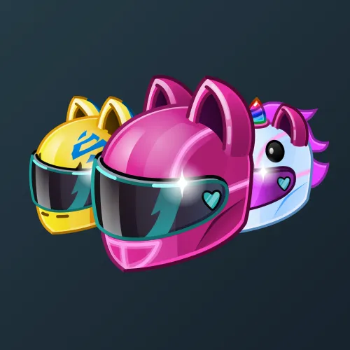

# Neko Helmet

  <!-- Левая часть: карточка коллекции -->
  

    

      
    

    
Neko Helmet

    
Коллекция

  

  <!-- Правая часть: информация о подарке -->
  

    
<strong>Дата выхода:</strong> 8 марта 2025 
    <strong>Цена:</strong> 2 500 <a href="/stars">Stars⭐️</a> 
    <strong>Тираж:</strong> 18 000 шт. 
    <strong>Дата выхода улучшений:</strong> 8 марта 2025 
    <strong>Стоимость улучшения:</strong> от 500 до 25 000 <a href="/stars">Stars⭐️</a> 
    <strong>Улучшено:</strong> 15 396 шт. (85.5% от тиража) 
    <strong>Сожжено:</strong> 1 851 шт. (10.3% от тиража)

  

**Neko Helmet** — Telegram-подарок в виде мотоциклетного шлема-кошки с ушами, выпущенный 8 марта 2025 года. Изначальный тираж составлял 18 000 экземпляров. Улучшения стали доступны в день выхода, при этом до их введения было сожжено 1 851 подарок (10.3%). По состоянию на указанную дату улучшено 15 396 экземпляров (85.5% от тиража). Коллекция включает 59 уникальных моделей с заявленной редкостью от 0.5% до 2.7%.

Наиболее редкая модель коллекции — **Mad Clown** — насчитывает 60 улучшенных экземпляров, что соответствует реальной редкости 0.39% (при заявленных 0.5%).

Все подарки, выходившие на 8 марта, можно посмотреть <a href="/march-8-gifts">здесь</a>.

---

## Ключевые особенности

- Улучшения стали доступны в день выхода подарка.
- Высокий процент улучшенных экземпляров (85.5%) при цене входа 2 500 Stars.
- Модели с заявленной редкостью 0.5% имеют фактическое количество улучшенных от 60 до 84, при этом минимальное значение у **Mad Clown** (60).
- В группе 2.7% разброс количества составляет от 385 до 468, что близко к ожидаемым значениям.

## Модели и редкость

Коллекция состоит из 59 моделей. В таблице ниже представлено фактическое количество улучшенных экземпляров по каждой модели, а также реальная редкость (рассчитанная относительно общего числа улучшенных — 15 396) и заявленная при выпуске.

| №   | Название модели        | Реальная редкость (заявленная) | Кол-во улучшенных |
| --- | ---------------------- | ------------------------------- | ----------------- |
| 1   | Bulldog Bob            | 0.48% (0.5%)                    | 74                |
| 2   | Dalmatian              | 0.55% (0.5%)                    | 84                |
| 3   | Mad Clown              | 0.39% (0.5%)                    | 60                |
| 4   | Sky Diver              | 0.49% (0.5%)                    | 75                |
| 5   | Turbo Frog             | 0.42% (0.5%)                    | 65                |
| 6   | White Rabbit           | 0.53% (0.5%)                    | 81                |
| 7   | Wild Cat               | 0.45% (0.5%)                    | 70                |
| 8   | Astronaut              | 1.08% (1.0%)                    | 167               |
| 9   | Cookie Monster         | 1.01% (1.0%)                    | 156               |
| 10  | Disco Ball             | 0.99% (1.0%)                    | 153               |
| 11  | Dullahan               | 1.13% (1.0%)                    | 174               |
| 12  | Formula One            | 1.22% (1.0%)                    | 188               |
| 13  | Frostbear              | 0.88% (1.0%)                    | 136               |
| 14  | Glitch                 | 0.98% (1.0%)                    | 151               |
| 15  | Hell Rider             | 1.04% (1.0%)                    | 160               |
| 16  | Kawaii                 | 1.00% (1.0%)                    | 154               |
| 17  | Love Ghost             | 0.95% (1.0%)                    | 146               |
| 18  | Maneki Neko            | 1.12% (1.0%)                    | 173               |
| 19  | Princess               | 1.06% (1.0%)                    | 163               |
| 20  | Queen Bee              | 0.95% (1.0%)                    | 146               |
| 21  | Retro-Future           | 1.12% (1.0%)                    | 172               |
| 22  | Road Queen             | 1.01% (1.0%)                    | 156               |
| 23  | Savage                 | 1.12% (1.0%)                    | 172               |
| 24  | Sonic Rave             | 0.95% (1.0%)                    | 146               |
| 25  | Unicorn                | 1.08% (1.0%)                    | 166               |
| 26  | Wild Daisy             | 0.96% (1.0%)                    | 148               |
| 27  | Gold Rush              | 1.44% (1.5%)                    | 222               |
| 28  | Grey Shark             | 1.52% (1.5%)                    | 234               |
| 29  | Ladybug                | 1.53% (1.5%)                    | 236               |
| 30  | Starry Sky             | 1.45% (1.5%)                    | 224               |
| 31  | Steampunk              | 1.45% (1.5%)                    | 223               |
| 32  | Biker Girl             | 1.90% (2.0%)                    | 293               |
| 33  | Chrome                 | 1.96% (2.0%)                    | 301               |
| 34  | Lightspeed             | 2.20% (2.0%)                    | 339               |
| 35  | Poison Ivy             | 2.13% (2.0%)                    | 328               |
| 36  | Strawberry             | 1.86% (2.0%)                    | 286               |
| 37  | Techno                 | 2.12% (2.0%)                    | 326               |
| 38  | Twister                | 1.80% (2.0%)                    | 277               |
| 39  | Blackout               | 2.46% (2.3%)                    | 378               |
| 40  | Whiteout               | 2.23% (2.3%)                    | 344               |
| 41  | Cotton Drift           | 2.38% (2.5%)                    | 366               |
| 42  | Databreak              | 2.23% (2.5%)                    | 343               |
| 43  | Hornet                 | 2.42% (2.5%)                    | 373               |
| 44  | Hothead                | 2.57% (2.5%)                    | 396               |
| 45  | Jade Breeze            | 2.64% (2.5%)                    | 407               |
| 46  | Lagoon                 | 2.63% (2.5%)                    | 405               |
| 47  | Nebula                 | 2.33% (2.5%)                    | 359               |
| 48  | Night Race             | 2.47% (2.5%)                    | 380               |
| 49  | Optimus Prime          | 2.42% (2.5%)                    | 373               |
| 50  | Panther                | 2.77% (2.5%)                    | 426               |
| 51  | Red Shift              | 2.63% (2.5%)                    | 405               |
| 52  | Tokyo Sunset           | 2.40% (2.5%)                    | 370               |
| 53  | Ultravolt              | 2.30% (2.5%)                    | 354               |
| 54  | Acid Punch             | 2.75% (2.7%)                    | 423               |
| 55  | Caffeine               | 2.50% (2.7%)                    | 385               |
| 56  | Copper Alloy           | 2.69% (2.7%)                    | 414               |
| 57  | Lime Juice             | 3.04% (2.7%)                    | 468               |
| 58  | Shockwave              | 2.90% (2.7%)                    | 446               |
| 59  | Silver Surfer          | 2.83% (2.7%)                    | 435               |
| 60  | Solar Glare            | 2.65% (2.7%)                    | 408               |

Наиболее редкими являются модели с заявленной редкостью 0.5% — **Mad Clown** (60), **Turbo Frog** (65), **Wild Cat** (70), **Bulldog Bob** (74) и **Sky Diver** (75). При этом реальная редкость модели **Mad Clown** (0.39%) ниже заявленной, и это наименьшее количество улучшенных экземпляров во всей коллекции. Модели с редкостью 2.7% демонстрируют фактическое количество от 385 до 468, что в целом соответствует ожидаемому распределению.