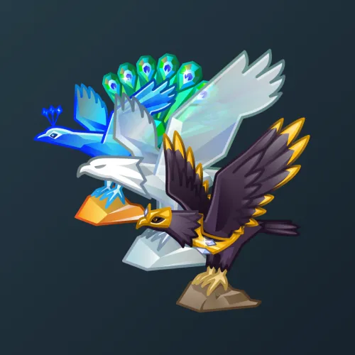

# Rare Bird

  

    

      
    

    
Rare Bird

    
Коллекция

  

  

    
<strong>Дата выхода:</strong> 4 июля 2025 
    <strong>Цена:</strong> 5 000 <a href="/stars">Stars⭐️</a> 
    <strong>Тираж:</strong> 15 000 шт. 
    <strong>Дата выхода улучшений:</strong> 3 февраля 2026 
    <strong>Стоимость улучшения:</strong> от 25 до 1 000 <a href="/stars">Stars⭐️</a> 
    <strong>Улучшено:</strong> 11 971 шт. (79.8% от тиража) 
    <strong>Сожжено:</strong> 29 шт. (0.2% от тиража)

  

**Rare Bird** — Telegram-подарок, выпущенный 4 июля 2025 года в честь американского праздника. Представляет собой стилизованных прозрачных хрустальных птиц, включая орла. Коллекция включает 51 уникальную модель с заявленной редкостью от 0.5% до 4%. Изначальный тираж составил 15 000 экземпляров. До введения улучшений 3 февраля 2026 года было сожжено всего 29 подарков (0.2%). По состоянию на указанную дату улучшено 11 971 экземпляр (79.8% от тиража). Наиболее редкая модель коллекции — **Fiscal Hawk** — насчитывает 49 улучшенных экземпляров, что соответствует реальной редкости 0.41% (при заявленных 0.5%).

## Модели и редкость

Коллекция состоит из 51 модели. В таблице ниже представлено фактическое количество улучшенных экземпляров по каждой модели, а также реальная редкость (рассчитанная относительно общего числа улучшенных — 11 971) и заявленная при выпуске.

| № | Название модели | Реальная редкость (заявленная) | Кол-во улучшенных |
|---|:---|:---|:---|
| 1 | Fiscal Hawk | 0.41% (0.5%) | 49 шт. |
| 2 | Frozen Gold | 0.55% (0.5%) | 66 шт. |
| 3 | Royal Pavo | 0.57% (0.5%) | 68 шт. |
| 4 | Thunderbird | 0.44% (0.5%) | 53 шт. |
| 5 | Zombie Rider | 0.55% (0.5%) | 66 шт. |
| 6 | Dark Knight | 0.98% (1.0%) | 117 шт. |
| 7 | Dark Prince | 0.94% (1.0%) | 112 шт. |
| 8 | Hot Chick | 1.07% (1.0%) | 128 шт. |
| 9 | Lucifer | 1.04% (1.0%) | 125 шт. |
| 10 | Rose Fairy | 1.03% (1.0%) | 123 шт. |
| 11 | Ruby Dodo | 0.95% (1.0%) | 114 шт. |
| 12 | Wave Glider | 0.94% (1.0%) | 112 шт. |
| 13 | Apex Drone | 1.45% (1.5%) | 173 шт. |
| 14 | Aurora Moth | 1.59% (1.5%) | 190 шт. |
| 15 | Black Hawk | 1.56% (1.5%) | 187 шт. |
| 16 | Dragon | 1.65% (1.5%) | 197 шт. |
| 17 | Fire Rooster | 1.64% (1.5%) | 196 шт. |
| 18 | Gargoyle | 1.27% (1.5%) | 152 шт. |
| 19 | Gilded Heron | 1.50% (1.5%) | 180 шт. |
| 20 | Golden Falcon | 1.48% (1.5%) | 177 шт. |
| 21 | Manticore | 1.50% (1.5%) | 179 шт. |
| 22 | Shadow Raven | 1.60% (1.5%) | 192 шт. |
| 23 | Sphinx | 1.50% (1.5%) | 179 шт. |
| 24 | Treasure | 1.36% (1.5%) | 163 шт. |
| 25 | Winged Victory | 1.67% (1.5%) | 200 шт. |
| 26 | Bat King | 1.98% (2.0%) | 237 шт. |
| 27 | Battlewing | 2.05% (2.0%) | 246 шт. |
| 28 | Crystal Swift | 2.15% (2.0%) | 257 шт. |
| 29 | Diamond Owl | 2.04% (2.0%) | 244 шт. |
| 30 | Hippogriff | 1.85% (2.0%) | 222 шт. |
| 31 | Icarus | 2.24% (2.0%) | 268 шт. |
| 32 | Necromancer | 1.86% (2.0%) | 223 шт. |
| 33 | Prehistoric | 2.05% (2.0%) | 246 шт. |
| 34 | Chickadee | 2.52% (2.5%) | 302 шт. |
| 35 | Garnet Koel | 2.46% (2.5%) | 294 шт. |
| 36 | Kakapo | 2.51% (2.5%) | 301 шт. |
| 37 | Pegasus | 2.55% (2.5%) | 305 шт. |
| 38 | Silver Spike | 2.46% (2.5%) | 295 шт. |
| 39 | Silver Wings | 2.55% (2.5%) | 305 шт. |
| 40 | The Emperor | 2.52% (2.5%) | 302 шт. |
| 41 | Copper Quack | 3.12% (3.0%) | 373 шт. |
| 42 | Pigeon | 3.23% (3.0%) | 387 шт. |
| 43 | Red Vulture | 2.75% (3.0%) | 329 шт. |
| 44 | Amber Toucan | 3.36% (3.5%) | 402 шт. |
| 45 | Azure Spark | 3.51% (3.5%) | 420 шт. |
| 46 | Crystal Swan | 3.38% (3.5%) | 405 шт. |
| 47 | Jade Jay | 3.38% (3.5%) | 405 шт. |
| 48 | Noble Puffin | 3.52% (3.5%) | 421 шт. |
| 49 | Pelican | 3.51% (3.5%) | 420 шт. |
| 50 | Phoenix | 3.25% (3.5%) | 389 шт. |
| 51 | Paradise | 3.96% (4.0%) | 474 шт. |

Наиболее редкими являются модели с заявленной редкостью 0.5% — **Fiscal Hawk** (49), **Thunderbird** (53), **Frozen Gold** (66), **Zombie Rider** (66) и **Royal Pavo** (68). При этом реальная редкость модели **Fiscal Hawk** (0.41%) ниже заявленной, и это наименьшее количество улучшенных экземпляров во всей коллекции.