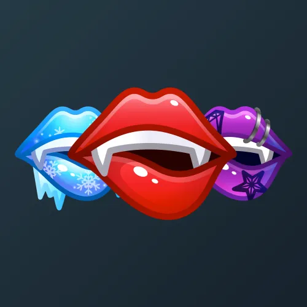

# Sharp Tongue

  

    

      
    

    
Sharp Tongue

    
Коллекция

  

  

    
<strong>Дата выхода:</strong> 29 октября 2024 
    <strong>Цена:</strong> 25 <a href="/stars">Stars⭐️</a> 
    <strong>Тираж:</strong> 10 000 шт. 
    <strong>Дата выхода улучшений:</strong> 1 января 2025 
    <strong>Стоимость улучшения:</strong> 25 <a href="/stars">Stars⭐️</a> 
    <strong>Улучшено:</strong> 8 099 шт. (81.0% от тиража) 
    <strong>Сожжено:</strong> 1 454 шт. (14.5% от тиража)

  

**Sharp Tongue** — Telegram-подарок, выпущенный 29 октября 2024 года в преддверии Хэллоуина. Представляет собой стилизованные женские губы с клыками («острый язычок»). Коллекция включает 49 уникальных моделей с заявленной редкостью от 0.5% до 2.5%. Изначальный тираж составил всего 10 000 экземпляров. До введения улучшений 1 января 2025 года было сожжено 1 454 подарка (14.5%). По состоянию на указанную дату улучшено 8 099 экземпляров (81.0% от тиража). Наиболее редкая модель коллекции — **Zombie Bite** — насчитывает 27 улучшенных экземпляров, что соответствует реальной редкости 0.33% (при заявленных 0.5%).

## Ключевые особенности

- Небольшой изначальный тираж (10 000 экземпляров) и последующее сожжение 14.5% подарков сделали улучшенные экземпляры коллекции более редкими и востребованными.

## Модели и редкость

Коллекция состоит из 49 моделей. В таблице ниже представлено фактическое количество улучшенных экземпляров по каждой модели, а также реальная редкость (рассчитанная относительно общего числа улучшенных — 8 099) и заявленная при выпуске.

| № | Название модели | Реальная редкость (заявленная) | Кол-во улучшенных |
|---|:---|:---|:---|
| 1 | Glitch | 0.56% (0.5%) | 45 шт. |
| 2 | Secret Look | 0.58% (0.5%) | 47 шт. |
| 3 | Teasing Look | 0.46% (0.5%) | 37 шт. |
| 4 | Zombie Bite | 0.33% (0.5%) | 27 шт. |
| 5 | Acid Witch | 1.51% (1.5%) | 122 шт. |
| 6 | Comics | 1.47% (1.5%) | 119 шт. |
| 7 | Frostbite | 1.64% (1.5%) | 133 шт. |
| 8 | Karlach | 1.59% (1.5%) | 129 шт. |
| 9 | Melony | 1.52% (1.5%) | 123 шт. |
| 10 | Neon Club | 1.68% (1.5%) | 136 шт. |
| 11 | Pop Art | 1.53% (1.5%) | 124 шт. |
| 12 | Punk Girl | 1.57% (1.5%) | 127 шт. |
| 13 | Redlight | 1.38% (1.5%) | 112 шт. |
| 14 | Sweety | 1.67% (1.5%) | 135 шт. |
| 15 | Coral Reef | 1.98% (2.0%) | 160 шт. |
| 16 | Devilfish | 1.96% (2.0%) | 159 шт. |
| 17 | Ferrum Fatale | 1.95% (2.0%) | 158 шт. |
| 18 | Galaxy | 2.26% (2.0%) | 183 шт. |
| 19 | Golden Girl | 1.70% (2.0%) | 138 шт. |
| 20 | High Voltage | 1.99% (2.0%) | 161 шт. |
| 21 | Leopard | 1.86% (2.0%) | 151 шт. |
| 22 | Lizard | 1.93% (2.0%) | 156 шт. |
| 23 | Minimalipstick | 1.85% (2.0%) | 150 шт. |
| 24 | Night Club | 2.04% (2.0%) | 165 шт. |
| 25 | Padme | 1.83% (2.0%) | 148 шт. |
| 26 | Succubus | 1.88% (2.0%) | 152 шт. |
| 27 | Sweet Berry | 2.09% (2.0%) | 169 шт. |
| 28 | Vampire | 1.94% (2.0%) | 157 шт. |
| 29 | Avatar | 2.56% (2.5%) | 207 шт. |
| 30 | Cold Bite | 2.63% (2.5%) | 213 шт. |
| 31 | Daring Kiss | 2.35% (2.5%) | 190 шт. |
| 32 | Femme Fatale | 2.54% (2.5%) | 206 шт. |
| 33 | Glamour | 2.67% (2.5%) | 216 шт. |
| 34 | Glossy Hot | 2.52% (2.5%) | 204 шт. |
| 35 | Hot Summer | 2.33% (2.5%) | 189 шт. |
| 36 | Hypnotic | 2.64% (2.5%) | 214 шт. |
| 37 | Lady Night | 3.09% (2.5%) | 250 шт. |
| 38 | Manga Smile | 2.42% (2.5%) | 196 шт. |
| 39 | Morticia | 2.28% (2.5%) | 185 шт. |
| 40 | Mystique | 2.23% (2.5%) | 181 шт. |
| 41 | Pepelicious | 2.30% (2.5%) | 186 шт. |
| 42 | Pink Mamba | 2.44% (2.5%) | 198 шт. |
| 43 | Queen | 2.75% (2.5%) | 223 шт. |
| 44 | Rainbow | 2.74% (2.5%) | 222 шт. |
| 45 | Sour Bite | 2.36% (2.5%) | 191 шт. |
| 46 | Spicy Mint | 2.56% (2.5%) | 207 шт. |
| 47 | Sunset | 2.54% (2.5%) | 206 шт. |
| 48 | Tangy Coil | 2.43% (2.5%) | 197 шт. |
| 49 | Vegan Snake | 2.61% (2.5%) | 211 шт. |
| 50 | Velvety | 2.27% (2.5%) | 184 шт. |

Наиболее редкими являются модели с заявленной редкостью 0.5% — **Zombie Bite** (27), **Teasing Look** (37), **Glitch** (45) и **Secret Look** (47). При этом реальная редкость модели **Zombie Bite** (0.33%) значительно ниже заявленной, и это наименьшее количество улучшенных экземпляров во всей коллекции.