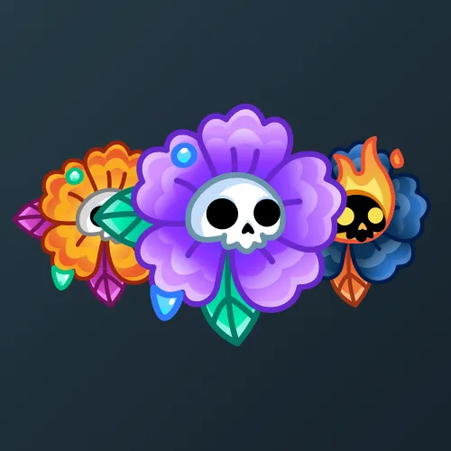

# Skull Flower

  <!-- Левая часть: карточка коллекции -->
  

    

      
    

    
Skull Flower

    
Коллекция

  

  <!-- Правая часть: информация о подарке -->
  

    
<strong>Дата выхода:</strong> 29 октября 2024 
    <strong>Цена:</strong> 25 <a href="/stars">Stars⭐️</a> 
    <strong>Тираж:</strong> 30 000 шт. 
    <strong>Дата выхода улучшений:</strong> 1 января 2025 
    <strong>Стоимость улучшения:</strong> 25 <a href="/stars">Stars⭐️</a> 
    <strong>Улучшено:</strong> 21 741 шт. (72.5% от тиража) 
    <strong>Сожжено:</strong> 5 874 шт. (19.6% от тиража)

  

**Skull Flower** — Telegram-подарок, выпущенный 29 октября 2024 года специально к Хэллоуину. Представляет собой цветок с черепом. Коллекция включает 50 уникальных моделей с заявленной редкостью от 0.5% до 3%. Изначальный тираж составил 30 000 экземпляров. До введения улучшений 1 января 2025 года было сожжено (обменяно на звёзды) 5 874 подарка (19.6%). По состоянию на указанную дату улучшено 21 741 экземпляр (72.5% от тиража). Стоимость улучшения фиксирована и составляет 25 Stars для всех моделей.

Помимо Skull Flower, в Telegram представлен другой вид NFT-цветов — <a href="/sakura-flower">Sakura Flower</a>.

Наиболее редкая модель коллекции — **Black Cat** — насчитывает 94 улучшенных экземпляра, что соответствует реальной редкости 0.43% (при заявленных 0.5%).

---

## Модели и редкость

Коллекция состоит из 50 моделей. В таблице ниже представлено фактическое количество улучшенных экземпляров по каждой модели, а также реальная редкость (рассчитанная относительно общего числа улучшенных — 21 741) и заявленная при выпуске.

| №   | Название модели     | Реальная редкость (заявленная) | Кол-во улучшенных |
| --- | ------------------- | ------------------------------- | ----------------- |
| 1   | Black Cat           | 0.43% (0.5%)                    | 94                |
| 2   | Ghost Rider         | 0.48% (0.5%)                    | 104               |
| 3   | Leopard             | 0.55% (0.5%)                    | 120               |
| 4   | Tim Burton          | 0.54% (0.5%)                    | 117               |
| 5   | Blue Bull           | 0.97% (1.0%)                    | 210               |
| 6   | Calavera            | 1.06% (1.0%)                    | 231               |
| 7   | Chromium            | 1.04% (1.0%)                    | 227               |
| 8   | Cobweb              | 1.20% (1.0%)                    | 260               |
| 9   | Cocoon              | 0.98% (1.0%)                    | 212               |
| 10  | Health Risk         | 0.98% (1.0%)                    | 214               |
| 11  | Pamplona            | 1.08% (1.0%)                    | 235               |
| 12  | Princess            | 1.04% (1.0%)                    | 227               |
| 13  | Sand Goldbud        | 0.97% (1.0%)                    | 211               |
| 14  | Soft Puff           | 0.91% (1.0%)                    | 198               |
| 15  | Dark Carnival       | 1.45% (1.5%)                    | 316               |
| 16  | Glowing Goth        | 1.39% (1.5%)                    | 303               |
| 17  | Graffiti            | 1.65% (1.5%)                    | 359               |
| 18  | Jack Sparrow        | 1.43% (1.5%)                    | 310               |
| 19  | Joyful Duck         | 1.55% (1.5%)                    | 337               |
| 20  | Technicolor         | 1.33% (1.5%)                    | 290               |
| 21  | Citrus Twist        | 1.95% (2.0%)                    | 424               |
| 22  | Hypercolor          | 2.11% (2.0%)                    | 458               |
| 23  | Luau Lily           | 2.13% (2.0%)                    | 464               |
| 24  | Marigold            | 2.07% (2.0%)                    | 451               |
| 25  | Neon Green          | 1.99% (2.0%)                    | 432               |
| 26  | Neon Pink           | 1.91% (2.0%)                    | 416               |
| 27  | Newspaper           | 1.96% (2.0%)                    | 427               |
| 28  | Secret Sprout       | 1.99% (2.0%)                    | 433               |
| 29  | Sun Dazzle          | 2.04% (2.0%)                    | 443               |
| 30  | Sunset              | 2.16% (2.0%)                    | 470               |
| 31  | Vector              | 2.01% (2.0%)                    | 438               |
| 32  | Azalea              | 2.99% (3.0%)                    | 651               |
| 33  | Black Dahlia        | 2.78% (3.0%)                    | 604               |
| 34  | Blue Iris           | 3.03% (3.0%)                    | 658               |
| 35  | Carnation           | 3.04% (3.0%)                    | 662               |
| 36  | Daisy               | 3.04% (3.0%)                    | 662               |
| 37  | Dewdrop             | 3.19% (3.0%)                    | 693               |
| 38  | Early Green         | 3.02% (3.0%)                    | 656               |
| 39  | Frozen Violet       | 2.93% (3.0%)                    | 637               |
| 40  | Gothic              | 2.99% (3.0%)                    | 650               |
| 41  | Mystic              | 2.96% (3.0%)                    | 643               |
| 42  | Nightshade          | 3.00% (3.0%)                    | 652               |
| 43  | Peony               | 2.91% (3.0%)                    | 633               |
| 44  | Pink Caprice        | 3.07% (3.0%)                    | 668               |
| 45  | Poinsettia          | 2.91% (3.0%)                    | 632               |
| 46  | Royal Azure         | 2.91% (3.0%)                    | 633               |
| 47  | Silversage          | 2.90% (3.0%)                    | 630               |
| 48  | Sunburst            | 3.11% (3.0%)                    | 677               |
| 49  | White Rose          | 3.00% (3.0%)                    | 652               |
| 50  | Wreath              | 2.84% (3.0%)                    | 617               |

Наиболее редкими являются модели с заявленной редкостью 0.5% — **Black Cat** (94), **Ghost Rider** (104), **Tim Burton** (117) и **Leopard** (120). При этом реальная редкость модели **Black Cat** (0.43%) ниже заявленной, и это наименьшее количество улучшенных экземпляров во всей коллекции. В группе с редкостью 3% наибольшее количество демонстрируют **Dewdrop** (693) и **Sunburst** (677), что соответствует реальной редкости около 3.19% и 3.11% — выше заявленной, тогда как **Black Dahlia** (604) с редкостью 2.78% находится у нижней границы.