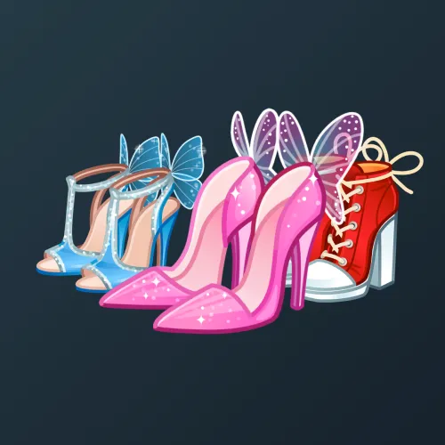

# Sky Stilettos

  

    

      
    

    
Sky Stilettos

    
Коллекция

  

  

    
<strong>Дата выхода:</strong> 14 февраля 2025 
    <strong>Цена:</strong> 300 <a href="/stars">Stars⭐️</a> 
    <strong>Тираж:</strong> 70 000 шт. 
    <strong>Дата выхода улучшений:</strong> 5 сентября 2025 
    <strong>Стоимость улучшения:</strong> от 25 до 50 000 <a href="/stars">Stars⭐️</a> 
    <strong>Улучшено:</strong> 50 644 шт. (72.3% от тиража) 
    <strong>Сожжено:</strong> 11 540 шт. (16.5% от тиража)

  

**Sky Stilettos** — Telegram-подарок, выпущенный 14 февраля 2025 года. Представляет собой стилизованные розовые туфли на высоком каблуке (шпильке). Коллекция включает 50 уникальных моделей с заявленной редкостью от 0.5% до 3%. Изначальный тираж составил 70 000 экземпляров. До введения улучшений 5 сентября 2025 года было сожжено 11 540 подарков (16.5%). По состоянию на указанную дату улучшено 50 644 экземпляра (72.3% от тиража). Наиболее редкая модель коллекции — **Fortuna** — насчитывает 240 улучшенных экземпляров, что соответствует реальной редкости 0.47% (при заявленных 0.5%).

## Ключевые особенности

- Высокая стоимость улучшения (до 50 000 Stars) не помешала улучшить более 72% тиража.

## Модели и редкость

Коллекция состоит из 50 моделей. В таблице ниже представлено фактическое количество улучшенных экземпляров по каждой модели, а также реальная редкость (рассчитанная относительно общего числа улучшенных — 50 644) и заявленная при выпуске.

| № | Название модели | Реальная редкость (заявленная) | Кол-во улучшенных |
|---|:---|:---|:---|
| 1 | Crypto Queen | 0.53% (0.5%) | 267 шт. |
| 2 | Fortuna | 0.47% (0.5%) | 240 шт. |
| 3 | Spidergirl | 0.51% (0.5%) | 258 шт. |
| 4 | Cinderella | 0.97% (1.0%) | 491 шт. |
| 5 | Diva | 1.02% (1.0%) | 518 шт. |
| 6 | Glossy | 0.97% (1.0%) | 491 шт. |
| 7 | Hellcat | 1.03% (1.0%) | 523 шт. |
| 8 | Lost World | 1.01% (1.0%) | 511 шт. |
| 9 | Asmodea | 1.42% (1.5%) | 720 шт. |
| 10 | Cowgirl | 1.51% (1.5%) | 764 шт. |
| 11 | Fluffy Cloud | 1.51% (1.5%) | 763 шт. |
| 12 | Frozen | 1.56% (1.5%) | 790 шт. |
| 13 | Glam Doll | 1.50% (1.5%) | 759 шт. |
| 14 | Heartbeat | 1.66% (1.5%) | 842 шт. |
| 15 | Jester | 1.44% (1.5%) | 729 шт. |
| 16 | April | 2.07% (2.0%) | 1 049 шт. |
| 17 | Companion | 1.96% (2.0%) | 993 шт. |
| 18 | Fergie | 1.97% (2.0%) | 1 000 шт. |
| 19 | Free Spirit | 1.97% (2.0%) | 1 000 шт. |
| 20 | Good Fairy | 1.99% (2.0%) | 1 010 шт. |
| 21 | Mermaid | 2.03% (2.0%) | 1 030 шт. |
| 22 | Pixie Dust | 1.90% (2.0%) | 963 шт. |
| 23 | Rebel | 2.06% (2.0%) | 1 042 шт. |
| 24 | Rosaria | 1.93% (2.0%) | 978 шт. |
| 25 | Serpent | 2.04% (2.0%) | 1 035 шт. |
| 26 | Snow White | 2.00% (2.0%) | 1 015 шт. |
| 27 | Tinker | 2.01% (2.0%) | 1 017 шт. |
| 28 | Vogue | 1.92% (2.0%) | 973 шт. |
| 29 | White Rose | 2.07% (2.0%) | 1 048 шт. |
| 30 | Wild Cherry | 2.03% (2.0%) | 1 026 шт. |
| 31 | Aurora | 2.52% (2.5%) | 1 276 шт. |
| 32 | Coquette | 2.43% (2.5%) | 1 233 шт. |
| 33 | Forget-Me-Not | 2.47% (2.5%) | 1 252 шт. |
| 34 | Graphium | 2.40% (2.5%) | 1 213 шт. |
| 35 | Heliconius | 2.49% (2.5%) | 1 260 шт. |
| 36 | Jasmine | 2.43% (2.5%) | 1 229 шт. |
| 37 | Mistress | 2.52% (2.5%) | 1 274 шт. |
| 38 | Mystery | 2.59% (2.5%) | 1 311 шт. |
| 39 | Phantom Blush | 2.52% (2.5%) | 1 278 шт. |
| 40 | Poison Ivy | 2.52% (2.5%) | 1 278 шт. |
| 41 | Rendezvous | 2.46% (2.5%) | 1 248 шт. |
| 42 | Rosy Moth | 2.49% (2.5%) | 1 262 шт. |
| 43 | Shining Star | 2.47% (2.5%) | 1 253 шт. |
| 44 | Teardrops | 2.55% (2.5%) | 1 291 шт. |
| 45 | Diaethria | 2.99% (3.0%) | 1 515 шт. |
| 46 | Eooxy | 3.04% (3.0%) | 1 538 шт. |
| 47 | Ladybug | 2.96% (3.0%) | 1 497 шт. |
| 48 | Leopard | 3.02% (3.0%) | 1 527 шт. |
| 49 | Machaon | 2.99% (3.0%) | 1 512 шт. |
| 50 | Queen Bee | 3.07% (3.0%) | 1 557 шт. |

Наиболее редкими являются модели с заявленной редкостью 0.5% — **Fortuna** (240), **Spidergirl** (258) и **Crypto Queen** (267). При этом реальная редкость модели **Fortuna** (0.47%) ниже заявленной, и это наименьшее количество улучшенных экземпляров во всей коллекции.