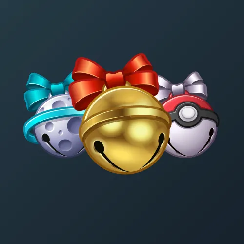

# Sleigh Bell

  <!-- Левая часть: карточка коллекции -->
  

    

      
    

    
Sleigh Bell

    
Коллекция

  

  <!-- Правая часть: информация о подарке -->
  

    
<strong>Дата выхода:</strong> 17 декабря 2024 
    <strong>Цена:</strong> 200 <a href="/stars">Stars⭐️</a> 
    <strong>Тираж:</strong> 50 000 шт. 
    <strong>Дата выхода улучшений:</strong> 23 февраля 2025 
    <strong>Стоимость улучшения:</strong> от 25 до 25 000 <a href="/stars">Stars⭐️</a> 
    <strong>Улучшено:</strong> 22 057 шт. (44.1% от тиража) 
    <strong>Сожжено:</strong> 22 000 шт. (44.0% от тиража)

  

**Sleigh Bell** — Telegram-подарок, выпущенный 17 декабря 2024 года в канун Рождества и Нового года. Представляет собой колокольчик для саней, один из атрибутов новогодних праздников. Коллекция включает 50 уникальных моделей с заявленной редкостью от 0.5% до 5%. Изначальный тираж составил 50 000 экземпляров. До введения улучшений 23 февраля 2025 года было сожжено (обменяно на звёзды) 22 000 подарков (44.0%). По состоянию на указанную дату улучшено 22 057 экземпляров (44.1% от тиража). Стоимость улучшения варьируется от 25 до 25 000 Stars в зависимости от модели.

Помимо Sleigh Bell, в Telegram представлена другая серия колокольчиков — <a href="/jingle-bells">Jingle Bells</a>.

Наиболее редкая модель коллекции — **Disco Blast** — насчитывает 103 улучшенных экземпляра, что соответствует реальной редкости 0.47% (при заявленных 0.5%).

---

## Модели и редкость

Коллекция состоит из 50 моделей. В таблице ниже представлено фактическое количество улучшенных экземпляров по каждой модели, а также реальная редкость (рассчитанная относительно общего числа улучшенных — 22 057) и заявленная при выпуске.

| №   | Название модели     | Реальная редкость (заявленная) | Кол-во улучшенных |
| --- | ------------------- | ------------------------------- | ----------------- |
| 1   | Darth Vader         | 0.50% (0.5%)                    | 111               |
| 2   | Disco Blast         | 0.47% (0.5%)                    | 103               |
| 3   | Stellar Map         | 0.53% (0.5%)                    | 117               |
| 4   | Stuart              | 0.57% (0.5%)                    | 125               |
| 5   | Beehive             | 0.94% (1.0%)                    | 207               |
| 6   | Blizzard            | 0.98% (1.0%)                    | 217               |
| 7   | Confetti            | 0.92% (1.0%)                    | 202               |
| 8   | Dark Orb            | 1.18% (1.0%)                    | 260               |
| 9   | Dead Space          | 0.86% (1.0%)                    | 189               |
| 10  | Ghost Fog           | 0.95% (1.0%)                    | 210               |
| 11  | Last Player         | 0.92% (1.0%)                    | 204               |
| 12  | Line Art            | 1.04% (1.0%)                    | 230               |
| 13  | Soap Bubble         | 1.02% (1.0%)                    | 226               |
| 14  | Tinker Bell         | 0.90% (1.0%)                    | 199               |
| 15  | Cherry              | 1.54% (1.5%)                    | 339               |
| 16  | Cowbell             | 1.47% (1.5%)                    | 324               |
| 17  | Dracula             | 1.46% (1.5%)                    | 322               |
| 18  | Fireball            | 1.46% (1.5%)                    | 321               |
| 19  | Golden Dusk         | 1.62% (1.5%)                    | 357               |
| 20  | Holy Grenade        | 1.40% (1.5%)                    | 309               |
| 21  | Moon Ride           | 1.45% (1.5%)                    | 319               |
| 22  | Mortabella          | 1.48% (1.5%)                    | 327               |
| 23  | Piranha Plant       | 1.53% (1.5%)                    | 338               |
| 24  | Poké Bell           | 1.58% (1.5%)                    | 349               |
| 25  | Arctic Igloo        | 1.98% (2.0%)                    | 436               |
| 26  | Black Silver        | 1.92% (2.0%)                    | 423               |
| 27  | Candy Cane          | 1.99% (2.0%)                    | 439               |
| 28  | Golden Zebra        | 2.13% (2.0%)                    | 469               |
| 29  | Iron Mint           | 1.97% (2.0%)                    | 434               |
| 30  | Night Club          | 1.95% (2.0%)                    | 431               |
| 31  | Obsidian Oak        | 2.02% (2.0%)                    | 446               |
| 32  | Police Siren        | 1.92% (2.0%)                    | 424               |
| 33  | Spetsnaz            | 1.96% (2.0%)                    | 432               |
| 34  | Deutschland         | 2.50% (2.5%)                    | 551               |
| 35  | Faint Pearl         | 2.58% (2.5%)                    | 569               |
| 36  | Joker               | 2.41% (2.5%)                    | 532               |
| 37  | Pistachio           | 2.43% (2.5%)                    | 536               |
| 38  | Rose Gold           | 2.55% (2.5%)                    | 563               |
| 39  | Satin Brass         | 2.51% (2.5%)                    | 554               |
| 40  | Candy Cloud         | 2.86% (3.0%)                    | 632               |
| 41  | Copper Rose         | 3.16% (3.0%)                    | 698               |
| 42  | Deep Echo           | 3.06% (3.0%)                    | 675               |
| 43  | Raspberry           | 3.06% (3.0%)                    | 674               |
| 44  | Sparkles            | 2.87% (3.0%)                    | 634               |
| 45  | Argentum            | 3.94% (4.0%)                    | 870               |
| 46  | Bronze              | 4.07% (4.0%)                    | 897               |
| 47  | Green Light         | 4.12% (4.0%)                    | 908               |
| 48  | Purple Gold         | 4.13% (4.0%)                    | 911               |
| 49  | Truffle             | 3.98% (4.0%)                    | 877               |
| 50  | Fairycore           | 5.16% (5.0%)                    | 1 138             |

Наиболее редкими являются модели с заявленной редкостью 0.5% — **Disco Blast** (103), **Darth Vader** (111), **Stellar Map** (117) и **Stuart** (125). При этом реальная редкость модели **Disco Blast** (0.47%) ниже заявленной, и это наименьшее количество улучшенных экземпляров во всей коллекции. В группе с редкостью 5% модель **Fairycore** (1 138) ожидаемо имеет наибольшее количество, и её реальная редкость (5.16%) незначительно превышает заявленную.