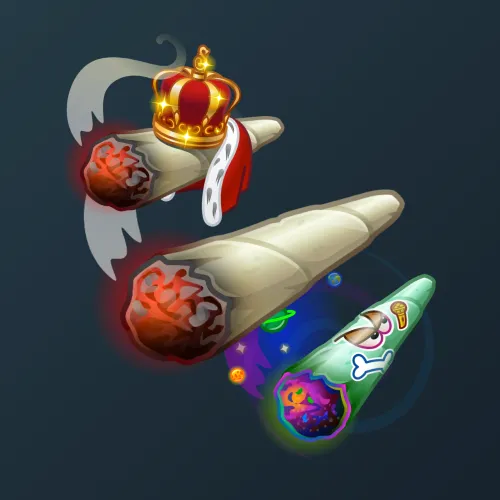

# Snoop Cigar

  <!-- Левая часть: карточка коллекции -->
  

    

      
    

    
Snoop Cigar

    
Коллекция

  

  <!-- Правая часть: информация о подарке -->
  

    
<strong>Дата выхода:</strong> 9 июля 2025 
    <strong>Цена:</strong> 1 000 <a href="/stars">Stars⭐️</a> 
    <strong>Тираж:</strong> 120 000 шт. 
    <strong>Дата выхода улучшений:</strong> 9 июля 2025 
    <strong>Стоимость улучшения:</strong> от 200 до 25 000 <a href="/stars">Stars⭐️</a> 
    <strong>Улучшено:</strong> 117 234 шт. (97.7% от тиража) 
    <strong>Сожжено:</strong> 120 шт. (0.1% от тиража)

  

**Snoop Cigar** — Telegram-подарок, выпущенный 9 июля 2025 года. Представляет собой косяк от Снуп Дога. Коллекция включает 50 уникальных моделей с заявленной редкостью от 0.5% до 3%. Изначальный тираж составил 120 000 экземпляров. Улучшения и возможность перевода в NFT стали доступны сразу в день выхода, 9 июля 2025 года. Было сожжено (обменяно на звёзды) всего 120 подарков (0.1%). По состоянию на указанную дату улучшено 117 234 экземпляра (97.7% от тиража). Стоимость улучшения варьируется от 200 до 25 000 Stars в зависимости от модели.

Другие подарки от Снуп Дога: <a href="/snoop-dogg">Snoop Dogg</a>, <a href="/low-rider">Low Rider</a>, <a href="/swag-bag">Swag Bag</a> и <a href="/westside-sign">Westside Sign</a>.

Наиболее редкая модель коллекции — **Cartoon Roll** — насчитывает 562 улучшенных экземпляра, что соответствует реальной редкости 0.48% (при заявленных 0.5%).

---

## Модели и редкость

Коллекция состоит из 50 моделей. В таблице ниже представлено фактическое количество улучшенных экземпляров по каждой модели, а также реальная редкость (рассчитанная относительно общего числа улучшенных — 117 234) и заявленная при выпуске.

| №   | Название модели     | Реальная редкость (заявленная) | Кол-во улучшенных |
| --- | ------------------- | ------------------------------- | ----------------- |
| 1   | Cartoon Roll        | 0.48% (0.5%)                    | 562               |
| 2   | Infinity Stoned     | 0.50% (0.5%)                    | 586               |
| 3   | Snoop Graffiti      | 0.50% (0.5%)                    | 582               |
| 4   | California          | 0.95% (1.0%)                    | 1 115             |
| 5   | Charmed Roll        | 1.00% (1.0%)                    | 1 175             |
| 6   | Crystal             | 1.07% (1.0%)                    | 1 251             |
| 7   | Gilded Copper       | 1.02% (1.0%)                    | 1 192             |
| 8   | Highway             | 0.99% (1.0%)                    | 1 157             |
| 9   | Hyperdrive          | 0.92% (1.0%)                    | 1 083             |
| 10  | Rap Battle          | 1.01% (1.0%)                    | 1 179             |
| 11  | Smoke Sway          | 0.99% (1.0%)                    | 1 158             |
| 12  | Snoop’s Pipe        | 0.97% (1.0%)                    | 1 137             |
| 13  | Soul Plane          | 1.03% (1.0%)                    | 1 213             |
| 14  | Doggystyle          | 1.53% (1.5%)                    | 1 798             |
| 15  | Meteor Impact       | 1.52% (1.5%)                    | 1 782             |
| 16  | Record Label        | 1.46% (1.5%)                    | 1 715             |
| 17  | Smoke Nukem         | 1.51% (1.5%)                    | 1 771             |
| 18  | Snoop Doggy         | 1.53% (1.5%)                    | 1 790             |
| 19  | Stargazer           | 1.55% (1.5%)                    | 1 815             |
| 20  | Surprise            | 1.52% (1.5%)                    | 1 779             |
| 21  | Baked Beats         | 2.05% (2.0%)                    | 2 402             |
| 22  | Happy Face          | 2.03% (2.0%)                    | 2 385             |
| 23  | Hot Stuff           | 2.01% (2.0%)                    | 2 351             |
| 24  | Snooperman          | 2.03% (2.0%)                    | 2 384             |
| 25  | Space Wrap          | 2.03% (2.0%)                    | 2 377             |
| 26  | Triple Shot         | 2.03% (2.0%)                    | 2 385             |
| 27  | America             | 2.47% (2.5%)                    | 2 900             |
| 28  | Angel Dust          | 2.46% (2.5%)                    | 2 889             |
| 29  | Cabbage Roll        | 2.48% (2.5%)                    | 2 911             |
| 30  | Debut Album         | 2.53% (2.5%)                    | 2 971             |
| 31  | Eurotrip            | 2.55% (2.5%)                    | 2 985             |
| 32  | Funk Dunk           | 2.50% (2.5%)                    | 2 928             |
| 33  | Hot Rod             | 2.53% (2.5%)                    | 2 965             |
| 34  | Ice Prince          | 2.44% (2.5%)                    | 2 864             |
| 35  | Mushizzle           | 2.50% (2.5%)                    | 2 936             |
| 36  | Royalty             | 2.49% (2.5%)                    | 2 921             |
| 37  | Smoke Dogg          | 2.45% (2.5%)                    | 2 873             |
| 38  | Vinyl Vibes         | 2.51% (2.5%)                    | 2 947             |
| 39  | Bandana             | 3.03% (3.0%)                    | 3 551             |
| 40  | Dolla Rolla         | 2.96% (3.0%)                    | 3 476             |
| 41  | Herbalist           | 3.08% (3.0%)                    | 3 617             |
| 42  | Jade Fade           | 3.05% (3.0%)                    | 3 580             |
| 43  | Lion King           | 2.97% (3.0%)                    | 3 482             |
| 44  | Mirage              | 2.92% (3.0%)                    | 3 425             |
| 45  | Old School          | 3.00% (3.0%)                    | 3 514             |
| 46  | Puff Puff Pass      | 2.99% (3.0%)                    | 3 506             |
| 47  | Rasta               | 2.93% (3.0%)                    | 3 441             |
| 48  | Ruby Doobie         | 3.06% (3.0%)                    | 3 592             |
| 49  | Snoop Ring          | 2.90% (3.0%)                    | 3 402             |
| 50  | The King            | 2.95% (3.0%)                    | 3 455             |

Наиболее редкими являются модели с заявленной редкостью 0.5% — **Cartoon Roll** (562), **Snoop Graffiti** (582) и **Infinity Stoned** (586). При этом реальная редкость модели **Cartoon Roll** (0.48%) ниже заявленной, и это наименьшее количество улучшенных экземпляров во всей коллекции. В группе с редкостью 3% наибольшее количество демонстрируют **Herbalist** (3 617) и **Ruby Doobie** (3 592), что соответствует реальной редкости около 3.08% и 3.06% — выше заявленной, тогда как **Snoop Ring** (3 402) с редкостью 2.90% находится у нижней границы.