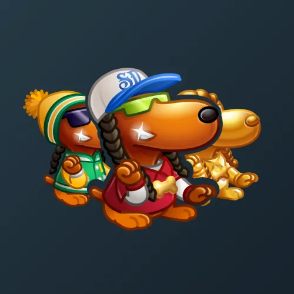

# Snoop Dogg

  <!-- Левая часть: карточка коллекции -->
  

    

      
    

    
Snoop Dogg

    
Коллекция

  

  <!-- Правая часть: информация о подарке -->
  

    
<strong>Дата выхода:</strong> 9 июля 2025 
    <strong>Цена:</strong> 200 <a href="/stars">Stars⭐️</a> 
    <strong>Тираж:</strong> 600 000 шт. 
    <strong>Дата выхода улучшений:</strong> 9 июля 2025 
    <strong>Стоимость улучшения:</strong> от 25 до 25 000 <a href="/stars">Stars⭐️</a> 
    <strong>Улучшено:</strong> 580 049 шт. (96.7% от тиража) 
    <strong>Сожжено:</strong> 4 150 шт. (0.7% от тиража)

  

**Snoop Dogg** — Telegram-подарок, выпущенный 9 июля 2025 года. Представляет собой собаку Снуп Дога. Коллекция включает 50 уникальных моделей с заявленной редкостью от 0.5% до 3%. Изначальный тираж составил 600 000 экземпляров. Улучшения и возможность перевода в NFT стали доступны сразу в день выхода, 9 июля 2025 года. Было сожжено (обменяно на звёзды) всего 4 150 подарков (0.7%). По состоянию на указанную дату улучшено 580 049 экземпляров (96.7% от тиража). Стоимость улучшения варьируется от 25 до 25 000 Stars в зависимости от модели.

Другие подарки от Снуп Дога: <a href="/low-rider">Low Rider</a>, <a href="/snoop-cigar">Snoop Cigar</a>, <a href="/swag-bag">Swag Bag</a> и <a href="/westside-sign">Westside Sign</a>.

Наиболее редкая модель коллекции — **Doggfather** — насчитывает 2 817 улучшенных экземпляров, что соответствует реальной редкости 0.49% (при заявленных 0.5%).

---

## Модели и редкость

Коллекция состоит из 50 моделей. В таблице ниже представлено фактическое количество улучшенных экземпляров по каждой модели, а также реальная редкость (рассчитанная относительно общего числа улучшенных — 580 049) и заявленная при выпуске.

| №   | Название модели     | Реальная редкость (заявленная) | Кол-во улучшенных |
| --- | ------------------- | ------------------------------- | ----------------- |
| 1   | Doggfather          | 0.49% (0.5%)                    | 2 817             |
| 2   | Goldizzle           | 0.50% (0.5%)                    | 2 902             |
| 3   | King Snoop          | 0.49% (0.5%)                    | 2 853             |
| 4   | AI Dogg             | 1.00% (1.0%)                    | 5 803             |
| 5   | Doberman            | 1.01% (1.0%)                    | 5 853             |
| 6   | Horseman            | 0.99% (1.0%)                    | 5 729             |
| 7   | Label Lord          | 1.00% (1.0%)                    | 5 806             |
| 8   | Plastic Beach       | 0.98% (1.0%)                    | 5 684             |
| 9   | Red Fur Coat        | 0.99% (1.0%)                    | 5 753             |
| 10  | Afro Disco          | 1.51% (1.5%)                    | 8 765             |
| 11  | Backspin            | 1.50% (1.5%)                    | 8 701             |
| 12  | Black Gold          | 1.49% (1.5%)                    | 8 666             |
| 13  | Captain Mack        | 1.51% (1.5%)                    | 8 759             |
| 14  | Dapper Doggo        | 1.51% (1.5%)                    | 8 783             |
| 15  | Retro Vibe          | 1.49% (1.5%)                    | 8 661             |
| 16  | Barks A Locks       | 1.99% (2.0%)                    | 11 529            |
| 17  | Blonde              | 1.99% (2.0%)                    | 11 522            |
| 18  | Bollywood           | 2.01% (2.0%)                    | 11 630            |
| 19  | Bow Wizzle          | 2.00% (2.0%)                    | 11 575            |
| 20  | Chow Wow            | 1.99% (2.0%)                    | 11 570            |
| 21  | Chrome              | 2.00% (2.0%)                    | 11 587            |
| 22  | Cold Topaz          | 1.99% (2.0%)                    | 11 555            |
| 23  | Emerald             | 2.00% (2.0%)                    | 11 575            |
| 24  | Green Light         | 2.03% (2.0%)                    | 11 762            |
| 25  | King Ruby           | 2.00% (2.0%)                    | 11 595            |
| 26  | Old School          | 1.98% (2.0%)                    | 11 491            |
| 27  | Sapphire            | 2.02% (2.0%)                    | 11 716            |
| 28  | Silver              | 2.01% (2.0%)                    | 11 635            |
| 29  | Streetwise          | 1.99% (2.0%)                    | 11 564            |
| 30  | Woofee              | 2.03% (2.0%)                    | 11 795            |
| 31  | Y2K Skin            | 1.98% (2.0%)                    | 11 507            |
| 32  | Yap Yap             | 2.04% (2.0%)                    | 11 827            |
| 33  | Barks Lightyear     | 2.49% (2.5%)                    | 14 456            |
| 34  | Beanie              | 2.51% (2.5%)                    | 14 548            |
| 35  | Black Diamond       | 2.50% (2.5%)                    | 14 495            |
| 36  | Funky Homie         | 2.52% (2.5%)                    | 14 626            |
| 37  | Long Beach          | 2.49% (2.5%)                    | 14 470            |
| 38  | Olympics            | 2.49% (2.5%)                    | 14 453            |
| 39  | Purple Hoodie       | 2.51% (2.5%)                    | 14 562            |
| 40  | Shower Cap          | 2.54% (2.5%)                    | 14 731            |
| 41  | Team USA            | 2.51% (2.5%)                    | 14 554            |
| 42  | Chill Homie         | 2.98% (3.0%)                    | 17 315            |
| 43  | Club Dawg           | 2.97% (3.0%)                    | 17 231            |
| 44  | Double G            | 2.98% (3.0%)                    | 17 261            |
| 45  | Fish Hat            | 3.05% (3.0%)                    | 17 687            |
| 46  | Groove Pup          | 2.98% (3.0%)                    | 17 280            |
| 47  | Huggy Bear          | 3.00% (3.0%)                    | 17 426            |
| 48  | Iconic Dude         | 3.05% (3.0%)                    | 17 667            |
| 49  | Peach Mode          | 3.00% (3.0%)                    | 17 379            |
| 50  | Super Bowl          | 2.97% (3.0%)                    | 17 206            |

Наиболее редкими являются модели с заявленной редкостью 0.5% — **Doggfather** (2 817), **King Snoop** (2 853) и **Goldizzle** (2 902). При этом реальная редкость модели **Doggfather** (0.49%) незначительно ниже заявленной, и это наименьшее количество улучшенных экземпляров во всей коллекции. В группе с редкостью 3% наибольшее количество демонстрируют **Fish Hat** (17 687) и **Iconic Dude** (17 667), что соответствует реальной редкости около 3.05% — выше заявленной, тогда как **Super Bowl** (17 206) с редкостью 2.97% находится у нижней границы.