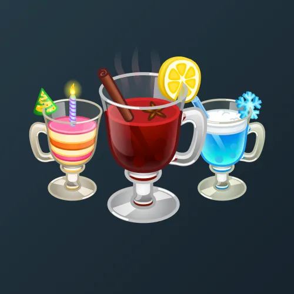

# Spiced Wine

  

    

      
    

    
Spiced Wine

    
Коллекция

  

  

    
<strong>Дата выхода:</strong> 24 ноября 2024 
    <strong>Цена:</strong> 15 <a href="/stars">Stars⭐️</a> 
    <strong>Тираж:</strong> 400 000 шт. 
    <strong>Дата выхода улучшений:</strong> 1 января 2025 
    <strong>Стоимость улучшения:</strong> 25 <a href="/stars">Stars⭐️</a> 
    <strong>Улучшено:</strong> 102 611 шт. (25.7% от тиража) 
    <strong>Сожжено:</strong> 253 910 шт. (63.5% от тиража)

  

**Spiced Wine** — Telegram-подарок, выпущенный 24 ноября 2024 года. Представляет собой стилизованный винный напиток с добавлением различных приправ. Коллекция включает 100 уникальных моделей с заявленной редкостью от 0.4% до 1.3%. Изначальный тираж составил 400 000 экземпляров. До введения улучшений 1 января 2025 года было сожжено 253 910 подарков (63.5%). По состоянию на указанную дату улучшено 102 611 экземпляров (25.7% от тиража). Наиболее редкая модель коллекции — **Water Spout** — насчитывает 383 улучшенных экземпляра, что соответствует реальной редкости 0.37% (при заявленных 0.4%).

## Ключевые особенности

- Значительное сокращение тиража (более 63% сожжено) до введения улучшений способствовало росту рыночной стоимости оставшихся экземпляров.
- Низкая стоимость улучшения (25 Stars) не привела к высокому проценту улучшений — улучшено только 25.7% от изначального тиража.

## Модели и редкость

Коллекция состоит из 100 моделей. В таблице ниже представлено фактическое количество улучшенных экземпляров по каждой модели, а также реальная редкость (рассчитанная относительно общего числа улучшенных — 102 611) и заявленная при выпуске.

| № | Название модели | Реальная редкость (заявленная) | Кол-во улучшенных |
|---|:---|:---|:---|
| 1 | Black Hole | 0.38% (0.4%) | 393 шт. |
| 2 | Captain Nemo | 0.38% (0.4%) | 391 шт. |
| 3 | Dark Disco | 0.43% (0.4%) | 442 шт. |
| 4 | Hazmat | 0.40% (0.4%) | 414 шт. |
| 5 | Lightly Chilled | 0.44% (0.4%) | 452 шт. |
| 6 | Loading | 0.41% (0.4%) | 421 шт. |
| 7 | Magmarita | 0.38% (0.4%) | 385 шт. |
| 8 | Milky Way | 0.39% (0.4%) | 404 шт. |
| 9 | Moon Rocks | 0.39% (0.4%) | 396 шт. |
| 10 | Swamp Gas | 0.41% (0.4%) | 422 шт. |
| 11 | Water Spout | 0.37% (0.4%) | 383 шт. |
| 12 | High Class | 0.46% (0.5%) | 476 шт. |
| 13 | Over Ice | 0.50% (0.5%) | 514 шт. |
| 14 | Aquarium | 0.81% (0.8%) | 834 шт. |
| 15 | Aries Rum | 0.78% (0.8%) | 799 шт. |
| 16 | Birthday Parfait | 0.82% (0.8%) | 839 шт. |
| 17 | Blew Bubble | 0.77% (0.8%) | 792 шт. |
| 18 | Blue Burn | 0.84% (0.8%) | 857 шт. |
| 19 | Brain Enhancer | 0.74% (0.8%) | 759 шт. |
| 20 | Cancer Collins | 0.72% (0.8%) | 743 шт. |
| 21 | Capri Sun | 0.81% (0.8%) | 835 шт. |
| 22 | Chocolate Cherry | 0.78% (0.8%) | 799 шт. |
| 23 | Cube Libra | 0.83% (0.8%) | 849 шт. |
| 24 | Deep Blue Sea | 0.79% (0.8%) | 814 шт. |
| 25 | Ember Elixir | 0.74% (0.8%) | 763 шт. |
| 26 | Flaming Mint | 0.83% (0.8%) | 852 шт. |
| 27 | Gaso Green | 0.78% (0.8%) | 799 шт. |
| 28 | Gin Gemini | 0.80% (0.8%) | 824 шт. |
| 29 | Glitterwine | 0.77% (0.8%) | 792 шт. |
| 30 | Green Energy | 0.81% (0.8%) | 836 шт. |
| 31 | Green Glitter | 0.79% (0.8%) | 812 шт. |
| 32 | Intense Indigo | 0.79% (0.8%) | 814 шт. |
| 33 | Kiwi Degree | 0.81% (0.8%) | 833 шт. |
| 34 | Leonade | 0.78% (0.8%) | 798 шт. |
| 35 | Love Elixir | 0.84% (0.8%) | 867 шт. |
| 36 | Magenta Mix | 0.79% (0.8%) | 806 шт. |
| 37 | Night Sky | 0.79% (0.8%) | 814 шт. |
| 38 | Nightbulb | 0.80% (0.8%) | 826 шт. |
| 39 | Pink Flame | 0.83% (0.8%) | 848 шт. |
| 40 | Pisces Sour | 0.89% (0.8%) | 911 шт. |
| 41 | Sag Sangria | 0.74% (0.8%) | 758 шт. |
| 42 | Scorpio Sling | 0.82% (0.8%) | 838 шт. |
| 43 | Scuba Dive | 0.88% (0.8%) | 898 шт. |
| 44 | Shark Attack | 0.81% (0.8%) | 832 шт. |
| 45 | Taurus-tini | 0.82% (0.8%) | 841 шт. |
| 46 | Thought Tonic | 0.75% (0.8%) | 772 шт. |
| 47 | Tiny Trifle | 0.84% (0.8%) | 860 шт. |
| 48 | Vin Virgo | 0.82% (0.8%) | 838 шт. |
| 49 | With Caution | 0.82% (0.8%) | 838 шт. |
| 50 | Yellow Pop | 0.80% (0.8%) | 825 шт. |
| 51 | Absinthe | 1.29% (1.3%) | 1 326 шт. |
| 52 | Aqua Vita | 1.36% (1.3%) | 1 398 шт. |
| 53 | Blackout | 1.35% (1.3%) | 1 386 шт. |
| 54 | Blood Orange | 1.31% (1.3%) | 1 342 шт. |
| 55 | Blue Brew | 1.28% (1.3%) | 1 310 шт. |
| 56 | Blueberry | 1.27% (1.3%) | 1 302 шт. |
| 57 | Brass Monkey | 1.28% (1.3%) | 1 314 шт. |
| 58 | Buckwheat | 1.25% (1.3%) | 1 285 шт. |
| 59 | Citrus Punch | 1.31% (1.3%) | 1 349 шт. |
| 60 | Color Theory | 1.29% (1.3%) | 1 327 шт. |
| 61 | Cool Water | 1.30% (1.3%) | 1 330 шт. |
| 62 | Copper Sun | 1.34% (1.3%) | 1 380 шт. |
| 63 | Cranberry Lime | 1.36% (1.3%) | 1 392 шт. |
| 64 | Dehydrated | 1.32% (1.3%) | 1 353 шт. |
| 65 | Desaturated | 1.31% (1.3%) | 1 347 шт. |
| 66 | Dusky Draft | 1.29% (1.3%) | 1 319 шт. |
| 67 | Earl Grey | 1.28% (1.3%) | 1 312 шт. |
| 68 | Gluhwein | 1.29% (1.3%) | 1 325 шт. |
| 69 | Going Grape | 1.26% (1.3%) | 1 291 шт. |
| 70 | Golden Glow | 1.35% (1.3%) | 1 388 шт. |
| 71 | Golden Goblet | 1.29% (1.3%) | 1 328 шт. |
| 72 | Green Gradient | 1.30% (1.3%) | 1 330 шт. |
| 73 | Greenwein | 1.30% (1.3%) | 1 330 шт. |
| 74 | Hot Cold | 1.32% (1.3%) | 1 354 шт. |
| 75 | Indigo | 1.33% (1.3%) | 1 364 шт. |
| 76 | Indigo Orange | 1.34% (1.3%) | 1 380 шт. |
| 77 | Kalamansi | 1.28% (1.3%) | 1 311 шт. |
| 78 | Light Grape | 1.28% (1.3%) | 1 318 шт. |
| 79 | Lime Slice | 1.29% (1.3%) | 1 329 шт. |
| 80 | Low Tide | 1.33% (1.3%) | 1 361 шт. |
| 81 | Magenta Mist | 1.29% (1.3%) | 1 325 шт. |
| 82 | Mellow Merlot | 1.28% (1.3%) | 1 316 шт. |
| 83 | Melted Ice | 1.26% (1.3%) | 1 289 шт. |
| 84 | Minty Fresh | 1.27% (1.3%) | 1 308 шт. |
| 85 | Persimmon | 1.38% (1.3%) | 1 416 шт. |
| 86 | Pink Colada | 1.32% (1.3%) | 1 357 шт. |
| 87 | Pink Orange | 1.32% (1.3%) | 1 357 шт. |
| 88 | Purple Potion | 1.23% (1.3%) | 1 260 шт. |
| 89 | Purplexed | 1.31% (1.3%) | 1 343 шт. |
| 90 | Rosemary | 1.31% (1.3%) | 1 342 шт. |
| 91 | Shadow Spirit | 1.26% (1.3%) | 1 288 шт. |
| 92 | South Pacific | 1.30% (1.3%) | 1 333 шт. |
| 93 | Tarkhuna | 1.29% (1.3%) | 1 320 шт. |
| 94 | Tea Infusion | 1.26% (1.3%) | 1 288 шт. |
| 95 | Tequila Sunrise | 1.30% (1.3%) | 1 335 шт. |
| 96 | The Grinch | 1.29% (1.3%) | 1 328 шт. |
| 97 | Turquoise | 1.28% (1.3%) | 1 316 шт. |
| 98 | Vague Berry | 1.28% (1.3%) | 1 314 шт. |
| 99 | Vitamin C | 1.31% (1.3%) | 1 340 шт. |
| 100 | Whiskey Wine | 1.31% (1.3%) | 1 346 шт. |

Наиболее редкими являются модели с заявленной редкостью 0.4% — **Water Spout** (383), **Magmarita** (385), **Captain Nemo** (391), **Black Hole** (393), **Moon Rocks** (396), **Milky Way** (404), **Hazmat** (414), **Loading** (421), **Swamp Gas** (422), **Dark Disco** (442), **Lightly Chilled** (452). При этом реальная редкость модели **Water Spout** (0.37%) ниже заявленной, и это наименьшее количество улучшенных экземпляров во всей коллекции.