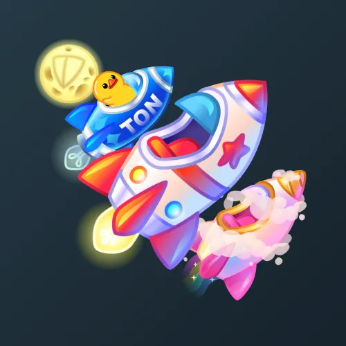

# Stellar Rocket

  

    

      
    

    
Stellar Rocket

    
Коллекция

  

  

    
<strong>Дата выхода:</strong> 12 апреля 2025 
    <strong>Цена:</strong> 200 <a href="/stars">Stars⭐️</a> 
    <strong>Тираж:</strong> 180 000 шт. 
    <strong>Дата выхода улучшений:</strong> 11 августа 2025 
    <strong>Стоимость улучшения:</strong> от 25 до 25 000 <a href="/stars">Stars⭐️</a> 
    <strong>Улучшено:</strong> 135 965 шт. (75.5% от тиража) 
    <strong>Сожжено:</strong> 23 682 шт. (13.2% от тиража)

  

**Stellar Rocket** — Telegram-подарок, выпущенный 12 апреля 2025 года в честь Дня космонавтики. Представляет собой стилизованную космическую ракету. Коллекция включает 50 уникальных моделей с заявленной редкостью от 0.5% до 3%. Изначальный тираж составил 180 000 экземпляров. До введения улучшений 11 августа 2025 года было сожжено 23 682 подарка (13.2%). По состоянию на указанную дату улучшено 135 965 экземпляров (75.5% от тиража). Наиболее редкая модель коллекции — **Mission Uranus** — насчитывает 663 улучшенных экземпляра, что соответствует реальной редкости 0.49% (при заявленных 0.5%).

## Ключевые особенности

- Коллекция приурочена ко Дню космонавтики (12 апреля).
- Высокий процент улучшенных экземпляров (75.5%) при относительно высокой стартовой цене (200 Stars).

## Модели и редкость

Коллекция состоит из 50 моделей. В таблице ниже представлено фактическое количество улучшенных экземпляров по каждой модели, а также реальная редкость (рассчитанная относительно общего числа улучшенных — 135 965) и заявленная при выпуске.

| № | Название модели | Реальная редкость (заявленная) | Кол-во улучшенных |
|---|:---|:---|:---|
| 1 | Bitcoin | 0.50% (0.5%) | 677 шт. |
| 2 | Mission Uranus | 0.49% (0.5%) | 663 шт. |
| 3 | To The Moon | 0.53% (0.5%) | 720 шт. |
| 4 | Black Wing | 1.00% (1.0%) | 1 358 шт. |
| 5 | Gunship | 0.98% (1.0%) | 1 339 шт. |
| 6 | Jewels | 1.01% (1.0%) | 1 375 шт. |
| 7 | Mega Death | 1.01% (1.0%) | 1 369 шт. |
| 8 | Normandy | 0.98% (1.0%) | 1 330 шт. |
| 9 | Nostromo | 0.98% (1.0%) | 1 329 шт. |
| 10 | Space Bot | 0.99% (1.0%) | 1 351 шт. |
| 11 | Space Veggie | 0.99% (1.0%) | 1 340 шт. |
| 12 | Telegram | 1.00% (1.0%) | 1 359 шт. |
| 13 | Chrome | 1.44% (1.5%) | 1 954 шт. |
| 14 | Knowledge | 1.52% (1.5%) | 2 073 шт. |
| 15 | Pepelatz | 1.56% (1.5%) | 2 119 шт. |
| 16 | Planet Express | 1.46% (1.5%) | 1 986 шт. |
| 17 | Police Box | 1.51% (1.5%) | 2 047 шт. |
| 18 | Submarine | 1.47% (1.5%) | 1 993 шт. |
| 19 | Alien Pizza | 2.00% (2.0%) | 2 719 шт. |
| 20 | Baby Carrot | 2.01% (2.0%) | 2 740 шт. |
| 21 | Clever Bird | 2.06% (2.0%) | 2 802 шт. |
| 22 | Doomsday | 2.02% (2.0%) | 2 748 шт. |
| 23 | Fishing Cat | 1.93% (2.0%) | 2 628 шт. |
| 24 | Laika | 2.06% (2.0%) | 2 805 шт. |
| 25 | Little Journey | 2.04% (2.0%) | 2 772 шт. |
| 26 | Pencil | 2.02% (2.0%) | 2 742 шт. |
| 27 | Squirrel | 2.01% (2.0%) | 2 728 шт. |
| 28 | Worm Gun | 1.98% (2.0%) | 2 687 шт. |
| 29 | Banana | 2.50% (2.5%) | 3 405 шт. |
| 30 | Cardboard | 2.47% (2.5%) | 3 352 шт. |
| 31 | Checkered | 2.52% (2.5%) | 3 432 шт. |
| 32 | First Step | 2.56% (2.5%) | 3 477 шт. |
| 33 | Flower Power | 2.48% (2.5%) | 3 377 шт. |
| 34 | Jet Bike | 2.46% (2.5%) | 3 343 шт. |
| 35 | Lava Lamp | 2.41% (2.5%) | 3 272 шт. |
| 36 | Malfunction | 2.53% (2.5%) | 3 437 шт. |
| 37 | Rocket Plush | 2.52% (2.5%) | 3 432 шт. |
| 38 | Silver Ride | 2.60% (2.5%) | 3 542 шт. |
| 39 | Soap Bubbles | 2.52% (2.5%) | 3 432 шт. |
| 40 | Astro Peach | 3.07% (3.0%) | 4 178 шт. |
| 41 | Fireworks | 2.98% (3.0%) | 4 055 шт. |
| 42 | Green Jelly | 3.00% (3.0%) | 4 077 шт. |
| 43 | Hornet | 2.99% (3.0%) | 4 060 шт. |
| 44 | Lollipop | 3.01% (3.0%) | 4 090 шт. |
| 45 | Neon Fuel | 2.95% (3.0%) | 4 011 шт. |
| 46 | Popsicle | 3.00% (3.0%) | 4 084 шт. |
| 47 | Ruby Sparkle | 2.98% (3.0%) | 4 054 шт. |
| 48 | Sky Ghost | 2.91% (3.0%) | 3 954 шт. |
| 49 | Unicorn | 2.97% (3.0%) | 4 042 шт. |
| 50 | Vintage Toy | 3.04% (3.0%) | 4 129 шт. |

Наиболее редкими являются модели с заявленной редкостью 0.5% — **Mission Uranus** (663), **Bitcoin** (677) и **To The Moon** (720). При этом реальная редкость модели **Mission Uranus** (0.49%) ниже заявленной, и это наименьшее количество улучшенных экземпляров во всей коллекции.