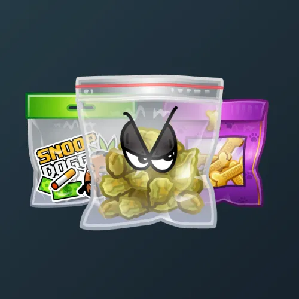

# Swag Bag

  <!-- Левая часть: карточка коллекции -->
  

    

      
    

    
Swag Bag

    
Коллекция

  

  <!-- Правая часть: информация о подарке -->
  

    
<strong>Дата выхода:</strong> 9 июля 2025 
    <strong>Цена:</strong> 500 <a href="/stars">Stars⭐️</a> 
    <strong>Тираж:</strong> 240 000 шт. 
    <strong>Дата выхода улучшений:</strong> 9 июля 2025 
    <strong>Стоимость улучшения:</strong> от 100 до 25 000 <a href="/stars">Stars⭐️</a> 
    <strong>Улучшено:</strong> 231 184 шт. (96.3% от тиража) 
    <strong>Сожжено:</strong> 785 шт. (0.3% от тиража)

  

**Swag Bag** — Telegram-подарок, выпущенный 9 июля 2025 года. Представляет собой пакетик с типичным для Снуп Дога содержимым. Коллекция включает 50 уникальных моделей с заявленной редкостью от 0.5% до 3.5%. Изначальный тираж составил 240 000 экземпляров. Улучшения и возможность перевода в NFT стали доступны сразу в день выхода, 9 июля 2025 года. Было сожжено (обменяно на звёзды) всего 785 подарков (0.3%). По состоянию на указанную дату улучшено 231 184 экземпляра (96.3% от тиража). Стоимость улучшения варьируется от 100 до 25 000 Stars в зависимости от модели.

Другие подарки от Снуп Дога: <a href="/snoop-dogg">Snoop Dogg</a>, <a href="/snoop-cigar">Snoop Cigar</a>, <a href="/low-rider">Low Rider</a> и <a href="/westside-sign">Westside Sign</a>.

Наиболее редкая модель коллекции — **Cashback** — насчитывает 1 110 улучшенных экземпляров, что соответствует реальной редкости 0.48% (при заявленных 0.5%).

---

## Модели и редкость

Коллекция состоит из 50 моделей. В таблице ниже представлено фактическое количество улучшенных экземпляров по каждой модели, а также реальная редкость (рассчитанная относительно общего числа улучшенных — 231 184) и заявленная при выпуске.

| №   | Название модели     | Реальная редкость (заявленная) | Кол-во улучшенных |
| --- | ------------------- | ------------------------------- | ----------------- |
| 1   | Cashback            | 0.48% (0.5%)                    | 1 110             |
| 2   | Cookie Dude         | 0.51% (0.5%)                    | 1 189             |
| 3   | Gin & Jewels        | 0.51% (0.5%)                    | 1 175             |
| 4   | Happy Herbs         | 0.52% (0.5%)                    | 1 208             |
| 5   | Missionary          | 0.51% (0.5%)                    | 1 183             |
| 6   | Snoop Life          | 0.48% (0.5%)                    | 1 117             |
| 7   | Blind Bag           | 1.00% (1.0%)                    | 2 316             |
| 8   | Darkness            | 1.00% (1.0%)                    | 2 311             |
| 9   | Golden Nugs         | 0.98% (1.0%)                    | 2 260             |
| 10  | Leopard             | 1.01% (1.0%)                    | 2 337             |
| 11  | P.I.M.P.            | 1.02% (1.0%)                    | 2 361             |
| 12  | The Last Meal       | 0.99% (1.0%)                    | 2 288             |
| 13  | Doll Buttons        | 1.47% (1.5%)                    | 3 396             |
| 14  | Snoop S             | 1.45% (1.5%)                    | 3 343             |
| 15  | Stack Pack          | 1.50% (1.5%)                    | 3 476             |
| 16  | April 20th          | 2.02% (2.0%)                    | 4 670             |
| 17  | Aviators            | 1.99% (2.0%)                    | 4 601             |
| 18  | Baggy Bag           | 2.03% (2.0%)                    | 4 682             |
| 19  | Boiling Hot         | 1.99% (2.0%)                    | 4 605             |
| 20  | Bulk Order          | 2.06% (2.0%)                    | 4 758             |
| 21  | Candy Shop          | 2.08% (2.0%)                    | 4 818             |
| 22  | Doggy Doggs         | 2.03% (2.0%)                    | 4 693             |
| 23  | Doggystyle          | 2.00% (2.0%)                    | 4 623             |
| 24  | Fish Hat            | 1.98% (2.0%)                    | 4 574             |
| 25  | Money Bag           | 1.98% (2.0%)                    | 4 586             |
| 26  | Muffins             | 1.98% (2.0%)                    | 4 583             |
| 27  | Platinum 8          | 1.96% (2.0%)                    | 4 530             |
| 28  | Shuffle             | 2.01% (2.0%)                    | 4 647             |
| 29  | Take It Easy        | 2.02% (2.0%)                    | 4 679             |
| 30  | Walk Of Fame        | 1.96% (2.0%)                    | 4 521             |
| 31  | West Toast          | 2.02% (2.0%)                    | 4 661             |
| 32  | Bark & Tag          | 2.52% (2.5%)                    | 5 823             |
| 33  | Crook To Cook       | 2.51% (2.5%)                    | 5 810             |
| 34  | Purple Smoke        | 2.46% (2.5%)                    | 5 684             |
| 35  | Rastafari           | 2.49% (2.5%)                    | 5 764             |
| 36  | Serious Dude        | 2.49% (2.5%)                    | 5 757             |
| 37  | Tag Bag             | 2.51% (2.5%)                    | 5 793             |
| 38  | Choco Doggs         | 2.96% (3.0%)                    | 6 851             |
| 39  | Choco Kush          | 3.01% (3.0%)                    | 6 960             |
| 40  | Dogg Treats         | 2.96% (3.0%)                    | 6 831             |
| 41  | Dogg’s Loot         | 3.03% (3.0%)                    | 7 003             |
| 42  | Gin and Juice       | 2.98% (3.0%)                    | 6 891             |
| 43  | Gummies             | 3.02% (3.0%)                    | 6 980             |
| 44  | Hop Corn            | 2.97% (3.0%)                    | 6 866             |
| 45  | Lollipops           | 3.03% (3.0%)                    | 6 992             |
| 46  | Platinum Drip       | 2.99% (3.0%)                    | 6 907             |
| 47  | Smokefest           | 3.06% (3.0%)                    | 7 063             |
| 48  | Snoopcoins          | 3.04% (3.0%)                    | 7 023             |
| 49  | Spicy Onion         | 2.97% (3.0%)                    | 6 866             |
| 50  | Lemon Pepper        | 3.51% (3.5%)                    | 8 107             |

Наиболее редкими являются модели с заявленной редкостью 0.5% — **Cashback** (1 110), **Snoop Life** (1 117), **Cookie Dude** (1 189) и другие. При этом реальная редкость модели **Cashback** (0.48%) ниже заявленной, и это наименьшее количество улучшенных экземпляров во всей коллекции. Модель с редкостью 3.5% — **Lemon Pepper** (8 107) — имеет реальную редкость 3.51%, что незначительно превышает заявленное значение, тогда как в группе 3% наименьшее количество у **Dogg Treats** (6 831) и **Choco Doggs** (6 851).