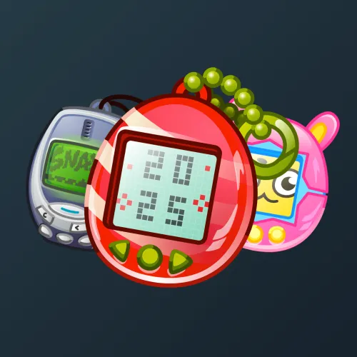

# Tama gadget

  <!-- Левая часть: карточка коллекции -->
  

    

      
    

    
Tama gadget

    
Коллекция

  

  <!-- Правая часть: информация о подарке -->
  

    
<strong>Дата выхода:</strong> 30 декабря 2024 
    <strong>Цена:</strong> 50 <a href="/stars">Stars⭐️</a> 
    <strong>Тираж:</strong> 200 000 шт. 
    <strong>Дата выхода улучшений:</strong> 7 марта 2025 
    <strong>Стоимость улучшения:</strong> от 25 до 25 000 <a href="/stars">Stars⭐️</a> 
    <strong>Улучшено:</strong> 103 239 шт. (51.6% от тиража) 
    <strong>Сожжено:</strong> 64 903 шт. (32.5% от тиража)

  

**Tama gadget** — Telegram-подарок, выпущенный 30 декабря 2024 года. Представляет собой тамагочи — игрушку с виртуальным питомцем. Коллекция включает 100 уникальных моделей с заявленной редкостью от 0.3% до 2%. Изначальный тираж составил 200 000 экземпляров. До введения улучшений 7 марта 2025 года было сожжено (обменяно на звёзды) 64 903 подарка (32.5%). По состоянию на указанную дату улучшено 103 239 экземпляров (51.6% от тиража). Стоимость улучшения варьируется от 25 до 25 000 Stars в зависимости от модели.

Наиболее редкая модель коллекции — **Game Boy** — насчитывает 253 улучшенных экземпляра, что соответствует реальной редкости 0.25% (при заявленных 0.3%).

---

## Модели и редкость

Коллекция состоит из 100 моделей. В таблице ниже представлено фактическое количество улучшенных экземпляров по каждой модели, а также реальная редкость (рассчитанная относительно общего числа улучшенных — 103 239) и заявленная при выпуске.

| №   | Название модели     | Реальная редкость (заявленная) | Кол-во улучшенных |
| --- | ------------------- | ------------------------------- | ----------------- |
| 1   | Alien Attack        | 0.32% (0.3%)                    | 330               |
| 2   | Birthday            | 0.29% (0.3%)                    | 304               |
| 3   | Diamond Ton         | 0.33% (0.3%)                    | 339               |
| 4   | Doom                | 0.30% (0.3%)                    | 310               |
| 5   | Egg Catch           | 0.33% (0.3%)                    | 336               |
| 6   | Furby               | 0.30% (0.3%)                    | 309               |
| 7   | Game Boy            | 0.25% (0.3%)                    | 253               |
| 8   | Heartbeat           | 0.27% (0.3%)                    | 278               |
| 9   | Lazy Egg            | 0.29% (0.3%)                    | 299               |
| 10  | Mecha Fight         | 0.30% (0.3%)                    | 306               |
| 11  | Nokia 3310          | 0.30% (0.3%)                    | 312               |
| 12  | Nyan Cat            | 0.31% (0.3%)                    | 318               |
| 13  | Pepe Feels          | 0.30% (0.3%)                    | 311               |
| 14  | Poo Byte            | 0.29% (0.3%)                    | 304               |
| 15  | Portal              | 0.26% (0.3%)                    | 272               |
| 16  | Puck Man            | 0.32% (0.3%)                    | 334               |
| 17  | R2D2                | 0.31% (0.3%)                    | 318               |
| 18  | Seraph              | 0.30% (0.3%)                    | 309               |
| 19  | The Demon           | 0.31% (0.3%)                    | 319               |
| 20  | Toxic Glitch        | 0.31% (0.3%)                    | 318               |
| 21  | Underdog            | 0.29% (0.3%)                    | 303               |
| 22  | Water Rings         | 0.31% (0.3%)                    | 315               |
| 23  | BMO                 | 0.51% (0.5%)                    | 525               |
| 24  | Bunny Grid          | 0.49% (0.5%)                    | 502               |
| 25  | Classic Blue        | 0.46% (0.5%)                    | 479               |
| 26  | Funky Stitch        | 0.52% (0.5%)                    | 536               |
| 27  | Mono Patch          | 0.48% (0.5%)                    | 496               |
| 28  | Pastel Thread       | 0.54% (0.5%)                    | 553               |
| 29  | Pixel Bunny         | 0.50% (0.5%)                    | 514               |
| 30  | Pixel Pink          | 0.49% (0.5%)                    | 501               |
| 31  | Stone Kitty         | 0.47% (0.5%)                    | 482               |
| 32  | Wooden Dog          | 0.50% (0.5%)                    | 519               |
| 33  | Yellow              | 0.53% (0.5%)                    | 549               |
| 34  | Health Wish         | 0.80% (0.8%)                    | 828               |
| 35  | Love Wish           | 0.77% (0.8%)                    | 794               |
| 36  | Lucky Wish          | 0.79% (0.8%)                    | 816               |
| 37  | Money Wish          | 0.80% (0.8%)                    | 822               |
| 38  | Wish Granted        | 0.83% (0.8%)                    | 859               |
| 39  | Dipsy               | 1.04% (1.0%)                    | 1 075             |
| 40  | Error-Po            | 1.05% (1.0%)                    | 1 082             |
| 41  | Laa-Laa-Lag         | 0.97% (1.0%)                    | 1 005             |
| 42  | Bondi Blue          | 1.10% (1.1%)                    | 1 137             |
| 43  | Crystal View        | 1.15% (1.1%)                    | 1 190             |
| 44  | Dalmatian           | 1.08% (1.1%)                    | 1 118             |
| 45  | Dino Egg            | 1.07% (1.1%)                    | 1 103             |
| 46  | Golden Sun          | 1.13% (1.1%)                    | 1 163             |
| 47  | Green Candy         | 1.10% (1.1%)                    | 1 131             |
| 48  | Holo Shell          | 1.06% (1.1%)                    | 1 096             |
| 49  | Icy Zebra           | 1.14% (1.1%)                    | 1 182             |
| 50  | Lime Chip           | 1.10% (1.1%)                    | 1 133             |
| 51  | Lush Stripe         | 1.08% (1.1%)                    | 1 110             |
| 52  | Neon Mirage         | 1.11% (1.1%)                    | 1 144             |
| 53  | Ruby Glaze          | 1.09% (1.1%)                    | 1 124             |
| 54  | Sapphire            | 1.11% (1.1%)                    | 1 149             |
| 55  | Shiny Pearl         | 1.10% (1.1%)                    | 1 136             |
| 56  | Spectrum            | 1.12% (1.1%)                    | 1 155             |
| 57  | Strawberry          | 1.10% (1.1%)                    | 1 140             |
| 58  | Tinky Winky         | 1.10% (1.1%)                    | 1 138             |
| 59  | Tropic Wave         | 1.13% (1.1%)                    | 1 171             |
| 60  | Wild Hunt           | 1.12% (1.1%)                    | 1 160             |
| 61  | Amber               | 2.11% (2.0%)                    | 2 177             |
| 62  | Argentum            | 1.98% (2.0%)                    | 2 041             |
| 63  | Bronze              | 2.08% (2.0%)                    | 2 146             |
| 64  | Candy Cane          | 2.02% (2.0%)                    | 2 086             |
| 65  | Cherry Milk         | 2.03% (2.0%)                    | 2 099             |
| 66  | Citrus Ice          | 2.04% (2.0%)                    | 2 107             |
| 67  | Clover              | 1.98% (2.0%)                    | 2 047             |
| 68  | Gold Rush           | 1.95% (2.0%)                    | 2 014             |
| 69  | Grape               | 1.98% (2.0%)                    | 2 043             |
| 70  | Grayscale           | 2.00% (2.0%)                    | 2 064             |
| 71  | Inferno             | 2.05% (2.0%)                    | 2 121             |
| 72  | Lavender            | 1.96% (2.0%)                    | 2 028             |
| 73  | Lime Shock          | 2.09% (2.0%)                    | 2 155             |
| 74  | Malachite           | 2.02% (2.0%)                    | 2 085             |
| 75  | Melon Pop           | 1.99% (2.0%)                    | 2 057             |
| 76  | Ocean               | 2.00% (2.0%)                    | 2 060             |
| 77  | Orchid              | 2.05% (2.0%)                    | 2 112             |
| 78  | Peach               | 2.00% (2.0%)                    | 2 060             |
| 79  | Pearl White         | 1.91% (2.0%)                    | 1 974             |
| 80  | Purple              | 1.89% (2.0%)                    | 1 952             |
| 81  | Sakura              | 1.98% (2.0%)                    | 2 046             |
| 82  | Shadow              | 1.92% (2.0%)                    | 1 978             |
| 83  | Sunrise             | 2.02% (2.0%)                    | 2 088             |
| 84  | Tangerine           | 2.01% (2.0%)                    | 2 074             |
| 85  | Twilight            | 1.99% (2.0%)                    | 2 057             |
| 86  | Verdant             | 2.02% (2.0%)                    | 2 089             |
| 87  | Vivid Sky           | 1.98% (2.0%)                    | 2 042             |
| 88  | Winter              | 2.01% (2.0%)                    | 2 070             |
| 89  | Yang                | 1.97% (2.0%)                    | 2 029             |
| 90  | Yin                 | 2.00% (2.0%)                    | 2 067             |

Наиболее редкими являются модели с заявленной редкостью 0.3% — **Game Boy** (253), **Portal** (272), **Heartbeat** (278), **Lazy Egg** (299) и другие. При этом реальная редкость модели **Game Boy** (0.25%) ниже заявленной, и это наименьшее количество улучшенных экземпляров во всей коллекции. В группе с редкостью 2% наименьшее количество у моделей **Purple** (1 952) и **Pearl White** (1 974), что соответствует реальной редкости около 1.89% и 1.91% — ниже заявленной, тогда как **Amber** (2 177) с редкостью 2.11% находится у верхней границы.