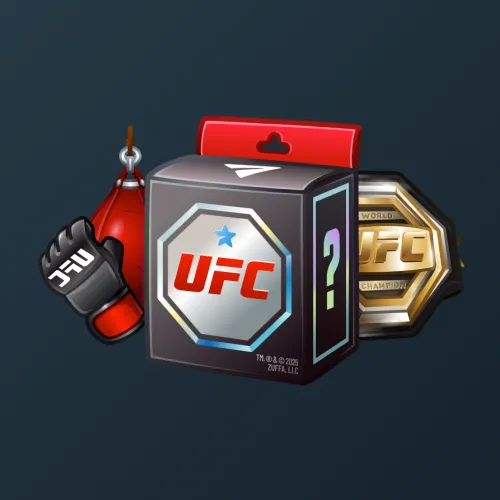

# UFC Strike

  <!-- Левая часть: карточка коллекции -->
  

    

      
    

    
UFC Strike

    
Коллекция

  

  <!-- Правая часть: информация о подарке -->
  

    
<strong>Дата выхода:</strong> 7 декабря 2025 
    <strong>Цена:</strong> 3 760 <a href="/stars">Stars⭐️</a> 
    <strong>Тираж:</strong> 60 000 шт. 
    <strong>Дата выхода улучшений:</strong> 7 декабря 2025 
    <strong>Стоимость улучшения:</strong> 0 <a href="/stars">Stars⭐️</a> 
    <strong>Улучшено:</strong> 56 966 шт. (94.9% от тиража)

  

**UFC Strike** (первоначальное название — «UFC Mystery Box») — Telegram-подарок, выпущенный 7 декабря 2025 года. Представляет собой фигурки, экипировку и чемпионские пояса знаменитых бойцов UFC. В число спортсменов входят: Хамзат Чимаев, Мераб Двалишвили, Шон О’Мэлли, Джон Джонс, Илия Топурия, Исраэль Адесанья, Чарльз Оливейра, Александр Волкановски, Алекс Перейра, Алешандри Пантожа. Коллекция включает 48 уникальных моделей с заявленной редкостью от 0.5% до 4%. Изначальный тираж составил 60 000 экземпляров. Улучшения и возможность перевода в NFT стали доступны сразу в день выхода, 7 декабря 2025 года. Стоимость улучшения отсутствует (0 Stars). По состоянию на указанную дату улучшено 56 966 экземпляров (94.9% от тиража).

Приобрести подарок можно было на аукционе, который запустил Telegram. Для участия ставка в звёздах должна была попасть в топ-250 одного из 240 раундов. Ограничений по количеству подарков на один аккаунт не было. Подробнее о процессе можно узнать в <a href="/guide/auction">гайде по аукциону</a>. Гифты сразу можно было улучшить и продать или купить на пре-маркете (<a href="/guide/premarket">инструкция</a>).

Наиболее редкая модель коллекции — **Gold O’Malley** — насчитывает 274 улучшенных экземпляра, что соответствует реальной редкости 0.48% (при заявленных 0.5%).

---

## Ключевые особенности

- Уникальный формат распространения: аукцион из 240 раундов, где победители определялись по размеру ставки в звёздах.
- В коллекции представлены именные модели 10 известных бойцов UFC в золотом исполнении с редкостью 0.5%, а также модели с их именами в категории 4%.
- Стоимость улучшения отсутствует (0 Stars), что является исключительным случаем среди Telegram-подарков.

## Модели и редкость

Коллекция состоит из 48 моделей. В таблице ниже представлено фактическое количество улучшенных экземпляров по каждой модели, а также реальная редкость (рассчитанная относительно общего числа улучшенных — 56 966) и заявленная при выпуске.

| №   | Название модели        | Реальная редкость (заявленная) | Кол-во улучшенных |
| --- | ---------------------- | ------------------------------- | ----------------- |
| 1   | Gold Adesanya          | 0.52% (0.5%)                    | 299               |
| 2   | Gold Chimaev           | 0.48% (0.5%)                    | 276               |
| 3   | Gold Dvalishvili       | 0.54% (0.5%)                    | 307               |
| 4   | Gold Jones             | 0.52% (0.5%)                    | 299               |
| 5   | Gold O’Malley          | 0.48% (0.5%)                    | 274               |
| 6   | Gold Oliveira          | 0.49% (0.5%)                    | 281               |
| 7   | Gold Pantoja           | 0.50% (0.5%)                    | 286               |
| 8   | Gold Pereira           | 0.53% (0.5%)                    | 302               |
| 9   | Gold Topuria           | 0.50% (0.5%)                    | 285               |
| 10  | Gold Volkanovski       | 0.53% (0.5%)                    | 304               |
| 11  | UFC World              | 0.51% (0.5%)                    | 293               |
| 12  | Ult Fighting           | 0.51% (0.5%)                    | 292               |
| 13  | Gold UFC Octagon       | 0.95% (1.0%)                    | 541               |
| 14  | UFC Classic            | 0.94% (1.0%)                    | 535               |
| 15  | UFC Glove Token        | 0.98% (1.0%)                    | 557               |
| 16  | Ultimate Ult           | 0.97% (1.0%)                    | 553               |
| 17  | Prime Relic            | 1.46% (1.5%)                    | 829               |
| 18  | UFC BMF                | 1.53% (1.5%)                    | 872               |
| 19  | UFC Keychain           | 1.54% (1.5%)                    | 875               |
| 20  | UFC Love               | 1.49% (1.5%)                    | 849               |
| 21  | Blue Glove Token       | 2.06% (2.0%)                    | 1 171             |
| 22  | Keychain Blue          | 2.02% (2.0%)                    | 1 150             |
| 23  | Keychain Red           | 2.01% (2.0%)                    | 1 144             |
| 24  | Red Glove Token        | 1.93% (2.0%)                    | 1 102             |
| 25  | UFC Legacy             | 2.06% (2.0%)                    | 1 176             |
| 26  | Combo Hit              | 3.04% (3.0%)                    | 1 729             |
| 27  | Dumbbell               | 2.96% (3.0%)                    | 1 685             |
| 28  | Fist Bump              | 2.98% (3.0%)                    | 1 695             |
| 29  | Level Up               | 2.98% (3.0%)                    | 1 700             |
| 30  | Train Time             | 3.10% (3.0%)                    | 1 764             |
| 31  | UFC Octagon            | 2.96% (3.0%)                    | 1 688             |
| 32  | A. Pantoja             | 3.92% (4.0%)                    | 2 231             |
| 33  | A. Pereira             | 4.08% (4.0%)                    | 2 325             |
| 34  | A. Volkanovski         | 4.06% (4.0%)                    | 2 315             |
| 35  | C. Oliveira            | 3.96% (4.0%)                    | 2 257             |
| 36  | Classic Blue           | 4.06% (4.0%)                    | 2 312             |
| 37  | Classic Red            | 3.90% (4.0%)                    | 2 222             |
| 38  | I. Adesanya            | 4.05% (4.0%)                    | 2 306             |
| 39  | I. Topuria             | 4.01% (4.0%)                    | 2 283             |
| 40  | J. Jones               | 3.90% (4.0%)                    | 2 223             |
| 41  | K. Chimaev             | 3.96% (4.0%)                    | 2 257             |
| 42  | M. Dvalishvili         | 3.88% (4.0%)                    | 2 212             |
| 43  | S. O’Malley            | 4.06% (4.0%)                    | 2 310             |
| 44  | UFC 25 Blue            | 4.05% (4.0%)                    | 2 308             |
| 45  | UFC 30 Red             | 4.02% (4.0%)                    | 2 291             |

Наиболее редкими являются модели с заявленной редкостью 0.5% — **Gold O’Malley** (274), **Gold Chimaev** (276), **Gold Oliveira** (281), **Gold Topuria** (285) и **Gold Pantoja** (286). При этом реальная редкость модели **Gold O’Malley** (0.48%) ниже заявленной, и это наименьшее количество улучшенных экземпляров во всей коллекции. В группе с редкостью 4% наибольшее количество демонстрируют **A. Pereira** (2 325) и **A. Volkanovski** (2 315), что соответствует реальной редкости около 4.08% и 4.06% — незначительно выше заявленной, тогда как **M. Dvalishvili** (2 212) с редкостью 3.88% находится у нижней границы.