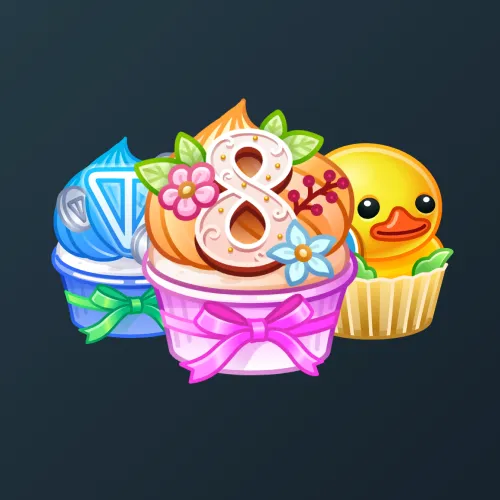

# Whip Cupcake

  <!-- Левая часть: карточка коллекции -->
  

    

      
    

    
Whip Cupcake

    
Коллекция

  

  <!-- Правая часть: информация о подарке -->
  

    
<strong>Дата выхода:</strong> 8 марта 2025 
    <strong>Цена:</strong> 50 <a href="/stars">Stars⭐️</a> 
    <strong>Тираж:</strong> 400 000 шт. 
    <strong>Дата выхода улучшений:</strong> 4 июля 2025 
    <strong>Стоимость улучшения:</strong> от 25 до 25 000 <a href="/stars">Stars⭐️</a> 
    <strong>Улучшено:</strong> 264 677 шт. (66.2% от тиража) 
    <strong>Сожжено:</strong> 32 381 шт. (8.1% от тиража)

  

**Whip Cupcake** — Telegram-подарок, выпущенный 8 марта 2025 года. Представляет собой пирожное или кекс со взбитыми сливками. Коллекция включает 50 уникальных моделей с заявленной редкостью от 0.5% до 3%. Изначальный тираж составил 400 000 экземпляров. До введения улучшений 4 июля 2025 года было сожжено (обменяно на звёзды) 32 381 подарок (8.1%). По состоянию на указанную дату улучшено 264 677 экземпляров (66.2% от тиража). Стоимость улучшения варьируется от 25 до 25 000 Stars в зависимости от модели.

Данный подарок входит в серию, выпущенную к 8 марта. Все подарки, выходившие на 8 марта, можно посмотреть <a href="/march-8-collection">здесь</a>.

Наиболее редкая модель коллекции — **Deep State** — насчитывает 1 302 улучшенных экземпляра, что соответствует реальной редкости 0.49% (при заявленных 0.5%).

---

## Модели и редкость

Коллекция состоит из 50 моделей. В таблице ниже представлено фактическое количество улучшенных экземпляров по каждой модели, а также реальная редкость (рассчитанная относительно общего числа улучшенных — 264 677) и заявленная при выпуске.

| №   | Название модели     | Реальная редкость (заявленная) | Кол-во улучшенных |
| --- | ------------------- | ------------------------------- | ----------------- |
| 1   | Bitcoin             | 0.50% (0.5%)                    | 1 318             |
| 2   | Deep State          | 0.49% (0.5%)                    | 1 302             |
| 3   | Resistance          | 0.50% (0.5%)                    | 1 324             |
| 4   | Circus              | 1.02% (1.0%)                    | 2 707             |
| 5   | Fast Charge         | 1.01% (1.0%)                    | 2 663             |
| 6   | Honey Bee           | 0.96% (1.0%)                    | 2 535             |
| 7   | Ogre Snack          | 0.98% (1.0%)                    | 2 603             |
| 8   | Starfish            | 0.98% (1.0%)                    | 2 606             |
| 9   | Sugar Daddy         | 0.99% (1.0%)                    | 2 631             |
| 10  | Toncoin             | 0.98% (1.0%)                    | 2 598             |
| 11  | Trump Cake          | 1.00% (1.0%)                    | 2 646             |
| 12  | Christmas           | 1.51% (1.5%)                    | 4 006             |
| 13  | Demoman             | 1.51% (1.5%)                    | 3 992             |
| 14  | Dracula             | 1.56% (1.5%)                    | 4 128             |
| 15  | Gummy Bears         | 1.47% (1.5%)                    | 3 899             |
| 16  | Hellspawn           | 1.50% (1.5%)                    | 3 969             |
| 17  | Maneki Neko         | 1.53% (1.5%)                    | 4 061             |
| 18  | Poopy Pie           | 1.53% (1.5%)                    | 4 039             |
| 19  | Stardust            | 1.52% (1.5%)                    | 4 030             |
| 20  | Sweetheart          | 1.51% (1.5%)                    | 4 004             |
| 21  | Tarot Cards         | 1.48% (1.5%)                    | 3 906             |
| 22  | Trippy              | 1.49% (1.5%)                    | 3 940             |
| 23  | Alien Slime         | 1.98% (2.0%)                    | 5 236             |
| 24  | Bag End             | 2.01% (2.0%)                    | 5 331             |
| 25  | Biohazard           | 1.94% (2.0%)                    | 5 127             |
| 26  | Cream Scream        | 2.04% (2.0%)                    | 5 394             |
| 27  | Half-Life           | 2.00% (2.0%)                    | 5 293             |
| 28  | Arizona             | 2.51% (2.5%)                    | 6 644             |
| 29  | Bitter Sweet        | 2.54% (2.5%)                    | 6 716             |
| 30  | Hawaii              | 2.54% (2.5%)                    | 6 730             |
| 31  | Jolly Roger         | 2.52% (2.5%)                    | 6 659             |
| 32  | Minion              | 2.46% (2.5%)                    | 6 512             |
| 33  | Paradise            | 2.49% (2.5%)                    | 6 595             |
| 34  | Spiritwood          | 2.51% (2.5%)                    | 6 650             |
| 35  | Sponge Duck         | 2.45% (2.5%)                    | 6 489             |
| 36  | Unicorn             | 2.48% (2.5%)                    | 6 554             |
| 37  | Wasteland           | 2.58% (2.5%)                    | 6 820             |
| 38  | Blueberry Hill      | 2.94% (3.0%)                    | 7 787             |
| 39  | Cherry Top          | 2.99% (3.0%)                    | 7 904             |
| 40  | Cloud Nine          | 3.01% (3.0%)                    | 7 966             |
| 41  | Fantastic Four      | 3.01% (3.0%)                    | 7 979             |
| 42  | First Bite          | 3.01% (3.0%)                    | 7 963             |
| 43  | Heaven Seven        | 3.01% (3.0%)                    | 7 964             |
| 44  | High Five           | 2.95% (3.0%)                    | 7 810             |
| 45  | March Eight         | 3.00% (3.0%)                    | 7 943             |
| 46  | Rising Dead         | 3.01% (3.0%)                    | 7 965             |
| 47  | Six Senses          | 3.01% (3.0%)                    | 7 955             |
| 48  | Triple Treat        | 2.99% (3.0%)                    | 7 905             |
| 49  | Two Sweet!          | 2.97% (3.0%)                    | 7 873             |
| 50  | Zero Sugar          | 3.04% (3.0%)                    | 8 059             |

Наиболее редкими являются модели с заявленной редкостью 0.5% — **Deep State** (1 302), **Bitcoin** (1 318) и **Resistance** (1 324). При этом реальная редкость модели **Deep State** (0.49%) ниже заявленной, и это наименьшее количество улучшенных экземпляров во всей коллекции. В группе с редкостью 3% наибольшее количество демонстрирует **Zero Sugar** (8 059), что соответствует реальной редкости 3.04% — выше заявленной, тогда как **Blueberry Hill** (7 787) с редкостью 2.94% находится у нижней границы.